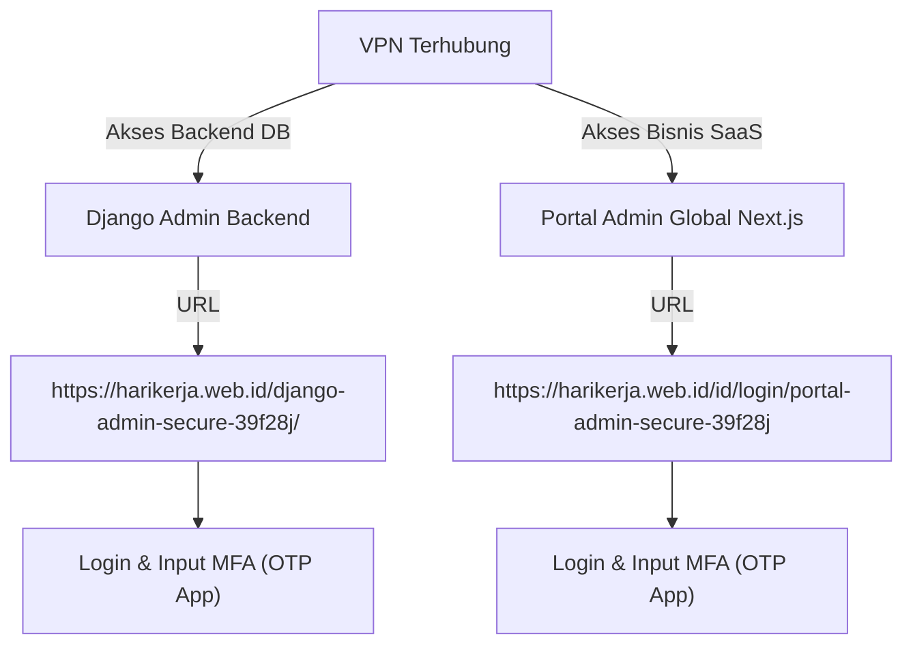

# Panduan Koneksi VPN & Akses Portal Admin

Panduan komprehensif ini menjelaskan cara mengonfigurasi VPN privat, mengakses portal admin via web browser untuk pengguna, serta langkah-langkah bagi administrator server untuk menyiapkan, mengonfigurasi, dan mengamankan seluruh arsitektur jaringan privat di platform HariKerja HRMS.

---

## 1. Pendahuluan & Strategi Keamanan
Platform HariKerja HRMS menerapkan pendekatan **Pertahanan Berlapis (Defense in Depth)** untuk melindungi data sensitif kepegawaian. Portal administratif tidak dibuka ke internet publik secara langsung. Dua lapis pertahanan utama yang diterapkan adalah:
1. **VPN Privat (OpenVPN / WireGuard):** Membatasi akses jaringan sehingga hanya IP di dalam subnet VPN privat (`10.8.0.0/24`) atau IP kantor tepercaya yang dapat menjangkau server administratif.
2. **Obfuscasi URL (`ADMIN_URL`):** Mengubah alamat akses admin bawaan (seperti `/admin/`) menjadi URL acak rahasia yang dinamis.
3. **Autentikasi Multi-Faktor (MFA / 2FA):** Mewajibkan token OTP 6-digit setelah pencocokan kata sandi berhasil.

---

## 2. Panduan Klien (User) - Konfigurasi VPN di Komputer Lokal

Sebelum mengakses portal admin via web, Anda wajib mengaktifkan koneksi VPN privat HariKerja pada perangkat Anda. Pilihlah salah satu sistem operasi di bawah ini:

### A. Klien Ubuntu / Debian (Linux)
Ubuntu mendukung koneksi VPN privat melalui antarmuka grafis (GUI) maupun terminal (CLI).

#### Opsi 1: Melalui GUI (Ubuntu Settings) - *Sangat Direkomendasikan*
1. **Instal Paket Dependensi (Hanya Sekali):**
   Buka terminal (`Ctrl + Alt + T`) lalu jalankan perintah berikut untuk menginstal integrasi OpenVPN dengan GNOME Network Manager:
   ```bash
   sudo apt update
   sudo apt install network-manager-openvpn-gnome -y
   sudo systemctl restart NetworkManager
   ```
2. **Impor File Profil VPN:**
   * Klik ikon status jaringan/suara di pojok kanan atas layar Anda, lalu klik **Settings** (ikon roda gigi).
   * Pilih menu **Network** di bilah navigasi kiri.
   * Di bagian **VPN**, klik tombol **`+` (Tambah)**.
   * Pilih opsi **Import from file...** pada bagian paling bawah dialog modal.
   * Telusuri dan pilih file profil `.ovpn` yang telah diberikan oleh Tim Administrator/DevOps Anda.
3. **Koneksikan:**
   * Klik kembali menu status jaringan di pojok kanan atas layar.
   * Pilih koneksi VPN baru Anda, lalu klik **Connect**.

#### Opsi 2: Melalui CLI / Terminal (OpenVPN & WireGuard)
* **Jika menggunakan OpenVPN (`.ovpn`):**
  ```bash
  sudo apt update && sudo apt install openvpn -y
  sudo openvpn --config /jalur/ke/profil_anda.ovpn
  ```
  *(Biarkan terminal ini tetap terbuka selama Anda bekerja. Tekan `Ctrl + C` untuk memutuskan koneksi).*
* **Jika menggunakan WireGuard (`.conf`):**
  ```bash
  sudo apt update && sudo apt install wireguard -y
  sudo cp /jalur/ke/profil.conf /etc/wireguard/wg0.conf
  sudo wg-quick up wg0
  ```
  *(Jalankan `sudo wg-quick down wg0` di terminal lain untuk mematikan koneksi).*

---

### B. Klien Windows
1. **Unduh & Instal Aplikasi:** Unduh dan pasang aplikasi resmi [OpenVPN Connect for Windows](https://openvpn.net/client-connect-vpn-for-windows/).
2. **Impor File Profil VPN:**
   * Buka aplikasi **OpenVPN Connect**.
   * Pilih tab **File**.
   * Tarik dan lepas (*drag and drop*) file `.ovpn` Anda ke dalam jendela aplikasi, atau klik **Browse** untuk memilih file secara manual dari penyimpanan lokal Anda.
3. **Koneksikan:**
   * Klik tombol geser **Connect** (dari warna abu-abu menjadi hijau).
   * Status koneksi yang sukses ditandai dengan grafik statistik bandwidth yang bergerak aktif dan ikon gembok hijau.

---

### C. Klien macOS
1. **Unduh & Instal Aplikasi:** Unduh dan pasang aplikasi resmi [OpenVPN Connect for macOS](https://openvpn.net/client-connect-vpn-for-mac-os/).
2. **Impor File Profil VPN:**
   * Jalankan aplikasi **OpenVPN Connect** melalui Launchpad atau Spotlight.
   * Klik tab **File** dan seret file `.ovpn` Anda ke dalam area yang disediakan.
3. **Koneksikan:**
   * Geser tombol **Connect** ke kanan.
   * Jika sistem macOS Anda memunculkan dialog persetujuan untuk membuat konfigurasi jaringan/VPN, masukkan kata sandi Mac Anda lalu klik **Allow** (Izinkan).
   * Status akan berubah menjadi hijau jika koneksi telah berhasil terhubung.

---

## 3. Panduan Klien (User) - Mengakses Portal Admin via Web

Setelah koneksi VPN Anda aktif (ditandai dengan status **Connected** / Hijau di aplikasi) serta domain telah dipetakan di file `hosts` komputer lokal Anda, Anda baru bisa mengakses kedua portal administratif melalui web browser:



### A. Portal Admin Global (SaaS Frontend Portal)
Portal ini digunakan oleh **Superadmin SaaS, Agen Support, Tim Finance, dan Tim Sales** untuk mengelola data operasional bisnis harian HariKerja.

* **URL Akses:** 
  * Bahasa Indonesia: `https://harikerja.web.id/id/login/portal-admin-secure-39f28j`
  * Bahasa Inggris: `https://harikerja.web.id/en/login/portal-admin-secure-39f28j`
* **Langkah Mengakses & Login:**
  1. Pastikan koneksi VPN Anda sudah aktif dan domain `harikerja.web.id` sudah diarahkan ke IP `10.8.0.1` di file `hosts` komputer lokal Anda (lihat bagian C untuk panduannya).
  2. Buka web browser (Chrome, Firefox, Edge, atau Safari) dan navigasikan ke URL di atas.
  3. Masukkan **Alamat Email** dan **Kata Sandi** akun staf admin Anda yang telah didaftarkan.
  4. Klik **Sign In**.
  5. Sistem akan menampilkan tantangan **Multi-Factor Authentication (MFA)**.
  6. Buka aplikasi authenticator Anda (seperti Google Authenticator atau Microsoft Authenticator) pada ponsel Anda.
  7. Masukkan **6-digit kode OTP** yang tertera untuk akun HariKerja Anda sebelum waktu habis.
  8. Anda akan berhasil diarahkan ke Dasbor Admin Global SaaS untuk mulai mengelola penyewa (*tenant*), langganan, dan tiket dukungan.

---

### B. Django Admin (Backend Database Console)
Portal ini digunakan secara sangat terbatas oleh **DevOps, Sysadmin, dan Lead Backend Developer** untuk kebutuhan darurat (*emergency debugging*) atau perbaikan data tingkat rendah langsung pada database.

* **URL Akses:** 
  * `https://harikerja.web.id/django-admin-secure-39f28j/`
* **Langkah Mengakses & Login:**
  1. Pastikan VPN Anda sudah aktif.
  2. Buka web browser dan navigasikan ke URL rahasia Django Admin di atas.
  3. Masukkan **Username** dan **Password** staf backend/DevOps Anda yang memiliki flag `is_staff` dan `is_superuser`.
  4. Klik **Log in**.
  5. Layar verifikasi **Django OTP (MFA)** akan muncul.
  6. Buka aplikasi authenticator di ponsel Anda, lalu masukkan **6-digit kode OTP** yang cocok dengan token Django Admin Anda.
  7. Setelah berhasil diverifikasi, Anda akan mendapatkan akses penuh untuk melakukan operasi CRUD langsung ke tabel database Postgres.

---

### C. Pemecahan Masalah (Troubleshooting) untuk Klien

* **Error `403 Forbidden` pada Django Admin (tapi Portal Admin bisa diakses):**
  * *Penyebab:* Domain `harikerja.web.id` mengarah ke IP publik server. Secara default, sistem operasi klien akan merutekan lalu lintas ke IP publik server VPN melalui koneksi internet fisik (bukan melalui VPN) guna menghindari loop perutean (*routing loop*). Akibatnya, Nginx mendeteksi IP publik ISP asli Anda, bukan IP privat VPN (`10.8.0.x`), sehingga diblokir oleh whitelist Nginx.
  * *Solusi:* Lakukan pemetaan (*mapping*) domain `harikerja.web.id` ke IP privat gateway VPN (`10.8.0.1`) pada file `hosts` komputer lokal Anda:
    * **Linux / macOS (`/etc/hosts`):** Buka terminal lalu jalankan perintah `sudo nano /etc/hosts`, kemudian tambahkan baris berikut di akhir file:
      ```text
      10.8.0.1 harikerja.web.id www.harikerja.web.id
      ```
    * **Windows (`C:\Windows\System32\drivers\etc\hosts`):** Buka Notepad dengan akses Administrator (*Run as Administrator*), buka file hosts tersebut, lalu tambahkan baris berikut di akhir file:
      ```text
      10.8.0.1 harikerja.web.id www.harikerja.web.id
      ```
* **Error `502 Bad Gateway`:**
  * *Penyebab:* Server Nginx aktif, tetapi kontainer backend (Django) atau frontend (Next.js) sedang dalam kondisi mati/restart di server.
  * *Solusi:* Hubungi administrator server untuk mengecek status Docker menggunakan perintah `docker compose ps` di server QA.
* **Kode OTP Selalu Salah / Tidak Valid:**
  * *Penyebab:* Waktu (jam dan menit) pada ponsel Anda tidak sinkron dengan waktu server (misinkronisasi waktu TOTP).
  * *Solusi:* Buka pengaturan aplikasi Google Authenticator -> **Settings** -> **Time correction for codes** -> **Sync now**. Pastikan jam di ponsel diset otomatis menggunakan jaringan internet.

---

## 4. Panduan Server Admin - Penyiapan & Pengamanan VPN

Sebagai administrator server (DevOps/Sysadmin), Anda bertanggung jawab untuk menyiapkan server VPN, mendistribusikan berkas profil klien secara aman, serta membatasi akses pada port Nginx.

Berikut adalah langkah-langkah terperinci untuk mengonfigurasi dan mengamankan lingkungan ini pada server Linux Ubuntu:

### Langkah 1: Instalasi & Konfigurasi OpenVPN Server
Cara paling cepat dan aman untuk memasang OpenVPN di server Ubuntu adalah menggunakan skrip teruji yang mengonfigurasi enkripsi terbaik secara otomatis.

1. **Unduh skrip instalasi:**
   ```bash
   curl -O https://raw.githubusercontent.com/angristan/openvpn-install/master/openvpn-install.sh
   chmod +x openvpn-install.sh
   ```
2. **Jalankan skrip sebagai root untuk memulai instalasi:**
   ```bash
   sudo ./openvpn-install.sh install
   ```
3. **Konfigurasikan pilihan berikut selama proses instalasi interaktif:**
   * **IP Address:** Pilih IP publik server Anda.
   * **Protocol:** Pilih **UDP** (lebih cepat dan stabil untuk VPN).
   * **Port:** Biarkan bawaan (`1194`) atau ubah ke port kustom untuk meningkatkan keamanan.
   * **DNS Resolvers:** Pilih DNS tepercaya seperti Cloudflare (`1.1.1.1` dan `1.0.0.1`) atau Google (`8.8.8.8`).
   * **Encryption / Cipher:** Pilih opsi standar yang disarankan oleh skrip (AES-256-GCM / SHA256) untuk menjamin keamanan tingkat tinggi.
4. **Selesai instalasi:** Skrip akan otomatis mengonfigurasi interface jaringan `tun0`, membuat layanan systemd `openvpn-server@server.service`, dan meminta Anda membuat profil klien pertama.

---

### Langkah 2: Manajemen Profil Klien VPN (Menambah & Menghapus User)
Jalankan skrip instalasi dengan sub-perintah atau opsi yang sesuai untuk mengelola klien VPN.

* **Menambahkan Pengguna Baru:**
  Anda dapat menambahkan pengguna baru menggunakan salah satu metode berikut:
  * **Opsi A: Sub-perintah Langsung (Direkomendasikan)**
    ```bash
    sudo ./openvpn-install.sh client add <nama-client>
    ```
    Ikuti instruksi untuk menentukan apakah file konfigurasi perlu diproteksi dengan kata sandi (*passphrase*).
  * **Opsi B: Menu Interaktif**
    ```bash
    sudo ./openvpn-install.sh interactive
    ```
    Pilih opsi **1) Add a new user**, masukkan nama client, dan pilih proteksi kata sandi.

  Skrip akan menghasilkan berkas konfigurasi di lokasi `/home/<user>/<nama-client>.ovpn` atau `/root/<nama-client>.ovpn`. Kirim file `.ovpn` ini secara aman ke staf yang bersangkutan melalui saluran komunikasi privat terenkripsi.

* **Mencabut Hak Akses Pengguna (Revoke User):**
  Jika ada staf yang keluar atau kehilangan perangkatnya, cabut hak aksesnya segera:
  * **Opsi A: Sub-perintah Langsung (Direkomendasikan)**
    ```bash
    sudo ./openvpn-install.sh client revoke <nama-client>
    ```
  * **Opsi B: Menu Interaktif**
    ```bash
    sudo ./openvpn-install.sh interactive
    ```
    Pilih opsi **2) Revoke an existing user** dan pilih nama pengguna yang ingin dihapus.

---

### Langkah 3: Konfigurasi Firewall Server (`ufw`)
Agar lalu lintas data dari subnet VPN (`10.8.0.0/24`) dapat diteruskan dengan benar ke kontainer Docker, aktifkan IP forwarding dan aturan routing NAT pada firewall UFW.

1. **Aktifkan IP Forwarding:**
   Buka `/etc/sysctl.conf` dan pastikan baris berikut tidak memiliki tanda komentar (`#`):
   ```ini
   net.ipv4.ip_forward=1
   ```
   Terapkan perubahan:
   ```bash
   sudo sysctl -p
   ```
2. **Konfigurasi NAT Routing di UFW:**
   Buka `/etc/ufw/before.rules` menggunakan editor teks (misal: `nano`):
   ```bash
   sudo nano /etc/ufw/before.rules
   ```
   Tambahkan aturan berikut di bagian paling atas file (sebelum baris `*filter`):
   ```text
   # Aturan NAT untuk OpenVPN
   *nat
   :POSTROUTING ACCEPT [0:0]
   -A POSTROUTING -s 10.8.0.0/24 -o eth0 -j MASQUERADE
   COMMIT
   ```
   *(Catatan: Gantilah `eth0` dengan nama interface jaringan internet utama server Anda, yang dapat Anda cek dengan perintah `ip route show | grep default`).*

3. **Izinkan Akses Port di Firewall:**
   ```bash
   sudo ufw allow 1194/udp   # Port OpenVPN
   sudo ufw allow 22/tcp     # SSH (Amankan!)
   sudo ufw allow 80/tcp     # HTTP (Nginx)
   sudo ufw allow 443/tcp    # HTTPS (Nginx)
   sudo ufw enable
   ```

---

### Langkah 4: Pengamanan Port & Subnet di Konfigurasi Nginx
Ini adalah langkah paling krusial untuk mengunci Portal Admin Django. Kita membatasi akses pada level web server Nginx dengan menggunakan blok `allow` dan `deny`.

Buka file konfigurasi Nginx lingkungan produksi atau QA Anda (misalnya [deploy/qa/nginx.conf](file:///home/afdhal/data/hr/hrms/deploy/qa/nginx.conf#L148-L162)):

```nginx
# Django Admin (Backend DB Console - Secret Static URL with IP/VPN Whitelisting)
location /django-admin-secure-39f28j/ {
    # Whitelist VPN private subnet and local loopback/Docker IPs
    allow 10.8.0.0/24;       # Subnet privat OpenVPN (Hanya IP ini yang diizinkan!)
    allow 10.0.0.0/8;        # Subnet internal Docker Network (Komunikasi antar-kontainer)
    allow 127.0.0.1;         # Local loopback pada server
    allow 103.197.190.47;    # IP Publik Kantor / Developer tepercaya
    deny all;                # Blokir SEMUA lalu lintas dari IP lainnya!

    proxy_pass http://backend_server;
    proxy_set_header Host $host;
    proxy_set_header X-Real-IP $remote_addr;
    proxy_set_header X-Forwarded-For $proxy_add_x_forwarded_for;
    proxy_set_header X-Forwarded-Proto $scheme;
}
```

#### Cara Kerja Proteksi Nginx:
* Ketika pengguna mengakses `https://harikerja.web.id/django-admin-secure-39f28j/` tanpa VPN aktif, Nginx mendeteksi IP asal (misal `114.122.x.x`). Karena IP tersebut tidak terdaftar di direktif `allow`, Nginx langsung memotong koneksi dan mengirimkan kode status **`403 Forbidden`**.
* Ketika VPN aktif, request dialirkan melalui tunnel VPN dan didekapsulasi sehingga Nginx membaca IP sumber sebagai `10.8.0.x`. Nginx mendeteksi kecocokan dengan aturan `allow 10.8.0.0/24;` dan mengizinkan request tersebut diteruskan ke kontainer Django Backend secara aman.

---

### Langkah 5: Hardening & Monitoring VPN Server (Praktik Terbaik)

Untuk menjamin tingkat keamanan server yang optimal, terapkan prosedur operasional berikut secara berkala:

1. **Rotasi Sertifikat Keamanan (SSL/TLS Keys):**
   Ganti sertifikat server VPN Anda minimal sekali setahun. Skrip `openvpn-install.sh` menggunakan enkripsi berbasis kurva eliptik (*elliptic curve*) secara default, namun masa berlaku enkripsi kunci harus terus diawasi.
2. **Audit Log VPN Secara Rutin:**
   Pantau siapa saja yang masuk dan waktu aktivitas mereka. Log koneksi OpenVPN dapat dibaca melalui journalctl atau file log:
   ```bash
   sudo tail -f /var/log/openvpn/openvpn.log
   # Atau jika menggunakan systemd journal:
   sudo journalctl -u openvpn-server@server -n 100 -f
   ```
   Carilah anomali seperti upaya masuk gagal yang berulang atau koneksi dari akun staf di luar jam kerja yang tidak wajar.
3. **Gunakan MFA untuk Akses SSH Server:**
   Selain memproteksi portal web dengan VPN dan MFA, pastikan akses terminal SSH ke server utama juga diproteksi dengan SSH Key (tanpa password login) dan jika memungkinkan, aktifkan autentikasi dua faktor di SSH menggunakan `google-authenticator-libpam`.

---

## 5. Ringkasan Hak Akses & Parameter Konfigurasi

| Parameter | Django Admin | Portal Admin Global |
| :--- | :--- | :--- |
| **Lapisan Sistem** | Backend Console (Django) | Frontend Portal (Next.js) |
| **Path URL QA/Prod** | `/django-admin-secure-39f28j/` | `/id/login/portal-admin-secure-39f28j` |
| **Proteksi Jaringan** | Subnet VPN Privat & Nginx Whitelist | Kontrol Hak Akses RBAC & MFA Server-side |
| **Kredensial** | Akun Staff Database (`is_staff=True`) | Akun Global Admin (`is_global_admin=True`) |
| **Metode MFA** | Google Authenticator (TOTP) | Google Authenticator (TOTP) |
| **Target Utama** | Tim DevOps & Core Developer (Troubleshooting) | Staf Operasional, Support, Keuangan (Harian) |

---
*Dokumen ini merupakan bagian dari dokumentasi spesifikasi teknis resmi platform HariKerja HRMS.*
