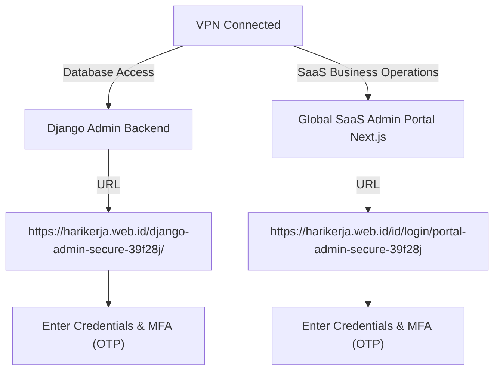

# VPN Connection & Admin Portal Access Guide

This comprehensive guide explains how to configure a private VPN, access the admin portals via a web browser for users, and provides step-by-step instructions for server administrators to set up, configure, and secure the entire private network architecture on the HariKerja HRMS platform.

---

## 1. Introduction & Security Strategy
The HariKerja HRMS platform applies a **Defense in Depth** approach to protect sensitive employee and tenant data. Administrative portals are not exposed directly to the public internet. The three main security layers implemented are:
1. **Private VPN (OpenVPN / WireGuard):** Restricts network access so only IPs within the private VPN subnet (`10.8.0.0/24`) or trusted office public IPs can reach the administrative server ports.
2. **Obfuscated URL (`ADMIN_URL`):** Changes the default administration access endpoint (like `/admin/`) to a dynamic, secret random URL path.
3. **Multi-Factor Authentication (MFA / 2FA):** Requires a 6-digit OTP token challenge after successful password verification.

---

## 2. Client (User) Guide - Configuring VPN on Local Computer

Before accessing the admin portal via the web, you must establish a connection to the HariKerja private VPN network on your local device. Select your operating system below:

### A. Ubuntu / Debian Client (Linux)
Ubuntu supports native private VPN connections via both GNOME Graphical Interface (GUI) and Terminal (CLI).

#### Option 1: Via GUI (Ubuntu Settings) - *Highly Recommended*
1. **Install Dependencies (One-Time Setup):**
   Open your terminal (`Ctrl + Alt + T`) and run the following command to install the OpenVPN integration for GNOME Network Manager:
   ```bash
   sudo apt update
   sudo apt install network-manager-openvpn-gnome -y
   sudo systemctl restart NetworkManager
   ```
2. **Import VPN Profile:**
   * Click the connection status menu at the top-right corner of your screen, then click **Settings** (gear icon).
   * Select the **Network** menu from the left navigation panel.
   * Under the **VPN** section, click the **`+` (Add)** button.
   * Choose the **Import from file...** option at the very bottom of the modal dialog.
   * Browse and select the `.ovpn` profile file provided by your Administrator/DevOps team.
3. **Establish Connection:**
   * Click the connection status menu at the top-right corner again.
   * Click your newly created VPN profile and select **Connect**.

#### Option 2: Via CLI / Terminal (OpenVPN & WireGuard)
* **Using OpenVPN (`.ovpn`):**
  ```bash
  sudo apt update && sudo apt install openvpn -y
  sudo openvpn --config /path/to/your_profile.ovpn
  ```
  *(Keep this terminal open while working. Press `Ctrl + C` to disconnect).*
* **Using WireGuard (`.conf`):**
  ```bash
  sudo apt update && sudo apt install wireguard -y
  sudo cp /path/to/profile.conf /etc/wireguard/wg0.conf
  sudo wg-quick up wg0
  ```
  *(Execute `sudo wg-quick down wg0` in another terminal to disconnect).*

---

### B. Windows Client
1. **Download & Install Client:** Download and install the official [OpenVPN Connect for Windows](https://openvpn.net/client-connect-vpn-for-windows/).
2. **Import Profile:**
   * Launch the **OpenVPN Connect** application.
   * Go to the **File** tab.
   * Drag and drop your `.ovpn` configuration file into the application window, or click **Browse** to select the file manually from your local directory.
3. **Establish Connection:**
   * Click the **Connect** toggle switch (turning from gray to green).
   * A successful connection is indicated by the moving bandwidth statistics graph and a green lock icon.

---

### C. macOS Client
1. **Download & Install Client:** Download and install the official [OpenVPN Connect for macOS](https://openvpn.net/client-connect-vpn-for-mac-os/).
2. **Import Profile:**
   * Open the **OpenVPN Connect** application from your Launchpad or Spotlight.
   * Go to the **File** tab and drag your `.ovpn` file into the designated area.
3. **Establish Connection:**
   * Slide the **Connect** toggle button to the right.
   * If macOS prompts you for permission to add network/VPN configurations, enter your Mac system password and click **Allow**.
   * The status will turn green once successfully connected.

---

## 3. Client (User) Guide - Accessing Admin Portals via Web

Once your VPN connection is active (status shown as **Connected** / Green in your VPN client), you can access the admin portals through your web browser. There are two distinct administrative portals depending on your operational role:



### A. Global SaaS Admin Portal (Frontend Next.js Portal)
This portal is used by **SaaS Superadmins, Customer Support Agents, Finance, and Sales Teams** for day-to-day business operations.

* **Access URLs:** 
  * Indonesian: `https://harikerja.web.id/id/login/portal-admin-secure-39f28j`
  * English: `https://harikerja.web.id/en/login/portal-admin-secure-39f28j`
* **Access & Login Steps:**
  1. Make sure your VPN connection is established.
  2. Open your web browser (Chrome, Firefox, Edge, or Safari) and navigate to the appropriate URL above.
  3. Enter the **Email Address** and **Password** registered for your administrator staff account.
  4. Click **Sign In**.
  5. The system will display the **Multi-Factor Authentication (MFA)** verification page.
  6. Open your authenticator application (such as Google Authenticator or Microsoft Authenticator) on your mobile device.
  7. Enter the **6-digit OTP code** shown for your HariKerja account before it expires.
  8. Upon successful validation, you will be redirected to the Global SaaS Admin Dashboard.

---

### B. Django Admin (Backend Database Console)
This console is strictly limited to **DevOps, Sysadmins, and Lead Backend Developers** for emergency data manipulation or direct database troubleshooting.

* **Access URL:** 
  * `https://harikerja.web.id/django-admin-secure-39f28j/`
* **Access & Login Steps:**
  1. Make sure your VPN connection is established.
  2. Open your web browser and navigate to the secret Django Admin URL above.
  3. Enter the **Username** and **Password** of your staff/DevOps account containing `is_staff` and `is_superuser` privileges.
  4. Click **Log in**.
  5. The **Django OTP (MFA)** verification screen will appear.
  6. Open your authenticator application on your mobile device and enter the **6-digit OTP code** linked to your Django Admin account.
  7. Once verified, you will be granted direct CRUD access to the raw Postgres database tables.

---

### C. Troubleshooting for Clients

* **`403 Forbidden` Error / Page Inaccessible:**
  * *Cause:* Your VPN is disconnected, or the IP you got from your local ISP network is not within the Nginx whitelist range.
  * *Solution:* Check your OpenVPN/WireGuard client. Ensure the connection toggle is green. If using terminal, check that the `openvpn` process is still running. If the issue persists, contact DevOps to check if your current public IP needs to be whitelisted.
* **`502 Bad Gateway` Error:**
  * *Cause:* The Nginx gateway is up, but the backend (Django) or frontend (Next.js) container is stopped or restarting on the server.
  * *Solution:* Contact the server administrator to verify container status using the command `docker compose ps` on the QA server.
* **OTP Code Always Invalid:**
  * *Cause:* Time mismatch (clock desynchronization) between your mobile device and the server (TOTP is highly time-sensitive).
  * *Solution:* Open Google Authenticator -> **Settings** -> **Time correction for codes** -> **Sync now**. Make sure your mobile phone's date/time is set to automatic.

---

## 4. Server Administrator Guide - Setting Up & Securing VPN

As a server administrator (DevOps/Sysadmin), you are responsible for provisioning the VPN server, securely generating and distributing client profiles, and enforcing IP restrictions on web gateway levels.

Below are detailed, step-by-step instructions to configure and secure this architecture on a Linux Ubuntu server:

### Step 1: OpenVPN Server Installation & Configuration
The most secure and efficient way to deploy OpenVPN on Ubuntu is using a standard, automated shell script that configures high-grade encryption automatically.

1. **Download the installation script:**
   ```bash
   curl -O https://raw.githubusercontent.com/angristan/openvpn-install/master/openvpn-install.sh
   chmod +x openvpn-install.sh
   ```
2. **Execute the script as root:**
   ```bash
   sudo ./openvpn-install.sh
   ```
3. **Configure the following parameters during the interactive prompts:**
   * **IP Address:** Select the public IP of your server.
   * **Protocol:** Select **UDP** (faster and more stable for VPN tunneling).
   * **Port:** Keep the default `1194` or change to a custom port for obfuscation.
   * **DNS Resolvers:** Choose a trusted resolver like Cloudflare (`1.1.1.1` and `1.0.0.1`) or Google (`8.8.8.8`).
   * **Encryption / Cipher:** Select the default recommended secure suites (AES-256-GCM / SHA256) for strong security.
4. **Completion:** The script will automatically configure the network interface `tun0`, create the systemd unit `openvpn-server@server.service`, and prompt you to create your first client profile.

---

### Step 2: Client Profile Management (Adding & Revoking Users)
Execute the installation script again to manage VPN clients.

* **Creating a New Client Profile:**
  1. Run the script: `sudo ./openvpn-install.sh`
  2. Select option **1) Add a new user**.
  3. Enter a descriptive client name (e.g., `afdhal-support`).
  4. Choose whether to protect the private key with a passphrase.
  5. The script generates a client configuration file at `/home/user/afdhal-support.ovpn` or `/root/afdhal-support.ovpn`.
  6. Deliver this `.ovpn` file to the user securely via an encrypted channel.

* **Revoking a Client Profile:**
  If a staff member leaves the company or their device is compromised, immediately revoke their access:
  1. Run the script: `sudo ./openvpn-install.sh`
  2. Select option **2) Revoke an existing user**.
  3. Select the name of the user you want to revoke.
  4. Confirm the action. The server will reject any subsequent connection attempts from that profile instantly.

---

### Step 3: Server Firewall Configuration (`ufw`)
To forward traffic from the VPN subnet (`10.8.0.0/24`) to Docker containers, enable IP forwarding and set up NAT masquerading in your UFW configuration.

1. **Enable IP Forwarding:**
   Edit `/etc/sysctl.conf` and ensure the following line is uncommented:
   ```ini
   net.ipv4.ip_forward=1
   ```
   Apply the changes:
   ```bash
   sudo sysctl -p
   ```
2. **Configure NAT Routing in UFW:**
   Open `/etc/ufw/before.rules` with a text editor:
   ```bash
   sudo nano /etc/ufw/before.rules
   ```
   Insert the following lines at the very top of the file, before the `*filter` line:
   ```text
   # NAT rules for OpenVPN
   *nat
   :POSTROUTING ACCEPT [0:0]
   -A POSTROUTING -s 10.8.0.0/24 -o eth0 -j MASQUERADE
   COMMIT
   ```
   *(Note: Replace `eth0` with the actual name of your server's primary network interface, which can be found using `ip route show | grep default`).*

3. **Open Mandatory Ports in the Firewall:**
   ```bash
   sudo ufw allow 1194/udp   # OpenVPN Port
   sudo ufw allow 22/tcp     # SSH (Secure this access!)
   sudo ufw allow 80/tcp     # HTTP (Nginx)
   sudo ufw allow 443/tcp    # HTTPS (Nginx)
   sudo ufw enable
   ```

---

### Step 4: Restricting Ports & Subnets in Nginx Gateway Configuration
This is the most critical step to secure the Django Admin interface. We lock down the access path at the Nginx level using `allow` and `deny` rules.

Open your production/QA Nginx configuration file (e.g., [deploy/qa/nginx.conf](file:///home/afdhal/data/hr/hrms/deploy/qa/nginx.conf#L148-L162)):

```nginx
# Django Admin (Backend DB Console - Secret Static URL with IP/VPN Whitelisting)
location /django-admin-secure-39f28j/ {
    # Whitelist VPN private subnet and local loopback/Docker IPs
    allow 10.8.0.0/24;       # OpenVPN private subnet (Only this IP range is allowed!)
    allow 10.0.0.0/8;        # Internal Docker network
    allow 127.0.0.1;         # Local loopback
    allow 103.197.190.47;    # Authorized developer public IP
    deny all;                # Block all other incoming traffic!

    proxy_pass http://backend_server;
    proxy_set_header Host $host;
    proxy_set_header X-Real-IP $remote_addr;
    proxy_set_header X-Forwarded-For $proxy_add_x_forwarded_for;
    proxy_set_header X-Forwarded-Proto $scheme;
}
```

#### How Nginx Protects the Admin Console:
* When a user attempts to access `https://harikerja.web.id/django-admin-secure-39f28j/` without their VPN active, Nginx detects their public IP (e.g. `114.122.x.x`). Since this IP is not whitelisted via an `allow` directive, Nginx blocks the connection and responds with a **`403 Forbidden`** error.
* Once the VPN is connected, the request is encapsulated and decrypted at the VPN gateway. Nginx reads the client IP as a private address `10.8.0.x`. Nginx matches this with the `allow 10.8.0.0/24;` rule and safely routes the request to the Django container.

---

### Step 5: VPN Server Hardening & Monitoring (Best Practices)

To maintain maximum server integrity, enforce the following operations regularly:

1. **Rotate Cryptographic Keys (SSL/TLS):**
   Rotate the server's security certificates and CA keys at least once a year. The `openvpn-install.sh` uses secure Elliptic Curve parameters by default, but monitoring the certificate expiration date is required.
2. **Perform Regular VPN Log Audits:**
   Track successful logins and connection timestamps. Read OpenVPN logs using journalctl or tail the log file:
   ```bash
   sudo tail -f /var/log/openvpn/openvpn.log
   # Or via systemd journal:
   sudo journalctl -u openvpn-server@server -n 100 -f
   ```
   Audit logs for anomalies like repetitive authentication failures or active connections outside working hours.
3. **Enforce MFA for SSH Terminal Access:**
   In addition to web-based portal protections, secure raw terminal access to the host server using SSH Keys (disabling password authentication) and consider configuring PAM-based MFA using `google-authenticator-libpam`.

---

## 5. Quick Summary of Access Permissions & Configuration

| Parameter | Django Admin | Global SaaS Admin Portal |
| :--- | :--- | :--- |
| **System Layer** | Backend Console (Django) | Frontend Portal (Next.js) |
| **URL Path (QA/Prod)** | `/django-admin-secure-39f28j/` | `/id/login/portal-admin-secure-39f28j` |
| **Network Protection** | Private VPN Subnet & Nginx Whitelist | Server-side RBAC & MFA Controls |
| **Credentials** | DB Staff Account (`is_staff=True`) | Global Admin Account (`is_global_admin=True`) |
| **MFA Method** | Google Authenticator (TOTP) | Google Authenticator (TOTP) |
| **Primary Audience** | DevOps & Core Devs (Debugging) | Operational, Support, & Finance Staff (Daily Tasks) |

---
*This document is a part of the official HariKerja HRMS technical specifications documentation.*
