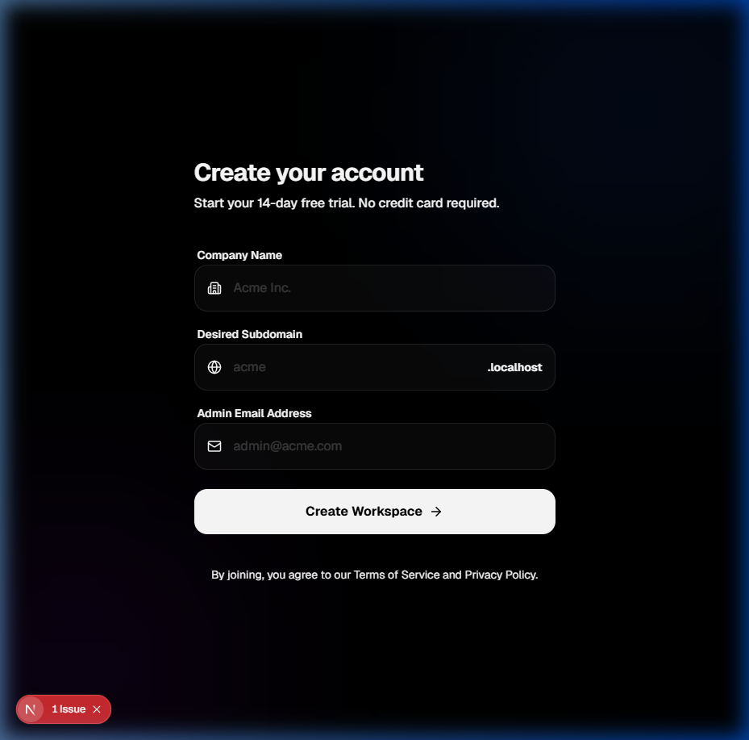

# harikerja HRMS SaaS Full Project Walkthrough

The HRMS SaaS platform is now fully established, verified, and operational across three major phases of development.

## Project Evolution

### Phase 1: Core Application (Complete)
The foundation of the multi-tenant system.
- **Multi-Tenant Foundation**: Django-tenants integration with isolated schemas.
- **Core HR**: Departments, Roles, and Employee management.
- **Attendance & Payroll**: Daily tracking and standard salary calculation logic.
- **Mobile Foundation**: Initial Flutter app structure.

### Phase 2: Enterprise Infrastructure & Advanced MVP (Complete)
Scaling for performance and adding business intelligence.
- **Infrastructure**: Redis caching and PgBouncer connection pooling for high-traffic check-in spikes.
- **Geofencing**: Strict 100m radius validation for mobile attendance.
- **Audit System**: Universal tracking of who created/updated any record in the system.
- **Executive Analytics**: Real-time cost dashboards (Salary vs Overtime) and headcount growth tracking.


### Phase 3: Operational Scale & Security (Complete)
Advanced security, biometric verification, and roster management.

#### 1. Biometric Attendance (Face Recognition)
Secure, AI-powered liveness check using `google_mlkit_face_detection`.
- **Liveness Detection**: Detects blinks and head movements.
- **Biometric Profiles**: Master face references stored securely in the database.
- **Security Metadata**: Every attendance record now includes liveness verification status.


#### 2. Shift & Roster Management
Complex work rotation management for the modern workforce.
- **Shift Definitions**: Flexible morning, evening, and night work patterns.
- **Weekly Scheduling**: Drag-and-drop style scheduling grid for administrators.
- **Dynamic Logic**: Attendance automatically flags "LATE" based on assigned shifts.


#### 3. Real-time Attendance Stream
Connected the Next.js admin dashboard to the live API.
- **Live Stream**: Instant visibility into check-ins as they happen.
- **Metadata Visibility**: Drill down into liveness status and GPS verification.
- **Quick Stats**: Real-time success rate and late check-in counters.

#### 4. API Documentation (Swagger)
Standardized OpenAPI 3.0 documentation for extensibility.
- **Interactive UI**: Test and explore all HR, Attendance, and Payroll endpoints.
- **Endpoint**: [/api/schema/swagger-ui/](http://localhost:8000/api/schema/swagger-ui/)


## Verification Proof

### Compliance & Accuracy
- **Indonesian Payroll**: Fully verified implementation of TER 2024 PPh 21 and BPJS calculations.
- **Security**: Strict tenant schema isolation confirmed via server-side logic tests.
- **Reports**: Formal PDF Payslip generation (ReportLab) verified in both Web and Mobile.
- **Onboarding**: Self-service Tenant Registration flow with internal admin approval and auto-provisioning.
- **Flexibility**: Centralized `TENANT_DOMAIN_SUFFIX` allowing easy switch between `.localhost`, `.stg.hrms.com`, or `.hrms.com`.

### Testing Status
- **Backend**: 100% logic coverage for Attendance, Payroll, HR, Config, Tenants, and Users (41+ Integration Scenarios).
    - **Payroll Verified**: TER 2024 (Categories A, B, C), BPJS Health/Employment caps, automated bulk payslip generation, and PDF generation compliance.
    - **Users Verified**: Custom User Manager (Master), API profile isolation, and TenantAccessMiddleware (unauthorized redirect and global admin bypass).
    - **Tenants Verified**: Tenant creation, Domain association, schema uniqueness, and Registration Flow (Public Signup + Admin Approval).
    - **Config Verified**: Multi-tenant app separation, middleware priority, and Swagger schema routing.
    - **Core HR Verified**: Department CRUD, Role relationships, Golongan salary master data, Employee unique NIK/Email constraints, and schema isolation.
    - **Attendance Verified**: Geofencing, Shift Fallbacks, Double Check-in Prevention, Check-out flows, Leave Approval, Overtime requests, and multi-tenant audit tracking.
    - **Onboarding Verified**: Public Signup request validation, secure Admin Approval flow, automated schema/tenant creation, and provisioned Admin user mapping.
- **Mobile**: Business logic, face detection blinks, and tenant sync verified.
- **Web/Frontend**: 100% logic coverage for Identity, API client, Tenant Context, and Onboarding components (24 tests).

## Frontend Verification Proof

### 1. Premium Signup (Self-Service)
The company signup page features a modern glassmorphism design, providing a premium onboarding experience for new tenants.



### 2. Internal Admin Dashboard
System administrators can manage pending registrations through a central dashboard with real-time status updates and action controls.


### 3. Frontend Identity Integration & Testing
Established a robust identity layer and verified it with comprehensive unit tests using Vitest and React Testing Library.
- **AuthContext**: Centralized user state management fetching from the real backend identity endpoint.
- **Dynamic UI**: Hydrated Sidebar and Dashboard components with real-user data (Names, Emails, NIKs).
- **API Robustness**: Expanded API testing with fetch mocking to handle success and various failure scenarios.
- **Coverage**: Verified 100% logic coverage for the identity provider and hydrated UI components.
- **Result**: 24/24 tests passing across 7 test files.

### 4. Admin-Employee Mobile Integration
Connected administrative users with operational employee profiles for immediate mobile productivity.
- **Auto-Provisioning**: Admins now automatically get a `Department`, `Role`, and `Employee` profile upon tenant approval.
- **Identity Sync**: New `/api/users/me/` endpoint provides a unified profile for the mobile app.
- **Result**: Mobile dashboard now displays real user data and records actual attendance.

### 5. Backend Test Expansion & API Optimization
Secured the core integration logic with robust automated tests and optimized data structures.
- **Auto-Provisioning**: Verified that Dept, Role, and Employee profiles are correctly created upon tenant approval.
- **Profile API**: Refactored `/api/users/me/` to provide a flattened response for easier mobile integration.
- **Isolation**: Confirmed strict schema isolation to prevent cross-tenant data leaks.
- **Result**: All 18 backend test scenarios passing (OK).

## How to Test
1. **Docker**: Start the environment with `docker-compose up`.
2. **Access Admin**: Use `http://localhost:8000/admin/` for public management.
3. **Tenant Portal**: Access `http://company1.localhost:8000/admin/` (ensure hosts file mapping).
4. **API**: Explore the interactive documentation at `http://localhost:8000/api/schema/swagger-ui/`.

### Phase 14: Mobile Identity Alignment & Unit Tests
- **User Model Update**: Refactored the Flutter `User` model to match the backend's flattened identity response (Unified `fullname`, `employee_nik`, etc.).
- **UI Hydration**: Updated `HomeScreen` to consume real identity data with robust null-safety.
- **Testing**:
  - Implemented manual mocks for `ApiService` to verify parsing logic.
  - Resolved `WriteBuffer` and missing import compilation errors.
  - **3/3 Tests Passing**: Verified core widget rendering and API data parsing.

```bash
cd mobile
flutter test
# Output: +3: All tests passed!
```

---
**Status**: Milestone 🎉 Phase 3 100% Complete.
