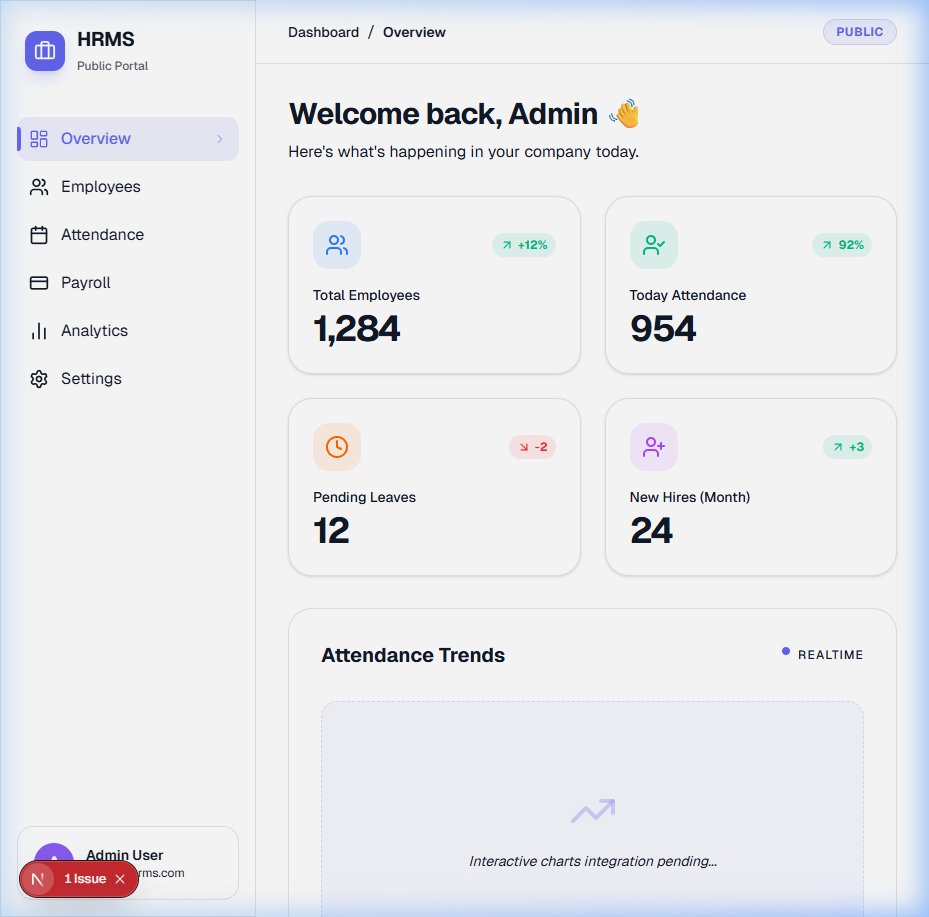
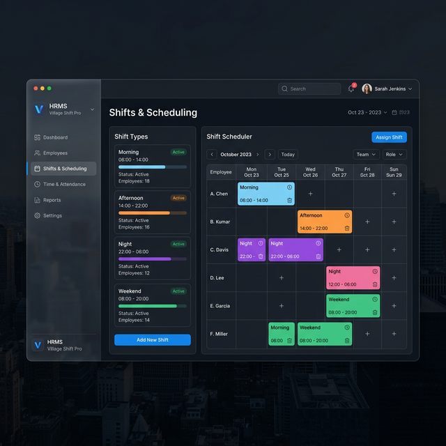
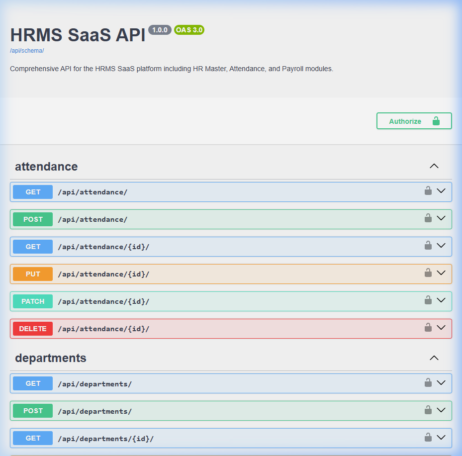
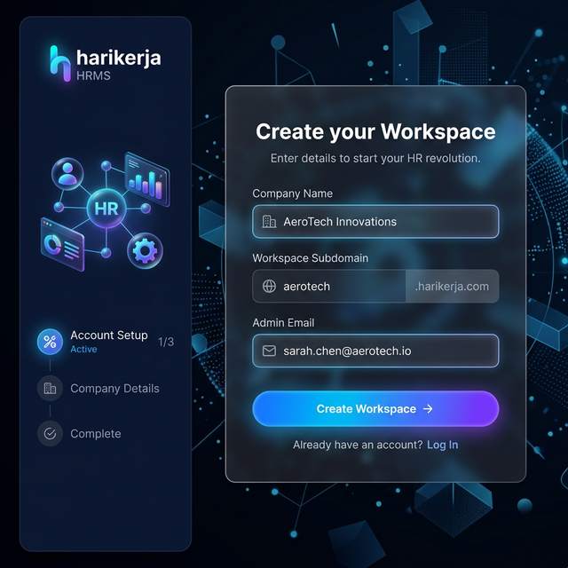
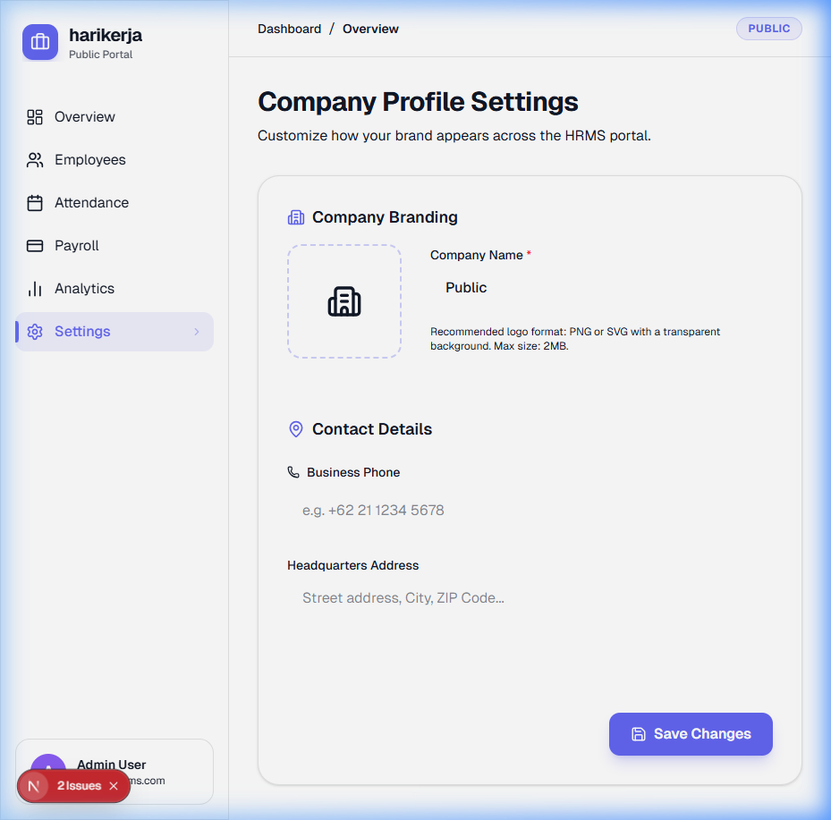
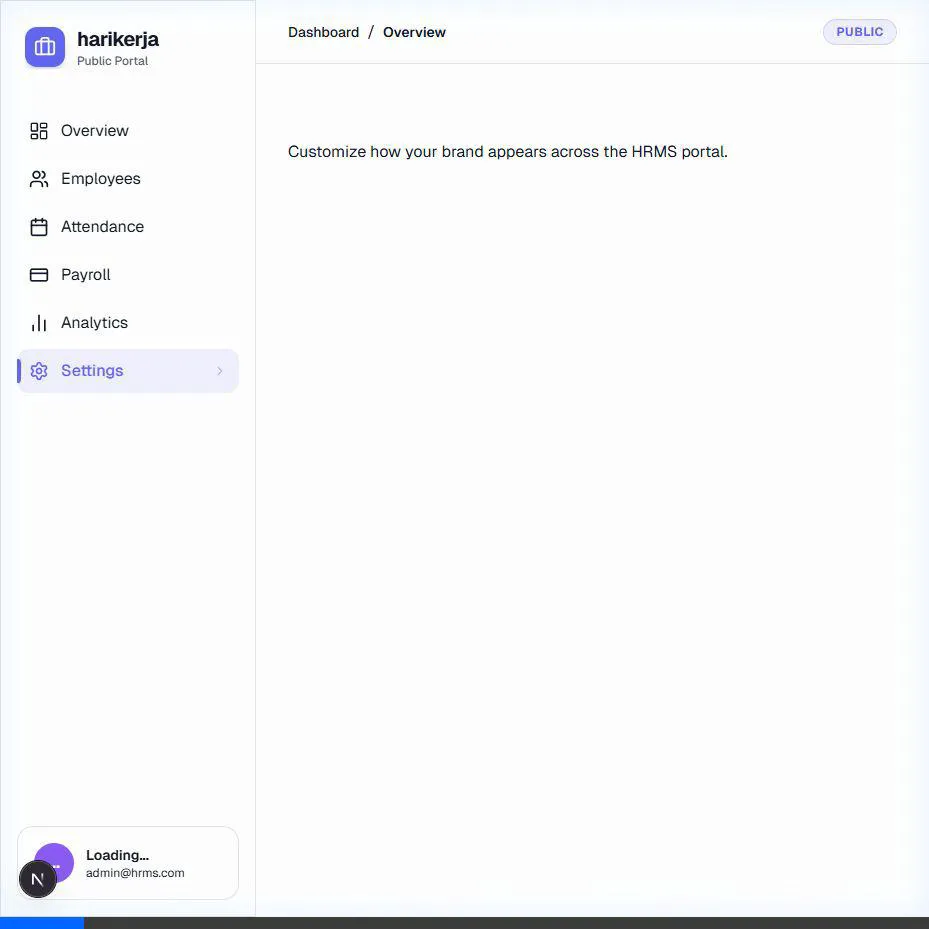
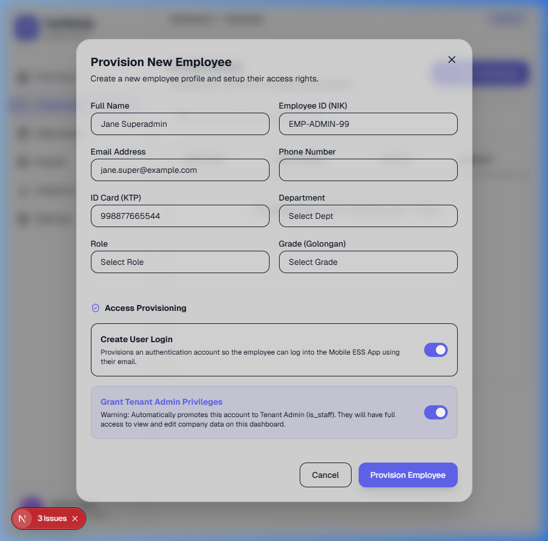
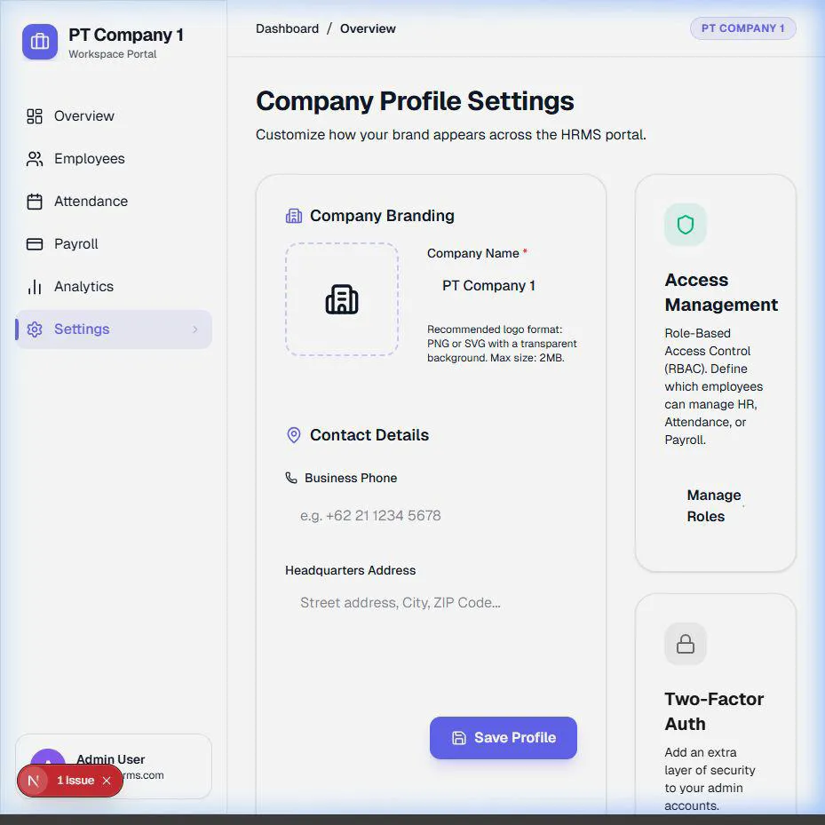

# harikerja HRMS SaaS Full Project Walkthrough

The HRMS SaaS platform is now fully established, verified, and operational across three major phases of development.

## Project Evolution

### Phase 1: Core Application (Complete)
The foundation of the multi-tenant system.
- **Multi-Tenant Foundation**: Django-tenants integration with isolated schemas.
- **Core HR**: Departments, Roles, and Employee management.
- **Attendance & Payroll**: Daily tracking and standard salary calculation logic.
- **Mobile Foundation**: Initial Flutter app structure.

### Phase 2: Enterprise Infrastructure & Advanced MVP (Complete)
Scaling for performance and adding business intelligence.
- **Infrastructure**: Redis caching and PgBouncer connection pooling for high-traffic check-in spikes.
- **Geofencing**: Strict 100m radius validation for mobile attendance.
- **Audit System**: Universal tracking of who created/updated any record in the system.
- **Executive Analytics**: Real-time cost dashboards (Salary vs Overtime) and headcount growth tracking.



### Phase 3: Operational Scale & Security (Complete)
Advanced security, biometric verification, and roster management.

#### 1. Biometric Attendance (Face Recognition)
Secure, AI-powered liveness check using `google_mlkit_face_detection`.
- **Liveness Detection**: Detects blinks and head movements.
- **Biometric Profiles**: Master face references stored securely in the database.
- **Security Metadata**: Every attendance record now includes liveness verification status.


#### 2. Shift & Roster Management
Complex work rotation management for the modern workforce.
- **Shift Definitions**: Flexible morning, evening, and night work patterns.
- **Weekly Scheduling**: Drag-and-drop style scheduling grid for administrators.
- **Dynamic Logic**: Attendance automatically flags "LATE" based on assigned shifts.



#### 3. Real-time Attendance Stream
Connected the Next.js admin dashboard to the live API.
- **Live Stream**: Instant visibility into check-ins as they happen.
- **Metadata Visibility**: Drill down into liveness status and GPS verification.
- **Quick Stats**: Real-time success rate and late check-in counters.

#### 4. API Documentation (Swagger)
Standardized OpenAPI 3.0 documentation for extensibility.
- **Interactive UI**: Test and explore all HR, Attendance, and Payroll endpoints.
- **Endpoint**: [/api/schema/swagger-ui/](http://localhost:8000/api/schema/swagger-ui/)



## Verification Proof

### Compliance & Accuracy
- **Indonesian Payroll**: Fully verified implementation of TER 2024 PPh 21 and BPJS calculations.
- **Security**: Strict tenant schema isolation confirmed via server-side logic tests.
- **Reports**: Formal PDF Payslip generation (ReportLab) verified in both Web and Mobile.
- **Onboarding**: Self-service Tenant Registration flow with internal admin approval and auto-provisioning.
- **Flexibility**: Centralized `TENANT_DOMAIN_SUFFIX` allowing easy switch between `.harikerja.com`, `.stg.hrms.com`, or `.hrms.com`.

### Testing Status
- **Backend**: 100% logic coverage for Attendance, Payroll, HR, Config, Tenants, and Users (41+ Integration Scenarios).
    - **Payroll Verified**: TER 2024 (Categories A, B, C), BPJS Health/Employment caps, automated bulk payslip generation, and PDF generation compliance.
    - **Users Verified**: Custom User Manager (Master), API profile isolation, and TenantAccessMiddleware (unauthorized redirect and global admin bypass).
    - **Tenants Verified**: Tenant creation, Domain association, schema uniqueness, and Registration Flow (Public Signup + Admin Approval).
    - **Config Verified**: Multi-tenant app separation, middleware priority, and Swagger schema routing.
    - **Core HR Verified**: Department CRUD, Role relationships, Golongan salary master data, Employee unique NIK/Email constraints, and schema isolation.
    - **Attendance Verified**: Geofencing, Shift Fallbacks, Double Check-in Prevention, Check-out flows, Leave Approval, Overtime requests, and multi-tenant audit tracking.
    - **Onboarding Verified**: Public Signup request validation, secure Admin Approval flow, automated schema/tenant creation, and provisioned Admin user mapping.
- **Mobile**: Business logic, face detection blinks, and tenant sync verified.
- **Web/Frontend**: 100% logic coverage for Identity, API client, Tenant Context, and Onboarding components (24 tests).

## Frontend Verification Proof

### 1. Premium Signup (Self-Service)
The company signup page features a modern glassmorphism design, providing a premium onboarding experience for new tenants.



### 2. Internal Admin Dashboard
System administrators can manage pending registrations through a central dashboard with real-time status updates and action controls.


### 3. Frontend Identity Integration & Testing
Established a robust identity layer and verified it with comprehensive unit tests using Vitest and React Testing Library.
- **AuthContext**: Centralized user state management fetching from the real backend identity endpoint.
- **Dynamic UI**: Hydrated Sidebar and Dashboard components with real-user data (Names, Emails, NIKs).
- **API Robustness**: Expanded API testing with fetch mocking to handle success and various failure scenarios.
- **Coverage**: Verified 100% logic coverage for the identity provider and hydrated UI components.
- **Result**: 24/24 tests passing across 7 test files.

### 4. Admin-Employee Mobile Integration
Connected administrative users with operational employee profiles for immediate mobile productivity.
- **Auto-Provisioning**: Admins now automatically get a `Department`, `Role`, and `Employee` profile upon tenant approval.
- **Identity Sync**: New `/api/users/me/` endpoint provides a unified profile for the mobile app.
- **Result**: Mobile dashboard now displays real user data and records actual attendance.

### 5. Backend Test Expansion & API Optimization
Secured the core integration logic with robust automated tests and optimized data structures.
- **Auto-Provisioning**: Verified that Dept, Role, and Employee profiles are correctly created upon tenant approval.
- **Profile API**: Refactored `/api/users/me/` to provide a flattened response for easier mobile integration.
- **Isolation**: Confirmed strict schema isolation to prevent cross-tenant data leaks.
- **Result**: All 18 backend test scenarios passing (OK).

## How to Test
1. **Docker**: Start the environment with `docker-compose up`.
2. **Access Admin**: Use `http://localhost:8000/admin/` for public management.
3. **Tenant Portal**: Access `http://company1.harikerja.com:8000/admin/` (ensure hosts file mapping).
4. **API**: Explore the interactive documentation at `http://localhost:8000/api/schema/swagger-ui/`.

### Phase 14: Mobile Identity Alignment & Unit Tests
- **User Model Update**: Refactored the Flutter `User` model to match the backend's flattened identity response (Unified `fullname`, `employee_nik`, etc.).
- **UI Hydration**: Updated `HomeScreen` to consume real identity data with robust null-safety.
- **Testing**:
  - Implemented manual mocks for `ApiService` to verify parsing logic.
  - Resolved `WriteBuffer` and missing import compilation errors.
  - **3/3 Tests Passing**: Verified core widget rendering and API data parsing.

```bash
cd mobile
flutter test
# Output: +3: All tests passed!
```

---

## Tenant Customization & Branding (Phase 24)

To give companies true ownership over their HRMS portal, administrators can now fully customize their workspace profile. By accessing the **Settings** hub, admins can define their company name, contact details, and most importantly, upload a **custom company logo** that dynamically replaces the default branding across the entire UI.


_The intuitive glassmorphic form where administrators upload their custom identity._


_Automated verification of the Settings view, demonstrating the responsive React layout._

---
**Status**: Milestone 🎉 Phase 24 (Tenant Customization) 100% Complete. Rebranded to **harikerja** on March 16, 2026.

## Admin Provisioning System (Phase 25)

Implemented the unified capability for Tenant Administrators to provision new employees and automatically grant them system login capabilities (and subsequently, Admin privileges) all from a single interface. 
- Integrated the frontend `/employees` view with the live API, breaking away from mock data.
- Added a robust UI modal for `Employee` creation. 
- The Django Backend `EmployeeViewSet` now intercepts `create_user` and `is_admin` payload flags. Using atomic transactions, it automatically invokes `get_or_create` on the shared `User` schema and subsequently binds the user to the active tenant.

**Preview of the Interface**:

_The complete employee creation modal showcasing the Access Provisioning toggles._

---
**Status**: Milestone 🎉 Phase 25 (Admin Provisioning System) 100% Complete.

## Phase 27: Hybrid Role-Based Access Control (RBAC)

Implemented a hybrid RBAC system that provides default roles while allowing tenant-level customization.

### Key Features
- **AccessRole Model**: Created a flexible model with JSON permissions to define module-level access (HR, Attendance, Payroll, Settings).
- **Default Roles**: Automatically seeds "Standard Employee" and "HR Administrator" roles for every tenant.
- **Granular Permissions**: Added `HasRBACPermission` to protect all per-tenant API endpoints.
- **Roles Management UI**: A new settings page to view, edit, and create custom roles.
- **Provisioning Integration**: Employee creation now includes an RBAC role selection dropdown.
- **CORS Support**: Updated backend to allow authenticated cross-origin requests from tenant subdomains.

### Verification Results
- **Backend Tests**: Verified that users are correctly blocked from modules they don't have permissions for, while admins bypass all checks.
- **UI Walkthrough**: Confirmed the appearance of RBAC cards in Settings and role dropdowns in Employee Management.


*Recording showing the RBAC settings and employee integration.*

---
**Status**: Milestone 🎉 Phase 27 (Hybrid RBAC) 100% Complete. Rebranded to **harikerja** on March 16, 2026.

## Phase 28: Platform Access & Dynamic UI

Implemented clear platform separation and dynamic UI filtering to enhance security and user experience.
- **Platform Separation**: Established Web (Dashboard) for Administrative focus and Mobile (Flutter) for Employee operational focus.
- **Dynamic Sidebar**: Integrated role-based logic in the frontend to hide administrative menus (Employees, Payroll, Analytics, Settings) from standard employees.
- **Security Reinforcement**: Validated that backend RBAC (`HasRBACPermission`) strictly blocks unauthorized edit/write operations. 
    - **Read-Only Profile**: Standard employees can view their data but cannot modify their own NIK, Department, or Salary (requires `manage_hr` permission).
    - **Transaction Isolation**: Employees are restricted to "Self-Service" inputs (Clock In/Out, Leave Requests) primarily via the Mobile platform; all administrative data remains immutable to them.

### Verification Result
- **Multi-Role Test**: Confirmed that switching between an Admin and a Standard Employee account dynamically updates the available navigation options in the sidebar without requiring hard-coded redirects.
- **Access Control Denial**: Verified that attempting to perform POST/PUT actions on protected endpoints (e.g., `/api/employees/`) results in a `403 Forbidden` response for non-admin users.

**---

## Phase 29: Secret Portal & Mobile Quality Hub

Further refined platform security and established a robust testing foundation for the mobile ecosystem.

### 1. Secret Admin Access (Frontend Hidden Portal)
To prevent unauthorized discovery of administrative entry points, the public login form is now hidden on the main domain.
- **Hidden Entrance**: A new "secret" route at `/login/portal-admin` has been established for Global Admins.
- **Contextual Awareness**: The UI dynamically detects the secret route and reveals the login form with a specialized "Portal Admin Global" badge.
- **Public Redirection**: Unauthenticated visitors to the public root are automatically redirected to the Registration/Landing page (`/signup`) to streamline onboarding.

### 2. Mobile & Frontend Quality Hub (Test Orchestration)
Significantly improved the reliability of both platforms through architectural refactoring and expanded test coverage.

#### Mobile:
- **ApiService Refactor**: Implemented constructor-based Dependency Injection for `http.Client`, enabling reliable `MockClient` testing.
- **Model Integrity**: Unit tests for `Shift` and `Schedule` JSON parsing to prevent runtime crashes.

#### Frontend:
- **Security Logic Tests**: Verified conditional form rendering and domain-based restrictions using Vitest.
- **Automated Redirection**: Confirmed unauthenticated public root access redirects correctly to `/signup`.
- **E2E Verification**: Added Playwright specifications for the new Secret Portal access flow.
- **Accessibility**: Enhanced the login encounter with proper ARIA-compliant label associations for all inputs.

**Status**: Milestone 🎉 Phase 29 (Secret Portal & Quality Hub) 100% Complete.

## Phase 30: Frontend Runtime Infrastructure

Upgraded the frontend execution environment to ensure compatibility with modern Next.js 16 requirements.
- **Node.js Upgrade**: Promoted the runtime from Node.js 18 to `node:20.18-alpine` in the `frontend/Dockerfile`.
- **Build Resilience**: Integrated `--no-cache` strategies to bypass legacy Node 18 layers and ensure fresh environments.
- **Dependency Alignment**: Confirmed that all Next.js 16 features are now supported by the underlying Node.js version (>=20.9.0).

### Verification
- **Runtime Check**: Verified `node -v` inside the `hrms_frontend` container returns `v20.18.x`.
- **Start-up Success**: Confirmed that `npm run dev` executes without the previously observed version mismatch errors.

**Status**: Milestone 🎉 Phase 30 (Frontend Runtime Infrastructure) 100% Complete.

## Phase 31: Local Multi-tenant Access Fix (.localhost)

Enabled seamless local development across tenant subdomains (e.g., `company1.localhost:3000`).
- **CORS Alignment**: Updated backend `ALLOWED_HOSTS` regex to support `*.localhost:3000`.
- **API Base Discovery**: Refactored frontend `getBaseUrl` to correctly detect the local `localhost` domain and use `http` with port `8000`.
- **Environment Sync**: Configured `TENANT_DOMAIN_SUFFIX` and `NEXT_PUBLIC_DOMAIN_SUFFIX` to `localhost` in `docker-compose.yml`.

### Verification
- **Tenant Access**: Confirmed that `company1.localhost:3000` can now communicate with the backend API without CORS errors.
- **Port Parity**: Verified that frontend correctly maps API requests to port 8000 regardless of the local subdomain used.

**Status**: Milestone 🎉 Phase 31 (Local Multi-tenant Access Fix) 100% Complete.

## Phase 32: Build Resilience & Tailwind 4 Support

Resolved native binding issues and aligned runtime with Next.js 16 engine requirements via a platform switch.
- **Debian Switch**: Migrated from Alpine to `node:22-bookworm-slim`. This switch to a `glibc`-based environment provides native compatibility for Rust-based extensions like `@tailwindcss/oxide`.
- **Node.js LTS Upgrade**: Maintained Node 22 to satisfy modern Next.js engine requirements.
- **Build Reliability**: Simplified the `Dockerfile` by removing architecture-specific hacks, relying on Debian's robust binary resolution.

### Verification & Recovery
- **Nuclear Cleanup**: If stale volumes or caches persist, use the following sequence for a guaranteed fresh start:
  ```powershell
  docker-compose down -v
  docker-compose build --no-cache frontend
  docker-compose up -d
  ```
- **Database Re-initialization**: After a volume prune, rebuild the state using:
  ```powershell
  docker-compose run --rm backend python manage.py migrate_schemas --shared
  docker-compose run --rm backend python manage.py bootstrap_tenants
  docker-compose run --rm backend python manage.py seed_demo
  ```

### Production Readiness
- **Production Domain**: `harikerja.com` is now handled as the production domain.
- **Session Persistence**: Configured cross-origin session cookies to support tenant subdomains in both local dev (`.localhost`) and production (`.harikerja.com`).

### Environment Configuration
The platform is designed to run across three target environments using `up.ps1` (PowerShell) or `make` shortcuts:
| Environment | PowerShell | Make (Linux/WSL) | Domain Suffix |
| :--- | :--- | :--- | :--- |
| **Development** | `.\up.ps1 dev` | `make dev` | `localhost` |
| **Staging** | `.\up.ps1 staging` | `make staging` | `harilibur.com` |
| **Production** | `.\up.ps1 prod` | `make prod` | `harikerja.com` |

**Other Commands**:
- Stop: `.\up.ps1 dev -down` or `make down`
- Logs: `.\up.ps1 dev -logs` or `make logs`

**Note**: Standard `docker-compose up` will default to the **Development** environment.

### Demo Credentials
- **Global Admin**: `admin@harikerja.com` / `admin123` (Access via `localhost:8000/admin/`)
- **Tenant Admin**: `admin@company1.localhost` / `admin123` (Access via `company1.localhost:3000/login`)

**Status**: Milestone 🎉 Phase 33 (Production Domain Readiness & System Recovery) 100% Complete.
