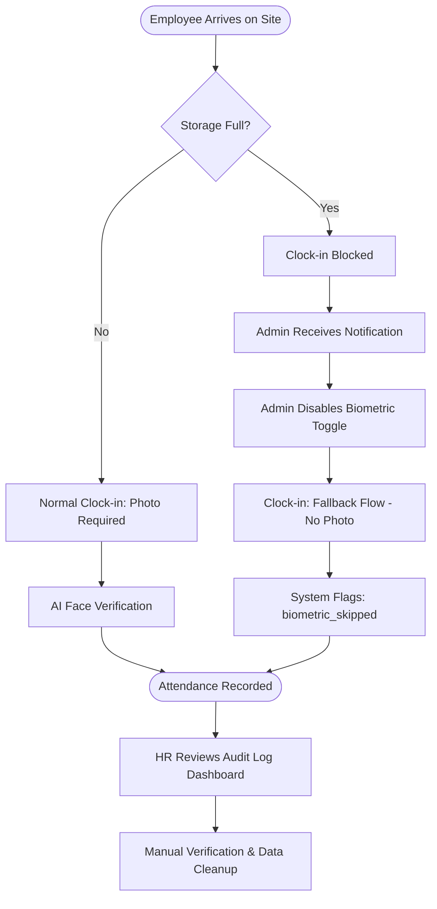

# Walkthrough: HRMS Attendance & Payroll Overhaul

This document summarizes the major enhancements made to the HRMS Attendance and Payroll modules to improve operational flexibility, data integrity, and auditing capabilities.

## 1. Integrated Policy Configuration
Administrators can now configure organizational policies directly from the **Settings** page. These settings are globally applied to the calculation engines.
- **Lateness & Absence Deductions**: Fixed deduction rates that are automatically consumed by the Payroll Calculator to adjust net salaries.
- **Custom Approval Levels**: Granular control over approval hierarchies for Leave, Overtime, and Reimbursements (e.g., Supervisor-only, HR-only, or Both).
- **Emergency Biometric Toggle**: A fail-safe mechanism to allow clock-ins without photos if the tenant's storage quota is exceeded.

## 2. Automated Attendance Intelligence
To ensure data accuracy without manual intervention:
- **Auto-Recalculation**: When an Attendance Correction Request is approved, the system automatically recalculates the status (e.g., from `LATE` to `PRESENT`) based on the new timestamps.
- **Biometric Audit Trail**: Any attendance entry performed while the biometric requirement is disabled is automatically flagged as `biometric_skipped: true`.

## 3. Dedicated Audit Dashboard
A new **Audit Log** interface is available in the Attendance module for HR Managers to review "flagged" attendance records.
- **Transparency**: Highlighting records that bypassed AI face verification for manual verification.
- **Real-time Monitoring**: Summary statistics for skipped records and period coverage.

## 4. Technical Reliability
- **Comprehensive Unit Tests**: New automated tests in `backend/attendance/tests/test_biometric_fallback.py` verify the integrity of the fallback logic.
- **Global Test Fix**: Stabilized the testing environment by resolving 301 Redirect issues related to SSL enforcement during unit tests.

---

## Operational Preview (Emergency Fallback)

The following visualization illustrates how the system handles attendance when storage capacity reaches its limit:

## Related Documents
- [Integrated Operations Workflow](file:///home/afdhal/data/hr/hrms/docs/hrms_operations_workflow.md)
- [Unit Test Case](file:///home/afdhal/data/hr/hrms/backend/attendance/tests/test_biometric_fallback.py)

---
*Created on: 2026-04-19*
