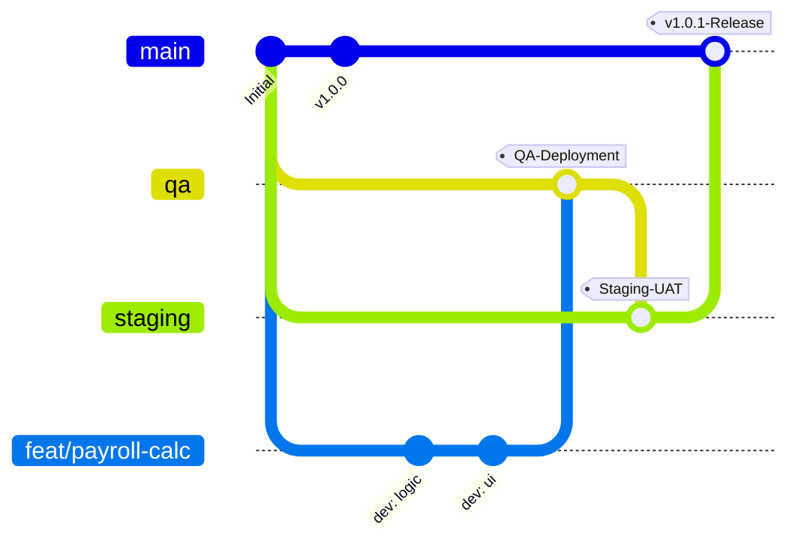
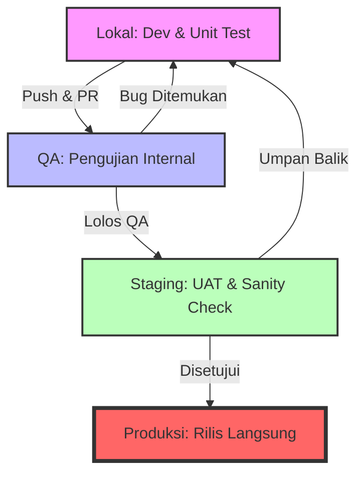
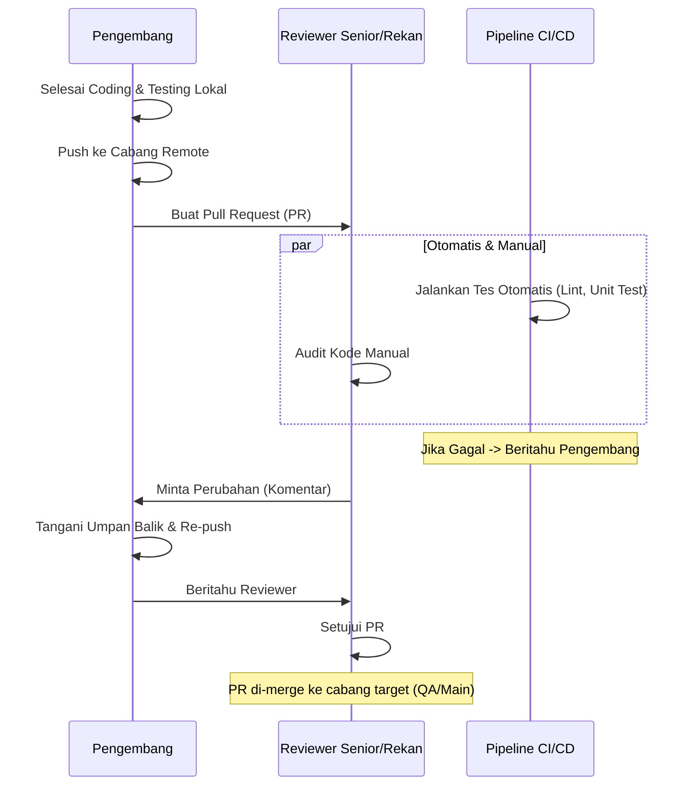

# Alur Kerja Penyebaran dan Manajemen Percabangan HRMS

Dokumen ini menguraikan prosedur operasi standar untuk manajemen kode sumber, pipeline penyebaran dari lokal ke produksi, dan penanganan fitur baru atau perbaikan bug.

## 1. Strategi Percabangan (Git Flow)

Kami mengikuti pendekatan yang terinspirasi dari Git Flow yang memprioritaskan stabilitas di cabang utama (`main`) sambil menyediakan lingkungan khusus untuk pengujian dan verifikasi.

### Struktur Cabang Utama
*   **`main`**: Cabang produksi. Kode di sini harus selalu stabil dan siap rilis. Setiap merge ke cabang ini memicu penyebaran ke lingkungan **Produksi**.
*   **`staging`**: Cabang pra-produksi/User Acceptance Testing (UAT). Digunakan untuk validasi akhir sebelum rilis publik. Disinkronkan dengan server **Staging**.
*   **`qa`**: Cabang Penjaminan Kualitas (QA) untuk pengujian internal. Fitur baru di-merge ke sini terlebih dahulu untuk verifikasi QA. Disinkronkan dengan server **QA**.

### Cabang Pendukung
*   **`feat/NAMA-FITUR`**: Digunakan untuk mengembangkan fitur baru (misal, `feat/payroll-calculator`).
*   **`fix/ID-ISU`**: Digunakan untuk perbaikan bug (misal, `fix/login-error`).
*   **`hotfix/ISU-MENDESAK`**: Perbaikan darurat kritis yang dibuat langsung dari `main` untuk menangani masalah produksi.

### Visualisasi Percabangan


---

## 2. Pipeline Penyebaran (Lokal -> QA -> Staging -> Prod)

### Langkah Detail:

1.  **Lokal (Pengembangan)**:
    *   Pengembang membuat cabang baru dari `main` (atau `qa` tergantung kebijakan tim).
    *   Mengimplementasikan kode dan melakukan unit testing secara lokal.
    *   Memastikan aplikasi berjalan dengan benar dengan konfigurasi lingkungan lokal.

2.  **QA (Penjaminan Kualitas)**:
    *   Pengembang melakukan push cabang ke repositori remote.
    *   Membuat Pull Request (PR) ke cabang `qa`.
    *   Setelah PR disetujui dan di-merge, CI/CD menyebarkan kode ke **Server QA**.
    *   Tim QA melakukan pengujian fungsional, integrasi, dan regresi.

3.  **Staging (UAT)**:
    *   Setelah lolos QA, cabang `qa` di-merge ke cabang `staging`.
    *   Penyebaran otomatis ke **Server Staging**.
    *   Pemangku kepentingan (Product Manager/Klien) melakukan User Acceptance Testing (UAT) akhir.

4.  **Produksi**:
    *   Setelah persetujuan UAT, cabang `staging` di-merge ke cabang `main`.
    *   Sebuah `Git Tag` dibuat (misal, `v1.1.0`).
    *   Kode disebarkan ke **Server Produksi**.

### Diagram Alur Penyebaran


---

## 3. Manajemen Tiket dan Fitur

Untuk setiap tiket (Jira/GitHub Issue) atau fitur baru, ikuti prosedur ini:

1.  **Analisis Tiket**: Pahami persyaratan dan Kriteria Penerimaan (Acceptance Criteria).
2.  **Percabangan**: Buat cabang dengan format `feat/id-tiket-judul` atau `fix/id-tiket-judul`.
    ```bash
    git checkout main
    git pull origin main
    git checkout -b feat/HR-123-payroll-export
    ```
3.  **Pengembangan**: Tulis kode modular. Lakukan commit sesering mungkin dengan pesan deskriptif.
4.  **Pengujian**: Jalankan rangkaian tes sebelum melakukan push.
    *   Backend: `pytest`
    *   Frontend: `npm test` atau `vitest`

---

## 4. Proses Tinjauan Kode (Code Review)

Tinjauan kode adalah langkah kritis untuk menjaga kualitas kode dan berbagi pengetahuan.

### Aturan Pull Request (PR):
*   **Deskripsi Jelas**: Jelaskan apa yang diubah, mengapa, dan cara mengujinya. Tautkan ke Tiket/Isu yang relevan.
*   **Bukti Visual**: Lampirkan tangkapan layar atau rekaman layar (Loom/GIF) untuk perubahan UI/UX apa pun.
*   **Pemeriksaan Otomatis**: PR tidak dapat di-merge jika pipeline CI/CD (Lint, Unit Test) gagal.
*   **Pemilihan Reviewer**: Setidaknya satu Pengembang Senior atau Tech Lead harus disertakan dalam peninjau.
*   **Ambang Batas Persetujuan**: Minimal **2 persetujuan** diperlukan untuk fitur; **1 persetujuan** untuk perbaikan bug kecil.

### Fokus Area Tinjauan:
1.  **Logika & Efisiensi**: Apakah ada cara yang lebih sederhana untuk mencapai hasil yang sama?
2.  **Keamanan**: Apakah ada potensi kerentanan (SQL injection, XSS, dll.)?
3.  **Keterbacaan**: Apakah kode cukup jelas dan mengikuti konvensi penamaan kami?
4.  **Penanganan Kesalahan**: Apakah kasus tepi (edge cases) dan potensi kegagalan ditangani dengan baik?

### Diagram Alur Tinjauan


---

## 5. Kebijakan Versi (Semantic Versioning)

Kami menggunakan **Semantic Versioning (SemVer)** untuk melacak rilis. Nomor versi diformat sebagai `vMAJOR.MINOR.PATCH` (misal, `v1.2.3`):

*   **MAJOR**: Perubahan yang merusak (breaking changes) yang tidak kompatibel ke belakang.
*   **MINOR**: Fitur baru yang ditambahkan dengan cara yang kompatibel ke belakang.
*   **PATCH**: Perbaikan bug yang kompatibel ke belakang.

### Prosedur Tagging:
Setiap kali merge ke `main` disetujui:
1.  Tentukan nomor versi berikutnya.
2.  Buat tag ringan atau beranotasi.
3.  Push tag ke repositori remote.

---

## 6. Sinkronisasi Fitur & Paritas Lingkungan

Untuk memastikan bahwa fitur yang berfungsi di **Lokal** juga berfungsi di **Produksi**, kami mengikuti aturan sinkronisasi berikut:

### 1. Sinkronisasi Migrasi Database
*   **Jangan pernah** mengubah skema database secara manual di server mana pun.
*   **Selalu** gunakan file migrasi (Alembic untuk Python/Backend).
*   Migrasi harus menjadi bagian dari PR dan dijalankan secara otomatis selama penyebaran ke QA/Staging/Prod.

### 2. Sinkronisasi Konfigurasi (`.env`)
*   Kami memelihara `template.env` di repositori.
*   Ketika sebuah fitur memerlukan variabel lingkungan baru (misal, `STRIPE_API_KEY`), pengembang harus:
    1.  Memperbarui `template.env`.
    2.  Memberitahu DevOps/Lead untuk menambahkan rahasia ke pengelola rahasia QA/Staging/Produksi.

### 3. Alur Kode (Aturan "Tanpa Pintasan")
*   **Aturan**: Tidak ada kode yang mencapai `main` tanpa melewati `qa` dan `staging`.
*   Jika bug ditemukan di `staging`, perbaikan harus dibuat di cabang `fix/`, di-merge ke `qa`, lalu di-merge kembali ke `staging`. Ini memastikan semua lingkungan tetap sinkron.

### 4. Strategi Merging
*   **Fitur ke QA**: Lebih baik gunakan `Squash and Merge` untuk menjaga riwayat `qa` tetap bersih.
*   **Lingkungan ke Lingkungan**: Selalu gunakan `Merge` standar (tanpa squash) untuk menjaga riwayat fitur mana yang dipindahkan.

---

## Lembar Sontekan Perintah

| Tindakan | Perintah Git |
| :--- | :--- |
| Perbarui Cabang Lokal | `git pull origin main` |
| Buat Fitur Baru | `git checkout -b feat/nama-fitur` |
| Simpan Perubahan | `git add . && git commit -m "feat: deskripsi"` |
| Push ke Server | `git push origin feat/nama-fitur` |
| Sinkronkan dengan QA | `git checkout qa && git pull origin qa` |
| **Buat Tag Rilis** | `git tag -a v1.x.x -m "Rilis versi 1.x.x"` |
| **Push Tag ke Remote** | `git push origin --tags` |
| **Rollback ke Tag** | `git checkout v1.x.x` |
