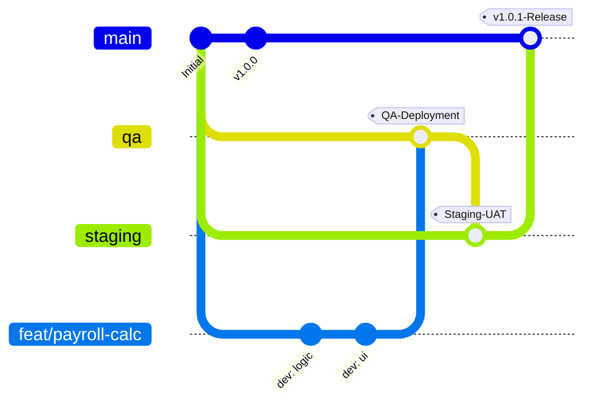
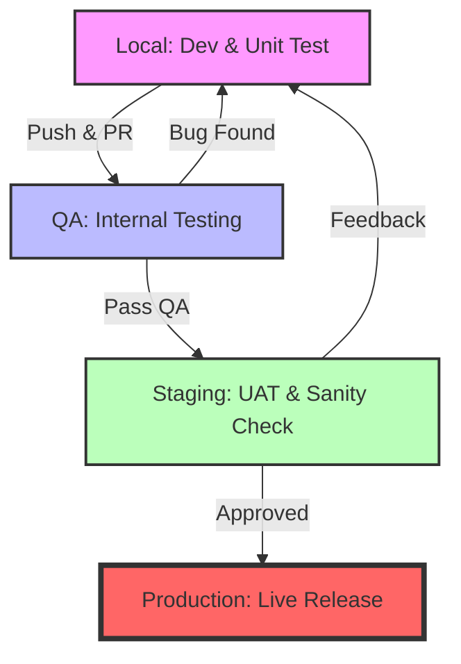
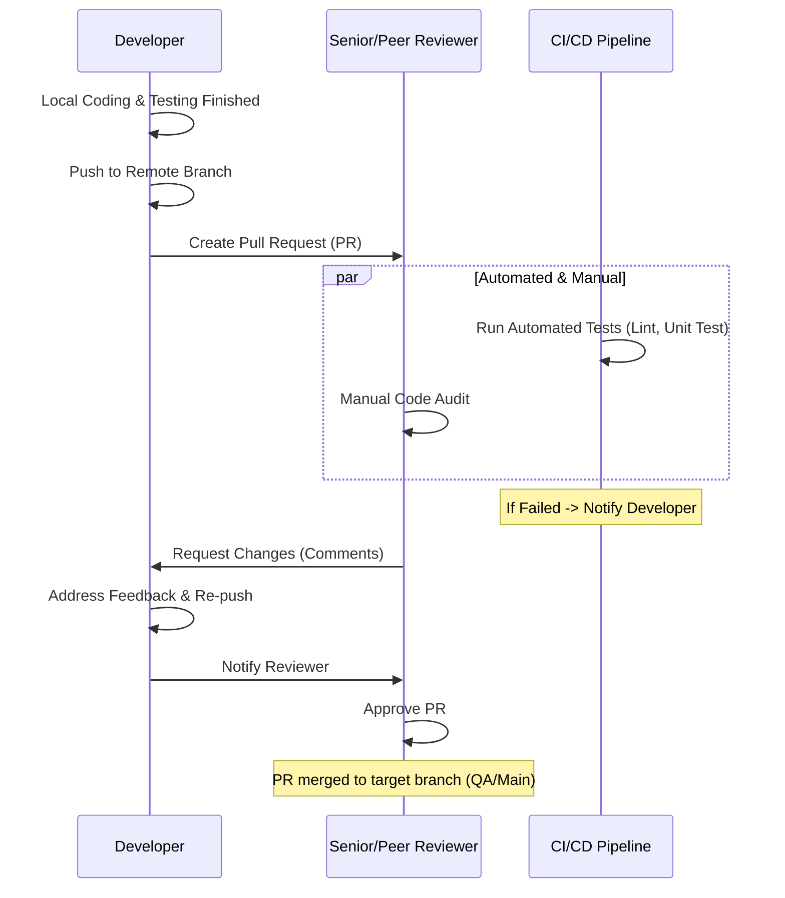

# HRMS Deployment Workflow and Branching Management

This document outlines the standard operating procedures for source code management, the deployment pipeline from local to production, and the handling of new features or bug fixes.

## 1. Branching Strategy (Git Flow)

We follow a Git Flow-inspired approach that prioritizes stability in the primary branch (`main`) while providing dedicated environments for testing and verification.

### Main Branch Structure
*   **`main`**: The production branch. Code here must always be stable and ready for release. Every merge to this branch triggers a deployment to the **Production** environment.
*   **`staging`**: The pre-production/User Acceptance Testing (UAT) branch. Used for final validation before public release. Synchronized with the **Staging** server.
*   **`qa`**: The Quality Assurance branch for internal testing. New features are merged here first for QA verification. Synchronized with the **QA** server.

### Supporting Branches
*   **`feat/FEATURE-NAME`**: Used for developing new features (e.g., `feat/payroll-calculator`).
*   **`fix/ISSUE-ID`**: Used for bug fixes (e.g., `fix/login-error`).
*   **`hotfix/URGENT-ISSUE`**: Critical emergency fixes created directly from `main` to address production issues.

### Branching Visualization


---

## 2. Deployment Pipeline (Local -> QA -> Staging -> Prod)

### Detailed Steps:

1.  **Local (Development)**:
    *   Developers create a new branch from `main` (or `qa` depending on team policy).
    *   Implement code and perform unit testing locally.
    *   Ensure the application runs correctly with local environment configurations.

2.  **QA (Quality Assurance)**:
    *   Developer pushes the branch to the remote repository.
    *   Create a Pull Request (PR) to the `qa` branch.
    *   Once the PR is approved and merged, CI/CD deploys the code to the **QA Server**.
    *   The QA team performs functional, integration, and regression testing.

3.  **Staging (UAT)**:
    *   Upon passing QA, the `qa` branch is merged into the `staging` branch.
    *   Automated deployment to the **Staging Server**.
    *   Stakeholders (Product Managers/Clients) perform final User Acceptance Testing (UAT).

4.  **Production**:
    *   After UAT approval, the `staging` branch is merged into the `main` branch.
    *   A `Git Tag` is created (e.g., `v1.1.0`).
    *   The code is deployed to the **Production Server**.

### Deployment Flow Diagram


---

## 3. Ticket and Feature Management

For every ticket (Jira/GitHub Issue) or new feature, follow this procedure:

1.  **Ticket Analysis**: Understand the requirements and Acceptance Criteria.
2.  **Branching**: Create a branch with the format `feat/ticket-id-title` or `fix/ticket-id-title`.
    ```bash
    git checkout main
    git pull origin main
    git checkout -b feat/HR-123-payroll-export
    ```
3.  **Development**: Write modular code. Commit frequently with descriptive messages.
4.  **Testing**: Run the test suite before pushing.
    *   Backend: `pytest`
    *   Frontend: `npm test` or `vitest`

---

## 4. Code Review Process

Code review is a critical step for maintaining code quality and knowledge sharing.

### Pull Request (PR) Rules:
*   **Clear Description**: Explain what was changed, why, and how to test it. Link to the relevant Ticket/Issue.
*   **Visual Evidence**: Attach screenshots or screen recordings (Loom/GIF) for any UI/UX changes.
*   **Automated Checks**: PRs cannot be merged if CI/CD pipelines (Lint, Unit Tests) are failing.
*   **Reviewer Selection**: At least one Senior Developer or Tech Lead must be included in the reviewers.
*   **Approval Threshold**: Minimum **2 approvals** are required for features; **1 approval** for minor bug fixes.

### Review Focus Areas:
1.  **Logic & Efficiency**: Is there a simpler way to achieve the same result?
2.  **Security**: Are there any potential vulnerabilities (SQL injection, XSS, etc.)?
3.  **Readability**: Is the code self-explanatory and following our naming conventions?
4.  **Error Handling**: Are edge cases and potential failures handled gracefully?

### Review Workflow Diagram


---

## 5. Versioning Policy (Semantic Versioning)

We use **Semantic Versioning (SemVer)** to track releases. A version number is formatted as `vMAJOR.MINOR.PATCH` (e.g., `v1.2.3`):

*   **MAJOR**: Breaking changes that are not backward compatible.
*   **MINOR**: New features added in a backward-compatible manner.
*   **PATCH**: Backward-compatible bug fixes.

### Tagging Procedure:
Every time a merge to `main` is approved:
1.  Determine the next version number.
2.  Create a lightweight or annotated tag.
3.  Push the tag to the remote repository.

---

## 6. Feature Synchronization & Environment Parity

To ensure that a feature working on **Local** also works on **Production**, we follow these synchronization rules:

### 1. Database Migrations Sync
*   **Never** change the database schema manually on any server.
*   **Always** use migration files (Alembic for Python/Backend).
*   Migrations must be part of the PR and are executed automatically during deployment to QA/Staging/Prod.

### 2. Configuration Sync (`.env`)
*   We maintain a `template.env` in the repository.
*   When a feature requires a new environment variable (e.g., `STRIPE_API_KEY`), the developer must:
    1.  Update `template.env`.
    2.  Notify the DevOps/Lead to add the secret to the QA/Staging/Production secret manager.

### 3. Code Flow (The "No-Shortcut" Rule)
*   **Rule**: No code reaches `main` without passing through `qa` and `staging`.
*   If a bug is found in `staging`, the fix must be made in a `fix/` branch, merged to `qa`, and then merged back to `staging`. This ensures all environments remain synchronized.

### 4. Merging Strategy
*   **Feature to QA**: Prefer `Squash and Merge` to keep the `qa` history clean.
*   **Environment to Environment**: Always use standard `Merge` (no squash) to preserve the history of which features were moved.

---

## Command Cheat Sheet

| Action | Git Command |
| :--- | :--- |
| Update Local Branch | `git pull origin main` |
| Create New Feature | `git checkout -b feat/feature-name` |
| Save Changes | `git add . && git commit -m "feat: description"` |
| Push to Server | `git push origin feat/feature-name` |
| Sync with QA | `git checkout qa && git pull origin qa` |
| **Create Release Tag** | `git tag -a v1.x.x -m "Release version 1.x.x"` |
| **Push Tags to Remote** | `git push origin --tags` |
| **Rollback to Tag** | `git checkout v1.x.x` |
