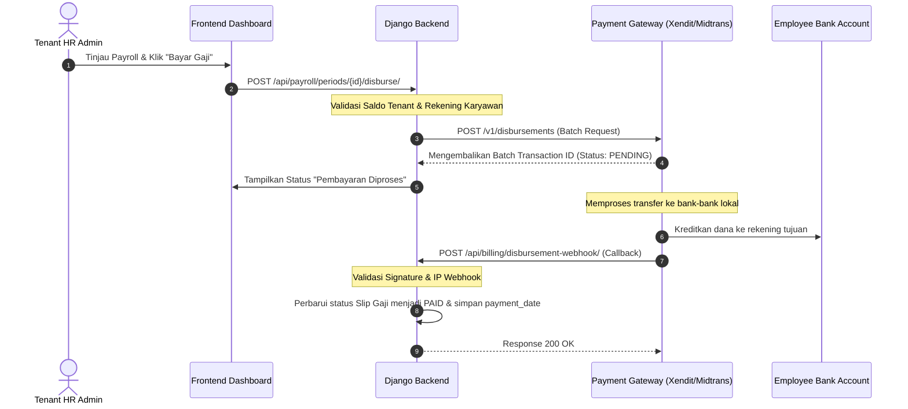
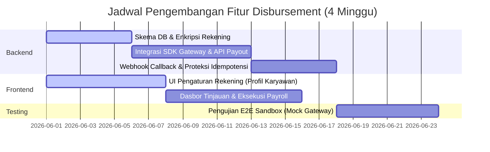

# Rencana Integrasi Pembayaran Gaji Langsung (Direct Payroll Payout / Disbursement)

Dokumen ini menyediakan rancangan teknis dan rencana implementasi untuk mengintegrasikan pengiriman gaji langsung (*direct salary disbursement*) pada platform **HariKerja HRMS** menggunakan Payment Gateway B2B (khususnya Xendit Disbursals atau Midtrans Payouts).

---

## 1. Tinjauan Umum & Arsitektur

Saat ini, modul payroll baru menghasilkan laporan slip gaji dalam format Excel/CSV. HR admin harus mengunggah berkas tersebut secara manual ke portal perbankan perusahaan (*corporate internet banking*) untuk melakukan transfer gaji.

Tujuan dari fitur ini adalah memungkinan Admin Tenant untuk melakukan transfer gaji instan secara langsung dari dasbor **HariKerja HRMS** ke rekening bank pribadi karyawan masing-masing hanya dengan satu klik.

### Alur Arsitektur Sistem:

---

## 2. Komponen Teknis Utama

### 2.1 Tambahan Skema Database
Untuk menyimpan detail rekening bank karyawan dengan aman dan melacak riwayat pembayaran:

*   **Enkripsi Rekening Bank**: Nomor rekening bank dan nama pemilik rekening wajib dienkripsi sebelum disimpan ke database menggunakan AES-256 (melalui `django-cryptography` atau kelas enkripsi kustom di Django).
*   **Model Baru**:
    *   `EmployeeBankAccount`: Menyimpan `employee_id`, `bank_code` (e.g., BCA, BNI, Mandiri), `account_number` (terenkripsi), dan `account_holder_name`.
    *   `DisbursementBatch`: Melacak transfer massal untuk suatu periode payroll. Menyimpan `payroll_period_id`, `gateway_batch_id`, `total_amount`, `status` (`PENDING`, `SUCCESS`, `FAILED`, `PARTIAL_SUCCESS`), dan data respon mentah (`raw_response`).
    *   `DisbursementItem`: Melacak transaksi transfer individu di dalam suatu batch. Menyimpan `payslip_id`, `recipient_bank`, `recipient_account`, `amount`, `status` (`SUCCESS`, `FAILED`), dan alasan kegagalan jika ada (`failure_reason`).

### 2.2 Best Practice Keamanan & Idempotensi
Karena modul ini menangani transfer uang riil, tingkat kesulitannya diklasifikasikan sebagai **Sedang-Tinggi**. Langkah pengamanan berikut wajib diterapkan:

1.  **Idempotency Keys**: Setiap permintaan pencairan dana yang dikirim ke API payment gateway harus menyertakan header `X-Idempotency-Key` yang unik (dibuat dari kombinasi `payroll_period_id` dan `batch_attempt_number`). Jika terjadi gangguan koneksi internet, pengiriman ulang API dengan key yang sama akan mencegah transfer ganda.
2.  **Verifikasi Rekening Penerima**: Sebelum transfer dijalankan, sistem harus memanggil API verifikasi rekening gateway (seperti verifikasi nama rekening Xendit/Midtrans) untuk memeriksa apakah nomor rekening tujuan cocok dengan nama karyawan yang terdaftar.
3.  **Validasi Saldo Deposit**: Backend harus memastikan saldo deposit/escrow tenant di payment gateway mencukupi sebelum memproses request, dan mengembalikan `400 Bad Request (INSUFFICIENT_FUNDS)` jika saldo kurang dari total nominal gaji.

### 2.3 Keamanan Webhook Callback
*   **Validasi Signature**: Endpoint webhook (`/api/payroll/disbursement-webhook/`) wajib menghitung token HMAC SHA256/SHA512 menggunakan payload dan shared secret gateway, lalu mencocokkannya dengan header request.
*   **IP Whitelisting**: Hanya menerima request webhook yang berasal dari IP server resmi milik Xendit/Midtrans.

---

## 3. Garis Waktu Pengembangan (Rencana 4 Minggu)

Integrasi teknis ini diperkirakan memakan waktu **3 sampai 4 minggu** untuk tim pengembang kecil (1 Backend + 1 Frontend).

### Rincian Jadwal Kerja:
*   **Minggu 1: Fondasi & Keamanan**
    *   Setup modifikasi skema database dan enkripsi kolom rekening bank karyawan.
    *   Pengembangan UI form profil karyawan untuk pengisian data bank.
*   **Minggu 2: Logika Eksekusi Payout**
    *   Integrasi SDK Python milik payment gateway (contoh: `xendit-python-sdk`).
    *   Membuat kontroler backend untuk menyusun parameter request batch transfer dan validasi kecukupan saldo deposit.
*   **Minggu 3: Webhook & Penanganan Error**
    *   Membuat endpoint webhook callback untuk menerima pembaruan status pembayaran asinkron.
    *   Implementasi error handling yang ketat, pencatatan log transaksi, dan pencegahan transfer ganda.
*   **Minggu 4: Dasbor Admin & Pengujian E2E**
    *   Pembuatan dasbor verifikasi admin untuk meninjau rekapitulasi, sisa deposit, dan tombol eksekusi.
    *   Eksekusi pengujian menyeluruh (E2E) pada lingkungan sandbox untuk menguji skenario kegagalan koneksi dan kegagalan transfer parsial.

---

## 4. Persyaratan Administratif (Non-Teknis)

Di luar penulisan kode program, persyaratan operasional berikut harus dipenuhi sebelum rilis live:
1.  **KYC (Know Your Customer)**: Platform harus memfasilitasi proses registrasi merchant/tenant ke payment gateway. Masing-masing perusahaan (Tenant) harus menyerahkan dokumen legal (SIUP, NIB, KTP Direktur, NPWP Perusahaan) untuk mengaktifkan fitur transfer uang keluar.
2.  **Manajemen Deposit**: Perusahaan wajib melakukan top-up ke akun saldo penampung (escrow) mereka di payment gateway sebelum dapat mengeksekusi transfer gaji.

---

## 🔗 Dokumen Terkait
*   [Peta Jalan Pengembangan (Indonesian)](./feature_gaps_and_roadmap.id.md)
*   [Feature Gaps & Development Roadmap (English)](./feature_gaps_and_roadmap.md)
