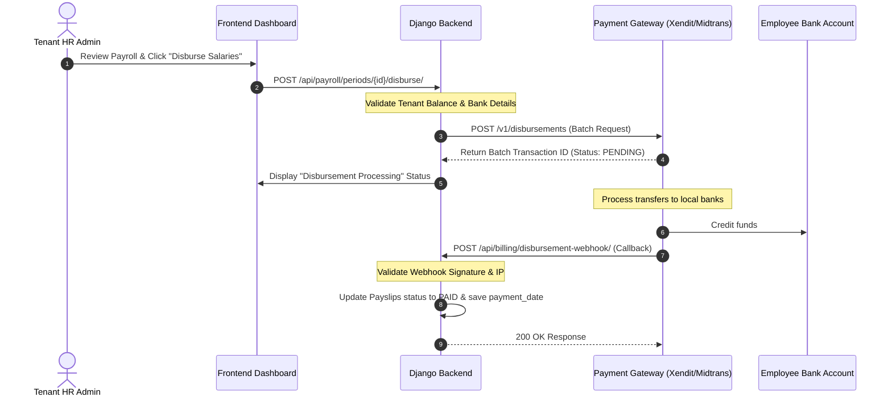
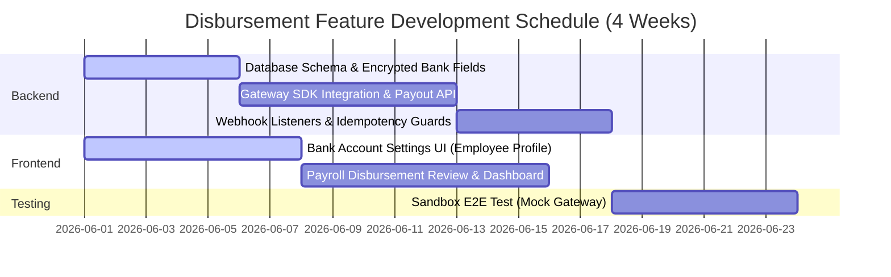

# Direct Payroll Payout Integration Plan (Xendit & Midtrans Disbursals)

This document provides a technical design and implementation blueprint for integrating direct salary disbursements (payouts) in the **HariKerja HRMS** platform using B2B Payment Gateways (specifically Xendit Disbursals or Midtrans Payouts).

---

## 1. Overview & Architecture

Currently, the payroll module generates payslip reports in Excel/CSV formats, which HR admins must manually upload to banking portals (corporate internet banking) to initiate salary transfers. 

The goal of this feature is to allow Tenant Admins to initiate instant, single-click salary transfers directly from the **HariKerja HRMS** dashboard to employees' personal bank accounts.

### System Architecture Flow:

---

## 2. Key Technical Components

### 2.1 Database Schema Additions
To securely store employee banking details and track payment histories:

*   **Bank Account Encryption**: Bank account numbers and owner names must be encrypted before database storage using AES-256 (Django's `django-cryptography` or custom field encryption class).
*   **New Models**:
    *   `EmployeeBankAccount`: Stores `employee_id`, `bank_code` (e.g., BCA, BNI, Mandiri), `account_number` (encrypted), and `account_holder_name`.
    *   `DisbursementBatch`: Tracks bulk transfers for a payroll period. Stores `payroll_period_id`, `gateway_batch_id`, `total_amount`, `status` (`PENDING`, `SUCCESS`, `FAILED`, `PARTIAL_SUCCESS`), and `raw_response`.
    *   `DisbursementItem`: Tracks individual transfers within a batch. Stores `payslip_id`, `recipient_bank`, `recipient_account`, `amount`, `status` (`SUCCESS`, `FAILED`), and `failure_reason`.

### 2.2 Security & Idempotency Best Practices
Because this module handles real money transfers, it is classified under **Medium-High Difficulty**. The following guards are mandatory:

1.  **Idempotency Keys**: Every disbursement request sent to the payment gateway API must contain a unique `X-Idempotency-Key` (typically formed by combining the `payroll_period_id` and the `batch_attempt_number`). If a network failure occurs, retrying the API call with the same key will prevent duplicate transfers.
2.  **Recipient Verification**: Before executing a payout, the system should invoke the gateway's bank account verification API (e.g., Xendit's `/bank-rules` or account validation endpoint) to check if the destination account number matches the registered employee name.
3.  **Tenant Escrow Balance Check**: The backend must check if the tenant has sufficient escrow/deposit funds on the gateway before requesting a payout, throwing a `400 Bad Request (INSUFFICIENT_FUNDS)` if it is lower than the total payroll amount.

### 2.3 Webhook Callback Security
*   **Signature Verification**: The webhook endpoint (`/api/payroll/disbursement-webhook/`) must calculate a SHA256/SHA512 HMAC token using the payload and the gateway's shared secret, validating it against the request header.
*   **IP Whitelisting**: Only accept webhook requests originating from verified Xendit/Midtrans API server IP ranges.

---

## 3. Development Timeline (4-Week Plan)

The technical integration takes approximately **3 to 4 weeks** for a small engineering team (1 Backend + 1 Frontend).

### Detailed Schedule:
*   **Week 1: Foundations & Security**
    *   Setup database schema changes and apply field-level encryption for bank credentials.
    *   Develop the frontend forms in the employee profile to collect bank details.
*   **Week 2: Payout Execution Logic**
    *   Integrate the Python SDK for the chosen payment gateway (e.g., `xendit-python-sdk`).
    *   Build the backend controller to structure the batch request parameters and validate sufficient escrow balances.
*   **Week 3: Webhook & Recovery Mechanisms**
    *   Write the webhook callback endpoints to handle asynchronous payment updates.
    *   Implement strict error handling, transaction logs, and idempotency key checks.
*   **Week 4: Frontend Dashboards & E2E Testing**
    *   Build the admin verification dashboard to review payroll summaries, deposit balances, and triggers.
    *   Execute end-to-end sandbox test suites covering edge cases (e.g., network timeouts, partial batch failures).

---

## 4. Administrative Requirements

Beyond code implementation, the following operational requirements must be met before going live:
1.  **KYC (Know Your Customer)**: The platform must facilitate merchant onboarding with the payment gateway. Individual corporate tenants must submit legal documentation (SIUP, NIB, KTP of directors, Tax ID) to activate payouts.
2.  **Deposit Management**: Tenants must fund their escrow balance account using Virtual Accounts or Bank Transfers before executing payroll.

---

## 🔗 Related Documents
*   [Feature Gaps & Development Roadmap (English)](./feature_gaps_and_roadmap.md)
*   [Peta Jalan Pengembangan (Indonesian)](./feature_gaps_and_roadmap.id.md)
