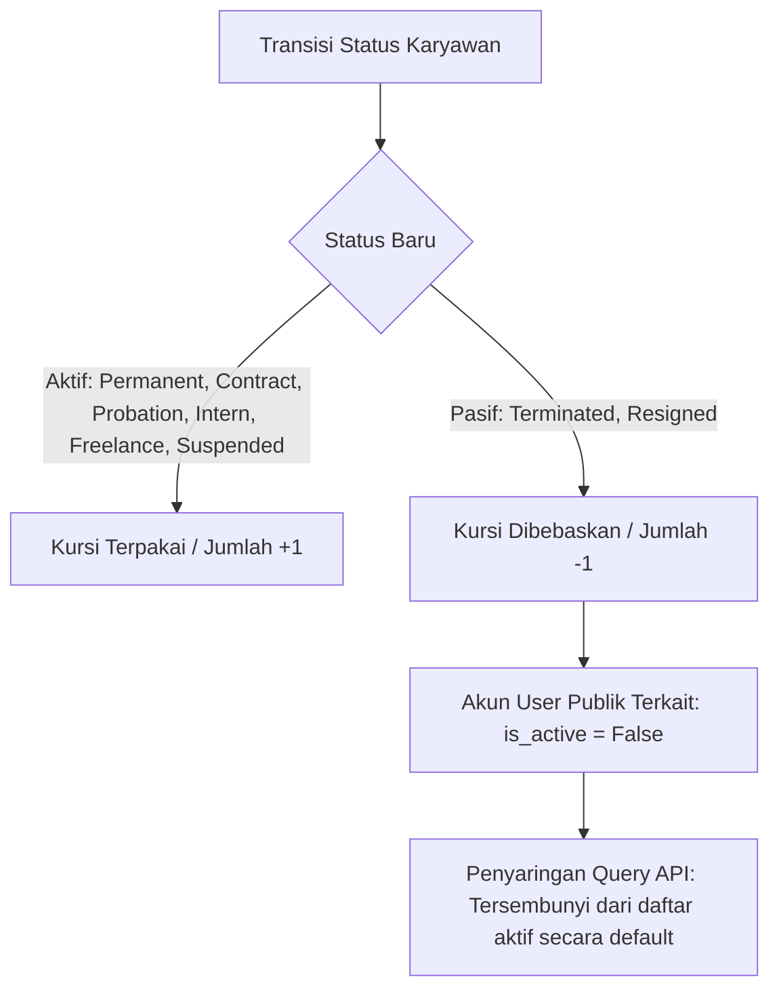

# Manajemen Status & Siklus Hidup Karyawan

Dokumen ini menjelaskan arsitektur, alur kerja, dan perilaku otomatis seputar siklus hidup Karyawan (*Employee lifecycle*), transisi status, deaktivasi akun pengguna (*User*), serta pengoptimalan kuota kapasitas kursi (*active seat quota*) dalam platform HRMS HariKerja.

---

## 1. Ikhtisar & Desain Arsitektur

HRMS HariKerja menerapkan penegakan kapasitas kuota Karyawan Aktif secara granular. Ini memastikan bahwa ketika seorang karyawan keluar dari penyewa/tenant (baik melalui pemutusan hubungan kerja/PHK maupun pengunduran diri/resign), platform secara otomatis menjalankan:
1. **Penegakan Keamanan (Security Enforcement)**: Kredensial autentikasi terkait (akun `User` karyawan tersebut) segera dinonaktifkan di skema `public`.
2. **Optimalisasi Sumber Daya (Resource Optimization)**: Kuota kursi aktif (`employee_count` pada model `Tenant`) segera dibebaskan, memungkinkan tenant untuk merekrut dan mendaftarkan karyawan aktif baru tanpa melebihi batas langganan mereka.



---

## 2. Sistem Status Kepegawaian (`EMPLOYMENT_STATUS_CHOICES`)

Model karyawan mendefinisikan 8 pilihan status kepegawaian untuk merepresentasikan kondisi operasional perusahaan secara akurat:

| Kunci Status | Nama Tampilan | Kategori | Perilaku & Penggunaan Kuota |
| :--- | :--- | :--- | :--- |
| `PERMANENT` | Tetap | Aktif | Menempati 1 kursi kuota aktif. Akun user tetap aktif. |
| `CONTRACT` | Kontrak | Aktif | Menempati 1 kursi kuota aktif. Akun user tetap aktif. |
| `PROBATION` | Percobaan | Aktif | Menempati 1 kursi kuota aktif. Akun user tetap aktif. |
| `INTERN` | Magang | Aktif | Menempati 1 kursi kuota aktif. Akun user tetap aktif. |
| `FREELANCE` | Lepas | Aktif | Menempati 1 kursi kuota aktif. Akun user tetap aktif. |
| `SUSPENDED` | Skorsing | Ditangguhkan | Menempati 1 kursi kuota aktif. Akses login biasanya dikunci tetapi tetap dihitung sebagai karyawan aktif. |
| `TERMINATED` | PHK/Diberhentikan | Pasif | **Kursi Bebas**. Otomatis mengubah `User.is_active` publik menjadi `False`. Tersembunyi dari list aktif. |
| `RESIGNED` | Resign/Mundur | Pasif | **Kursi Bebas**. Otomatis mengubah `User.is_active` publik menjadi `False`. Tersembunyi dari list aktif. |

---

## 3. Logika Bisnis & Signal Otomatis

Platform ini menggunakan Django signal `pre_save` dan `post_save` yang andal pada `backend/core/signals.py` untuk mengoordinasikan transisi status secara aman:

### A. Pengambilan Status Asal (`pre_save`)
Untuk mencegah *race condition*, platform menangkap status database asli karyawan sebelum perubahan disimpan:
```python
if instance.pk:
    try:
        original_emp = Employee.objects.get(pk=instance.pk)
        instance._original_status = original_emp.status
    except Employee.DoesNotExist:
        instance._original_status = None
```

### B. Deaktivasi User Otomatis (`post_save`)
Ketika status karyawan bergeser ke `TERMINATED` atau `RESIGNED`, signal akan otomatis menonaktifkan kredensial login mereka di skema `public`:
```python
@receiver(post_save, sender=Employee)
def deactivate_user_on_termination(sender, instance, **kwargs):
    user = instance.user
    if instance.status in ['TERMINATED', 'RESIGNED'] and user:
        user.is_active = False
        with schema_context('public'):
            user.save(update_fields=['is_active'])
```

### C. Pengoptimalan Kuota Kursi Kapasitas Karyawan (`post_save`)
Kuota headcount disesuaikan secara inkremental berdasarkan transisi:
- **Penerimaan / Pembuatan**: Jika karyawan baru dibuat dengan status aktif (bukan `TERMINATED` atau `RESIGNED`), `employee_count` bertambah 1.
- **Deaktivasi**: Jika status aktif berubah menjadi `TERMINATED` atau `RESIGNED`, kursi kuota dibebaskan (`employee_count` berkurang 1).
- **Reaktivasi**: Jika karyawan yang telah keluar diaktifkan kembali, sistem memeriksa kuota tenant saat ini. Jika melebihi batas kapasitas, `ValidationError` dilemparkan, yang secara otomatis membatalkan (*rollback*) transaksi.

---

## 4. Perilaku Endpoint API & Penyaringan Query Parameter

Untuk mendukung performa tinggi dan kebersihan state pada aplikasi klien, penyaringan dilakukan langsung di tingkat database pada API ViewSet (`EmployeeViewSet`):

### A. Pengambilan Daftar Karyawan (`GET /api/employees/`)
Secara default, karyawan yang telah di-PHK (`TERMINATED`) atau mengundurkan diri (`RESIGNED`) dikecualikan dari daftar yang dikembalikan ke manajer untuk menjaga kebersihan data dasbor operasional:
```python
show_terminated = self.request.query_params.get('show_terminated') == 'true'
if not show_terminated:
    queryset = queryset.exclude(status__in=['TERMINATED', 'RESIGNED'])
```

### B. Endpoint Khusus Pemutusan Hubungan Kerja (`POST /api/employees/<id>/terminate/`)
Administrator dapat menghentikan karyawan secara elegan melalui endpoint khusus. Ini melewati validasi serializer choices standar untuk segera mengeksekusi transisi status yang bersih dan atomik:
- Mengubah status langsung menjadi `TERMINATED`.
- Memicu deaktivasi user dan membebaskan kuota kursi.
- Membuat catatan audit log yang mendokumentasikan tindakan tersebut.

---

## 5. Kerangka Pengujian & Validasi

### A. Unit Test Backend
Diuji secara komprehensif di dalam `CoreModuleTestCase` pada file [test_core.py](file:///home/afdhal/data/hr/hrms/backend/core/tests/test_core.py):
- **`test_employee_terminate_endpoint`**: Memverifikasi bahwa pemanggilan endpoint khusus POST `terminate` mengubah status menjadi `TERMINATED` dan menonaktifkan akun kredensial `User` publik terkait.
- **`test_employee_resigned_status_and_filtering`**: Memastikan bahwa pembaruan status menjadi `RESIGNED` melalui PATCH berhasil menonaktifkan akun `User` publik terkait, menyembunyikannya dari daftar default, dan menampilkannya kembali hanya ketika parameter `?show_terminated=true` dikirimkan.

### B. E2E Playwright Tests
Diuji secara E2E melalui `tests/employees.spec.ts` di frontend:
1. **Akses Menu Interaktif**: Memverifikasi bahwa manajer harus mengklik tombol aksi tiga titik (`...`) pada baris tabel karyawan untuk menampilkan menu aksi.
2. **Persetujuan Dialog**: Mendengarkan dialog konfirmasi peramban (`"Terminate this employee?"`) dan mengkliknya untuk menyetujui.
3. **Penyembunyian Default**: Memastikan karyawan yang diberhentikan langsung hilang dari daftar dasbor aktif setelah aksi dikonfirmasi.
4. **Toggling Visibilitas**: Mengklik tombol "Show Terminated Staff" untuk memverifikasi karyawan pasif tersebut muncul di riwayat pencarian, dan tersembunyi kembali ketika dinonaktifkan.
