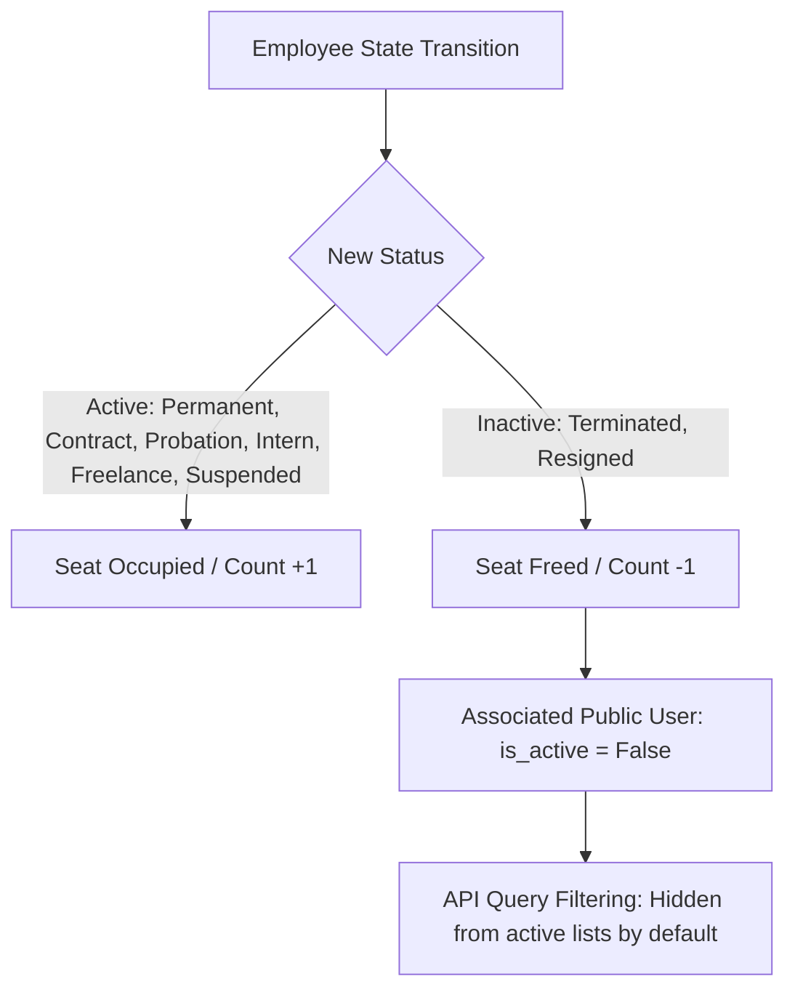

# Employee Lifecycle & Status Management

This document details the architecture, workflows, and automated behaviors surrounding the Employee lifecycle, status transitions, user account deactivations, and active seat quota optimization within the HariKerja HRMS platform.

---

## 1. Overview & Architectural Design

The HariKerja HRMS implements a granular Employee Lifecycle and Active Seat Quota enforcement. This ensures that when an employee departs from a tenant (either via termination or resignation), the platform automates:
1. **Security Enforcement**: The employee's associated authentication credentials (`User` account) are immediately deactivated in the `public` schema.
2. **Resource Optimization**: The active seat quota (`employee_count` on the `Tenant` model) is freed up, allowing the tenant to hire and provision a new active worker without exceeding their subscription limits.



---

## 2. Employment Status System (`EMPLOYMENT_STATUS_CHOICES`)

The employee model defines 8 distinct employment statuses to represent standard corporate operational states:

| Status Key | Display Name | Category | Behavior & Quota Occupancy |
| :--- | :--- | :--- | :--- |
| `PERMANENT` | Permanent | Active | Occupies 1 seat in active headcount. User account remains active. |
| `CONTRACT` | Contract | Active | Occupies 1 seat in active headcount. User account remains active. |
| `PROBATION` | Probation | Active | Occupies 1 seat in active headcount. User account remains active. |
| `INTERN` | Internship | Active | Occupies 1 seat in active headcount. User account remains active. |
| `FREELANCE` | Freelance | Active | Occupies 1 seat in active headcount. User account remains active. |
| `SUSPENDED` | Suspended | Suspended | Occupies 1 seat in active headcount. User account is typically locked out but counts as employee. |
| `TERMINATED` | Terminated | Inactive | **Freed Seat**. Automatically deactivates public `User.is_active` to `False`. Hidden from active lists. |
| `RESIGNED` | Resigned | Inactive | **Freed Seat**. Automatically deactivates public `User.is_active` to `False`. Hidden from active lists. |

---

## 3. Automated Business Logic & Signals

The platform uses robust Django `pre_save` and `post_save` signals in `backend/core/signals.py` to coordinate state transitions securely:

### A. Original State Capture (`pre_save`)
To prevent race conditions, the platform captures the original database state of the employee before any changes are committed:
```python
if instance.pk:
    try:
        original_emp = Employee.objects.get(pk=instance.pk)
        instance._original_status = original_emp.status
    except Employee.DoesNotExist:
        instance._original_status = None
```

### B. Automated User Deactivation (`post_save`)
When an employee's status shifts to `TERMINATED` or `RESIGNED`, a signal automatically deactivates their matching credentials in the `public` schema:
```python
@receiver(post_save, sender=Employee)
def deactivate_user_on_termination(sender, instance, **kwargs):
    user = instance.user
    if instance.status in ['TERMINATED', 'RESIGNED'] and user:
        user.is_active = False
        with schema_context('public'):
            user.save(update_fields=['is_active'])
```

### C. Headcount Seat Quota Optimization (`post_save`)
Seat limits are adjusted incrementally based on transitions:
- **Hiring / Creation**: If a new employee is created with an active status (not in `['TERMINATED', 'RESIGNED']`), `employee_count` increases by 1.
- **Deactivation**: If an active status changes to `TERMINATED` or `RESIGNED`, a seat is released (`employee_count` decreases by 1).
- **Reactivation**: If a terminated or resigned worker is rehired/activated, the system checks the tenant's current quota. If limits are exceeded, a `ValidationError` is raised, rolling back the transaction.

---

## 4. API Endpoints & Query Param Filtering

To support high performance and clean client states, filtering is enforced at the database level in the API ViewSet (`EmployeeViewSet`):

### A. Fetching Employee Lists (`GET /api/employees/`)
By default, terminated or resigned staff are excluded from lists returned to managers to maintain clean operational dashboards:
```python
show_terminated = self.request.query_params.get('show_terminated') == 'true'
if not show_terminated:
    queryset = queryset.exclude(status__in=['TERMINATED', 'RESIGNED'])
```

### B. Custom Graceful Termination Action (`POST /api/employees/<id>/terminate/`)
Administrators can terminate an employee via a dedicated endpoint. This bypasses standard choice validations to immediately execute a graceful, atomic transition:
- Set status directly to `TERMINATED`
- Trigger deactivations and free quotas
- Raise an audit event documenting the action

---

## 5. Verification & Testing Framework

### A. Backend Unit Tests
Fully covered under `CoreModuleTestCase` inside [test_core.py](file:///home/afdhal/data/hr/hrms/backend/core/tests/test_core.py):
- **`test_employee_terminate_endpoint`**: Verifies that calling the dedicated POST termination endpoint changes status to `TERMINATED` and deactivates the associated public `User` credentials.
- **`test_employee_resigned_status_and_filtering`**: Asserts that patching an employee's status to `RESIGNED` successfully deactivates their public `User` account, excludes them from the default list view, and includes them only when `?show_terminated=true` is requested.

### B. E2E Playwright Tests
Ensured via `tests/employees.spec.ts` in the frontend:
1. **Interactive Menu Access**: Verifies that managers must click the More Options dropdown (`...`) in a table row to expose actions.
2. **Accept Dialog**: Listens to the window's confirmation dialogue (`"Terminate this employee?"`) and clicks accept.
3. **Default list removal**: Asserts that the terminated employee disappears from the active dashboard list immediately.
4. **Toggling visibility**: Toggles "Show Terminated Staff" to ensure they appear in the historic view and disappear again when toggled off.
