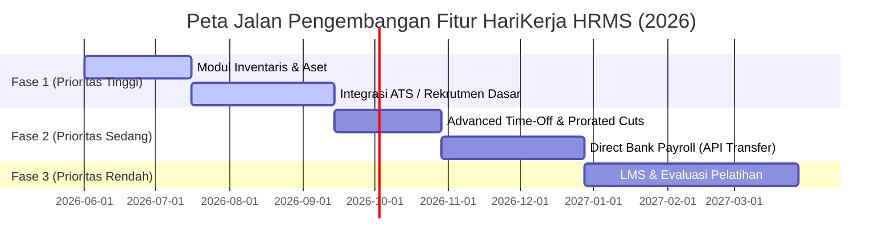

# Analisis Celah Fitur (Gaps) & Peta Jalan Pengembangan (Roadmap) HariKerja HRMS

Dokumen ini menganalisis fungsionalitas yang masih belum tersedia di **HariKerja HRMS** saat ini jika dibandingkan dengan sistem HRMS mapan lainnya di Indonesia (seperti Mekari Talenta atau Gadjian). Analisis ini ditujukan sebagai panduan peta jalan (*roadmap*) bagi tim pengembangan produk untuk mencapai kelengkapan fitur penuh.

---

## 1. Tinjauan Umum Kesenjangan Fitur

Secara fungsionalitas operasional harian (Absensi, Cuti, Lembur, Klaim Biaya, dan Penggajian dengan PPh 21 TER 2024 & BPJS), HariKerja memiliki fondasi yang sangat solid dan patuh hukum. Namun, untuk menjadi solusi *HR Super-App*, sistem ini masih memiliki beberapa celah fitur strategis (*feature gaps*).

---

## 2. Rincian Celah Fitur Utama (Gaps)

### 📦 2.1 Modul Inventaris & Aset (Asset Management)
*   **Status Saat Ini**: **Belum Ada**.
*   **Analisis**:
    *   HRMS modern umumnya menyediakan modul inventarisasi untuk melacak barang-barang inventaris kantor yang dipinjamkan ke karyawan (misalnya: Laptop, Monitor, Handphone Dinas, Mobil Kantor, Token Keamanan, atau Kartu Akses).
    *   Fitur ini sangat penting saat proses **Onboarding** (pembagian aset baru) dan **Offboarding** (pengembalian seluruh aset/alat kerja sebelum karyawan menerima slip gaji final).
*   **Usulan Fitur Masa Depan**:
    *   **Asset Catalog**: CRUD data aset perusahaan (Nomor Seri, Merek, Spesifikasi, Status Kondisi).
    *   **Asset Assignment**: Pencatatan serah-terima peminjaman aset ke karyawan tertentu secara digital.
    *   **Onboarding/Offboarding Checklist Integration**: Peringatan otomatis bagi HR jika ada karyawan yang *resign* namun masih memiliki aset yang belum dikembalikan (*outstanding assets*).

### 🤝 2.2 Sistem Rekrutmen & ATS (Applicant Tracking System)
*   **Status Saat Ini**: **Belum Ada**.
*   **Analisis**:
    *   Pemain HR besar memfasilitasi akuisisi bakat (*talent acquisition*) sebelum status kandidat berubah menjadi karyawan tetap di model [Employee](file:///home/afdhal/data/hr/hrms/backend/core/models.py#L97).
*   **Usulan Fitur Masa Depan**:
    *   **Job Posting & Portal Karir**: Membuat lowongan pekerjaan dan menayangkannya di portal karir publik tenant.
    *   **Resume Screening & Applicant Pipeline**: Melacak tahapan seleksi (Administrasi, Wawancara HR, Wawancara User, Offering).
    *   **Direct Onboarding Conversion**: Mengonversi data pelamar yang lolos menjadi model [Employee](file:///home/afdhal/data/hr/hrms/backend/core/models.py#L97) hanya dengan satu klik, tanpa perlu meng-input ulang.

### 🏦 2.3 Integrasi Transfer Gaji Langsung (Direct Bank/Payroll Transfer)
*   **Status Saat Ini**: **Belum Ada** (Baru mendukung perhitungan payroll komprehensif, pelaporan pajak, dan ekspor slip gaji).
*   **Analisis**:
    *   Kompetitor terkemuka di Indonesia menyediakan integrasi API perbankan (e.g. Bank Transfer BCA, Mandiri Corporate Pay, dll.) agar HR Admin dapat membayar seluruh gaji karyawan hanya dengan satu klik di dalam dasbor tanpa perlu membuka portal *corporate banking* atau mengunggah berkas CSV secara manual.
*   **Usulan Fitur Masa Depan**:
    *   **Bulk Payment API Integration**: Integrasi dengan gerbang pembayaran B2B (seperti Midtrans/Xendit Disbursals or Bank API lokal) untuk pembayaran gaji instan dari rekening deposit tenant ke rekening masing-masing karyawan.
    *   **Rekonsiliasi Otomatis**: Menandai status pembayaran slip gaji menjadi `PAID` secara instan setelah status transfer bank berhasil.

### 📚 2.4 LMS & Pelatihan Karyawan (Learning Management System)
*   **Status Saat Ini**: **Belum Ada**.
*   **Analisis**:
    *   Perusahaan menengah-besar memerlukan pelacakan kepatuhan pelatihan (*compliance training*) dan sertifikasi berkala untuk karyawannya.
*   **Usulan Fitur Masa Depan**:
    *   **Training Catalog**: Penyediaan kelas belajar mandiri atau jadwal pelatihan tatap muka.
    *   **Certification Tracking**: Peringatan kadaluwarsa sertifikat profesi atau lisensi kerja.

### 📅 2.5 Kebijakan Waktu Luang Lanjutan (Advanced Time-Off Policies)
*   **Status Saat Ini**: **Absensi Dasar & Cuti Tahunan Berbasis Saldo Sederhana** di kelas [LeaveBalance](file:///home/afdhal/data/hr/hrms/backend/attendance/models.py#L156).
*   **Analisis**:
    *   Sistem belum memfasilitasi kebijakan waktu luang dinamis yang umum di korporasi multinasional.
*   **Usulan Fitur Masa Depan**:
    *   **Accrual Rules**: Saldo cuti bertambah otomatis *secara bulanan* (misal: 1 hari per bulan) alih-alih diberikan sekaligus 12 hari di awal tahun.
    *   **Carry-Forward & Expired Automations**: Aturan hangus saldo cuti tahun lalu jika tidak digunakan sebelum tanggal tertentu (misal: kadaluwarsa setiap 31 Maret).
    *   **Unpaid Leave & Prorated Payroll Cuts**: Pemotongan gaji prorata secara otomatis di [PayrollCalculator](file:///home/afdhal/data/hr/hrms/backend/payroll/services.py#L100) jika karyawan mengambil cuti tidak dibayar (*unpaid leave*).

---

## 3. Rekomendasi Skala Prioritas Peta Jalan (Roadmap)

Untuk memaksimalkan dampak produk dengan sumber daya tim teknologi yang efisien, berikut adalah rekomendasi skala prioritas pengembangan fitur ke depan:

| Prioritas | Modul / Fitur | Alasan Strategis |
| :---: | :--- | :--- |
| **1** | **Inventaris & Aset** | Sangat mudah diimplementasikan (CRUD & Relasi Karyawan) namun memiliki dampak operasional yang tinggi bagi HR dalam mengontrol aset fisik. |
| **2** | **ATS & Rekrutmen** | Mengisi lubang terbesar pra-onboarding karyawan, meningkatkan daya tarik bagi tim rekrutmen. |
| **3** | **Advanced Time-Off & Prorated Cuts** | Menghilangkan beban perhitungan manual HR dalam memotong gaji karyawan akibat cuti tidak berbayar. |
| **4** | **Direct Bank Payroll** | Memberikan kemudahan bayar satu-klik, namun membutuhkan kepatuhan finansial dan lisensi API bank yang ketat. |
| **5** | **LMS & Pelatihan** | Hanya dibutuhkan oleh perusahaan berukuran besar (*Enterprise*), sehingga dapat ditunda ke fase pertumbuhan berikutnya. |

---
> [!NOTE]
> Peta jalan ini dirancang agar HariKerja HRMS dapat bertumbuh secara organik dari segmentasi UMKM (Free/Essential) menuju pasar menengah-atas (*Professional/Premium*) secara stabil.
