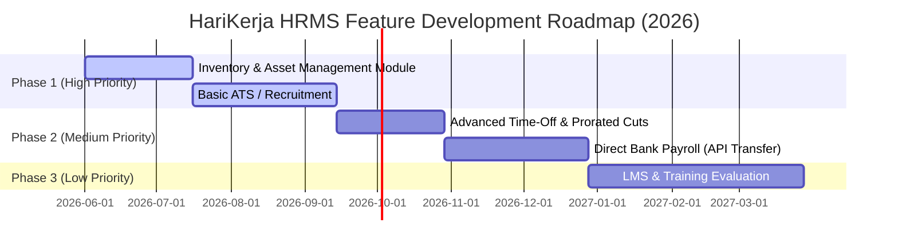

# Feature Gaps & Development Roadmap - HariKerja HRMS

This document analyzes the functionalities that are currently unavailable in **HariKerja HRMS** compared to established HRMS systems in Indonesia (such as Mekari Talenta or Gadjian). This analysis serves as a strategic roadmap for the development team to achieve full feature completeness.

---

## 1. Overview of Feature Gaps

In terms of daily operational functionalities (Attendance, Leaves, Overtime, Claims/Reimbursements, and Payroll with 2024 PPh 21 TER & BPJS compliance), HariKerja has an exceptionally solid and compliant foundation. However, to become a complete *HR Super-App*, there are several strategic feature gaps that need to be addressed.

---

## 2. Key Feature Gaps Detailed

### 📦 2.1 Inventory & Asset Management Module
*   **Current Status**: **None**.
*   **Analysis**:
    *   Modern HRMS solutions typically provide an inventory tracking module to manage company-owned assets assigned to employees (e.g., Laptops, Monitors, Work Phones, Company Cars, Security Tokens, or Access Cards).
    *   This feature is highly essential during **Onboarding** (assigning assets) and **Offboarding** (reclaiming all equipment before processing the final payroll settlement).
*   **Proposed Future Features**:
    *   **Asset Catalog**: CRUD operations for corporate assets (Serial Number, Brand, Specs, Condition Status).
    *   **Asset Assignment**: Digital log of asset loans and returns to/from specific employees.
    *   **Onboarding/Offboarding Integration**: Automated alerts to HR if a resigning employee has outstanding assets that haven't been returned.

### 🤝 2.2 Applicant Tracking System (ATS) & Recruitment
*   **Current Status**: **None**.
*   **Analysis**:
    *   Major HR players facilitate talent acquisition before a candidate's status changes to an active employee in the [Employee](file:///home/afdhal/data/hr/hrms/backend/core/models.py#L97) model.
*   **Proposed Future Features**:
    *   **Job Posting & Careers Portal**: Post open positions directly onto the tenant's public careers page.
    *   **Resume Screening & Applicant Pipeline**: Track hiring stages (Application, HR Interview, User Interview, Offering).
    *   **Direct Onboarding Conversion**: Convert successful applicants to the [Employee](file:///home/afdhal/data/hr/hrms/backend/core/models.py#L97) model with a single click, eliminating manual data entry.

### 🏦 2.3 Direct Bank/Payroll Transfer Integration
*   **Current Status**: **None** (Only supports comprehensive payroll computation, tax reporting, and payslip generation).
*   **Analysis**:
    *   Leading Indonesian competitors integrate with banking APIs (e.g., BCA Bank Transfer, Mandiri Corporate Pay, etc.) so that HR Admins can execute payroll payouts with a single click from the dashboard instead of manually uploading CSV files to banking portals.
*   **Proposed Future Features**:
    *   **Bulk Payment API Integration**: Partner with B2B payment gateways (such as Midtrans/Xendit Disbursals or local banking APIs) to enable instant salary disbursements. See the detailed [Direct Payroll Payout Integration Plan](./direct_payroll_payout.md) for architecture, schema requirements, and timelines.
    *   **Automated Reconciliation**: Instantly mark payslip status as `PAID` once the bank transfer execution succeeds.

### 📚 2.4 Learning Management System (LMS) & Training
*   **Current Status**: **None**.
*   **Analysis**:
    *   Medium-to-large enterprises require tracking compliance training and professional certifications.
*   **Proposed Future Features**:
    *   **Training Catalog**: Support self-paced internal modules or scheduled webinars/workshops.
    *   **Certification Tracking**: Monitor expirations for professional licenses and credentials.

### 📅 2.5 Advanced Time-Off Policies
*   **Current Status**: **Basic Attendance & Annual Leave Balance** represented in [LeaveBalance](file:///home/afdhal/data/hr/hrms/backend/attendance/models.py#L156).
*   **Analysis**:
    *   The system currently lacks complex time-off features common in multinational corporations.
*   **Proposed Future Features**:
    *   **Accrual Rules**: Accumulate leave days monthly (e.g., 1 day per month) rather than upfront at the start of the year.
    *   **Carry-Forward & Expiration Automations**: Automatically expire unused leaves from the previous year after a custom date (e.g., March 31st).
    *   **Unpaid Leave & Prorated Payroll Cuts**: Automatically apply pro-rata salary cuts in [PayrollCalculator](file:///home/afdhal/data/hr/hrms/backend/payroll/services.py#L100) when an employee takes unpaid leave.

---

## 3. Recommended Development Roadmap Priority

To maximize product impact with optimal engineering resource allocation, the following roadmap is recommended:

| Priority | Module / Feature | Strategic Rationale |
| :---: | :--- | :--- |
| **1** | **Inventory & Assets** | Straightforward implementation (basic CRUD & Employee relations) with high operational value for HR in managing hardware assets. |
| **2** | **ATS & Recruitment** | Fills the largest gap in the pre-onboarding employee lifecycle, increasing appeal to recruitment teams. |
| **3** | **Advanced Time-Off & Prorated Cuts** | Automatically calculates pro-rata unpaid leaves, removing payroll processing overhead for HR. |
| **4** | **Direct Bank Payroll** | Premium payout experience, but requires heavy compliance licensing and bank API negotiations. |
| **5** | **LMS & Training** | Generally required by larger corporate entities (Enterprise), so it can be safely deferred to later growth phases. |

---
> [!NOTE]
> This roadmap is designed to allow HariKerja HRMS to scale organically from SME targeting (Free/Essential plans) toward high-growth markets (Professional/Premium/Enterprise plans) reliably.
