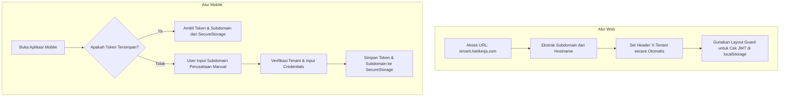
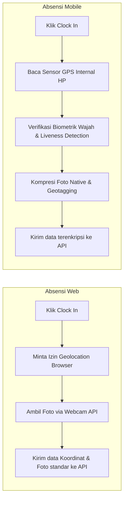

# Pemetaan Fitur, Perbandingan Alur, dan Analisis Perbedaan Platform (Web vs. Mobile)

Dokumen ini menyediakan panduan komprehensif mengenai perbedaan arsitektur, alur kerja (workflow), serta pemetaan fitur antara aplikasi **Web (Frontend)** dan **Mobile (Flutter)** pada sistem HariKerja.

---

## 1. Perbandingan Filosofi & Desain Platform

| Aspek | Web (Frontend Portal) | Mobile (Flutter App) |
| :--- | :--- | :--- |
| **Target Pengguna Utama** | Administrator HR, Pemilik Bisnis, Supervisor, & Karyawan Kantor | Karyawan Lapangan & Karyawan Operasional (Mobile-First) |
| **Pola Interaksi** | Input data masal, konfigurasi, analisis data besar, ekspor detail | Aksi cepat (Quick Actions), interaksi biometrik, ramah satu tangan |
| **Navigasi** | Berbasis URL dinamis (Rute & Layout Guard) | Berbasis Tumpukan Layar (Screen Stack & State) |
| **Akses Hardware** | Terbatas (Webcam API browser, Geolocation API browser) | Mendalam (Sensor GPS Asli, Kamera Native, Penyimpanan Enkripsi) |

---

## 2. Matriks Perbandingan Fitur & Otorisasi

Tabel berikut memetakan ketersediaan fitur di masing-masing platform beserta alasan fungsionalnya:

| Area Fitur | Fitur Spesifik | Web | Mobile | Rationale (Mengapa Berbeda?) |
| :--- | :--- | :---: | :---: | :--- |
| **SaaS & Billing** | Registrasi Tenant Baru | ✅ | ❌ | Pendaftaran perusahaan membutuhkan input formulir legalitas yang panjang dan pembayaran gateway yang lebih aman/nyaman dilakukan via desktop. |
| | Manajemen Langganan | ✅ | ❌ | Pengelolaan tagihan, invoice, dan siklus billing melibatkan data sensitif pemilik bisnis yang diisolasi pada portal web admin. |
| **Core HR** | CRUD Data Karyawan | ✅ | ❌ | Manajemen data karyawan secara masal memerlukan layar lebar untuk input data yang presisi dan minim kesalahan ketik. |
| | Manajemen Dokumen | ✅ | ✅ | **Web**: Unggah file digital (PDF/PNG) dari penyimpanan lokal. **Mobile**: Foto langsung fisik dokumen (KTP/NPWP) dengan kamera HP. |
| **Attendance** | Absensi (Clock In/Out) | ✅ | ✅ | **Web**: Untuk staf kantoran yang bekerja di depan PC. **Mobile**: Menggunakan GPS & deteksi wajah biometrik terverifikasi untuk karyawan dinamis. |
| | Geofencing Presisi | ❌ | ✅ | Geolocation API pada browser PC/laptop kurang akurat (seringkali berbasis IP Address) dan sangat mudah dipalsukan (GPS Spoofing). Mobile menggunakan hardware GPS asli. |
| | Liveness/Face ID | ❌ | ✅ | Aplikasi mobile memanfaatkan kamera native dan simulasi verifikasi wajah liveness untuk mencegah kecurangan foto/gambar statis. |
| **Modul Cuti & Lembur**| Pengajuan (Apply) | ✅ | ✅ | Karyawan dapat mengajukan dari mana saja (Desktop maupun Mobile). |
| | Persetujuan (Approval) | ✅ | ❌ | Persetujuan cuti dan lembur oleh manajer dipusatkan di Web untuk mempermudah visualisasi kalender cuti tim secara keseluruhan. |
| **Payroll** | Pemrosesan Gaji Massal | ✅ | ❌ | Perhitungan gaji melibatkan formula kompleks, potongan pajak (PPh 21), BPJS, dan integrasi bank transfer yang membutuhkan layar besar dan otorisasi admin tingkat tinggi. |
| | Lihat & Unduh Slip Gaji | ✅ | ✅ | Hak akses individu (Self-Service) sehingga karyawan dapat melihat dan mengunduh PDF slip gaji mereka baik lewat Web maupun HP. |
| **Performance** | Setup KPI & Matriks | ✅ | ❌ | Dikonfigurasi oleh HR / Direksi melalui Web untuk mendesain template performa perusahaan. |
| | Penilaian Mandiri | ✅ | ✅ | Karyawan mengisi evaluasi kinerja mereka sendiri secara mandiri di kedua platform. |

---

## 3. Analisis Alur Kerja (Workflow Comparison)

### A. Alur Autentikasi dan Resolusi Tenant
Persamaan utama adalah kedua platform menggunakan token JWT (`access` dan `refresh`) untuk berkomunikasi dengan API Backend. Namun, metode pemosisian tenant sangat berbeda:

> [!NOTE]
> Di Web, subdomain diisolasi di level browser (DNS routing). Di Mobile, karena merupakan *single binary* untuk semua klien, user harus memasukkan subdomain perusahaan secara manual saat login pertama kali.

---

### B. Alur Absensi Kehadiran (Clock In / Clock Out)
Absensi memiliki standar keamanan dan validasi yang berbeda di masing-masing platform:

> [!WARNING]
> Absensi Web rentan terhadap manipulasi lokasi menggunakan fitur *Developer Tools* (Sensor Spoofing) di browser. Oleh karena itu, untuk karyawan di luar kantor (field agents), perusahaan sangat disarankan mewajibkan penggunaan **Aplikasi Mobile** karena koordinat dibaca langsung dari hardware GPS terenkripsi dan dilengkapi dengan deteksi keaktifan wajah (liveness).

---

### C. Alur Pembaruan Profil dan Manajemen Dokumen
* **Persamaan**: Kedua alur bertujuan untuk memperbarui metadata profil pengguna (`fullName`, `email`, dll) dan mengunggah dokumen wajib (`KTP`, `NPWP`).
* **Perbedaan**:
  * **Di Web**: Karyawan dapat mengunggah dokumen digital dalam berbagai format (.pdf, .png, .jpg) dengan batas ukuran yang lebih besar menggunakan antarmuka *drag-and-drop*.
  * **Di Mobile**: Antarmuka dioptimalkan untuk memotret dokumen fisik secara langsung. Kamera HP akan memicu fungsi kompresi gambar sebelum dikirim ke backend untuk meminimalkan konsumsi kuota data seluler karyawan.

---

## 4. Keamanan & Penyimpanan Token (Token Storage)

* **Web**:
  * Menyimpan token di `localStorage` agar sesi tetap bertahan ketika tab ditutup.
  * Proteksi terhadap serangan Cross-Site Scripting (XSS) diimplementasikan dengan sanitasi input yang ketat pada sisi frontend.
* **Mobile**:
  * Menggunakan `FlutterSecureStorage` yang memanfaatkan enkripsi tingkat OS: **Keychain** pada iOS dan **AES encryption / KeyStore** pada Android.
  * Keamanan lebih tinggi karena aplikasi lain dalam satu perangkat tidak dapat mengakses area memori terenkripsi ini.

---

## 5. Ringkasan Prinsip Penempatan Fitur

Sistem HariKerja memisahkan fitur dengan aturan utama berikut:
1. **Employee Self-Service (ESS)** $\rightarrow$ Disediakan di **Web & Mobile**. Segala hal yang berkaitan dengan kebutuhan pribadi karyawan (absen, cuti, lembur, slip gaji, KPI pribadi) wajib ada di mobile agar mudah diakses di mana saja.
2. **Administrative & Mass Processing** $\rightarrow$ Hanya ada di **Web**. Pemrosesan payroll, perhitungan pajak, manajemen shift kerja massal, serta persetujuan pengajuan (approval) diisolasi di web untuk kenyamanan administratif dan layar kerja yang memadai.
3. **Hardware-Dependent Security** $\rightarrow$ Dioptimalkan khusus di **Mobile**. Fitur kehadiran berbasis biometrik wajah, pelacakan GPS latar belakang, dan unggah foto fisik dokumen langsung didesain khusus untuk aplikasi mobile demi integritas data absensi.
