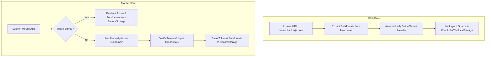
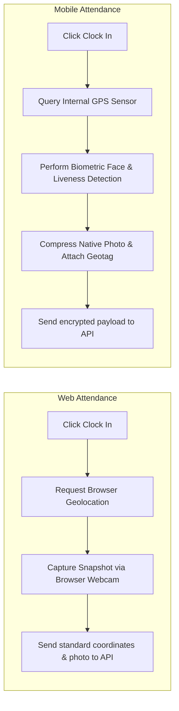

# Feature Map, Workflow Comparison, and Platform Analysis (Web vs. Mobile)

This document provides a comprehensive overview of the architectural differences, workflows, and feature mappings between the **Web (Frontend)** and **Mobile (Flutter)** applications in the HariKerja HRMS system.

---

## 1. Platform Design Philosophy

| Aspect | Web (Frontend Portal) | Mobile (Flutter App) |
| :--- | :--- | :--- |
| **Primary Target Audience** | HR Administrators, Business Owners, Supervisors, & Desk Workers | Field Workers & Operational Employees (Mobile-First) |
| **Interaction Pattern** | Bulk data entry, configurations, large dataset analytics, detailed exports | Quick actions, biometric authentication, single-handed ergonomics |
| **Navigation** | URL-based routing (Routes & Layout Guards) | Stack-based navigation (Screen Stack & State) |
| **Hardware Integration** | Limited (Browser Webcam API, Browser Geolocation API) | Native (Device GPS sensors, Native Camera, Encrypted Storage) |

---

## 2. Feature Comparison & Authorization Matrix

The following matrix lists the availability of features across platforms and the underlying functional rationale:

| Feature Area | Specific Feature | Web | Mobile | Rationale (Why are they different?) |
| :--- | :--- | :---: | :---: | :--- |
| **SaaS & Billing** | Tenant Sign-up | ✅ | ❌ | Corporate onboarding involves long legal/identity forms and checkout flows, which are easier and safer to perform on a desktop layout. |
| | Subscription Management | ✅ | ❌ | Billing cycles, invoice downloads, and subscription tiers are highly sensitive business-owner workflows isolated to the Web admin portal. |
| **Core HR** | Employee CRUD | ✅ | ❌ | Managing employee cohorts and bulk data input requires screen space to minimize typos and ensure compliance. |
| | Document Management | ✅ | ✅ | **Web**: Upload pre-saved digital files (PDF/PNG) from local storage. **Mobile**: Capture physical documents directly using the device camera. |
| **Attendance** | Clock In/Out | ✅ | ✅ | **Web**: For office staff working at desk PCs. **Mobile**: Uses GPS & face verification for dynamic or remote employees. |
| | Precise Geofencing | ❌ | ✅ | Browser Geolocation is easily spoofed via developer tools and often defaults to IP-based routing. Mobile uses physical GPS hardware sensors. |
| | Liveness/Face ID | ❌ | ✅ | Mobile utilizes the native device camera and face-liveness check to prevent identity spoofing using static images. |
| **Leaves & Overtime**| Submission | ✅ | ✅ | Employees can submit requests anywhere (desktop or phone). |
| | Approval Workflow | ✅ | ❌ | Supervisor and HR approval workflows are centralized on the Web to allow managers to view calendars and team coverage. |
| **Payroll** | Bulk Payroll processing | ✅ | ❌ | Payroll calculations (taxes, social security, BPJS) and bank transfer exports are complex operations requiring administrative control and large screen space. |
| | View/Download Payslips | ✅ | ✅ | Individual Self-Service access, allowing employees to view and download their slip PDFs on both Web and Mobile. |
| **Performance** | Setup KPI Templates | ✅ | ❌ | Configured by HR Managers and Executives on the Web to map company goals. |
| | Self-Appraisal | ✅ | ✅ | Employees can input their self-evaluations on either platform. |

---

## 3. Workflow Comparisons

### A. Authentication and Tenant Resolution Workflow
While both platforms use JWT tokens (`access` and `refresh`) to authenticate API requests, they locate tenant database schemas differently:

> [!NOTE]
> On the Web, tenant mapping is automatic based on the browser DNS hostname. On Mobile, due to a single compiled binary serving all customers, the user must input their company's subdomain manually on first launch.

---

### B. Attendance Workflow (Clock In / Clock Out)
The validation and security checks differ dynamically based on the platform:

> [!WARNING]
> Web attendance is susceptible to location spoofing using browser developer tools. Therefore, for remote or on-field personnel, companies are strongly advised to enforce the use of the **Mobile App** due to native GPS sensor hardware reading and face-liveness verification.

---

### C. Personal Document Upload Workflow
* **Similarities**: Both workflows allow updating metadata (`fullName`, `email`) and uploading identity records (`KTP`, `NPWP`).
* **Differences**:
  * **On Web**: Employees can upload pre-existing PDF or image assets using drag-and-drop.
  * **On Mobile**: Optimized for capturing the physical documents directly. The native camera compresses images locally before transfer to reduce mobile data usage.

---

## 4. Token Storage & Security

* **Web**:
  * Tokens are stored in `localStorage` to keep the user logged in across tab sessions.
  * Protection against Cross-Site Scripting (XSS) is enforced via strict frontend output encoding.
* **Mobile**:
  * Tokens are stored securely using `FlutterSecureStorage`, which interfaces with native OS-level encryption: **Keychain** on iOS and **AES KeyStore** on Android.
  * This provides a higher isolation level as other applications cannot read this private storage area.

---

## 5. Summary of Feature Placement Rules

The HariKerja architecture adheres to three core guidelines:
1. **Employee Self-Service (ESS)** $\rightarrow$ Deployed on **Web & Mobile**. Features for personal operational tasks (attendance, leaves, overtime, payslips, self-appraisals) must be accessible everywhere.
2. **Administration & Bulk Operations** $\rightarrow$ Deployed exclusively on the **Web**. Complex calculations, company-wide configuration, and approval dashboards require desktop layouts.
3. **Hardware-Bound Integrity** $\rightarrow$ Deployed exclusively on **Mobile**. Face-liveness checks, background GPS tracking, and native document capture ensure data validity.
