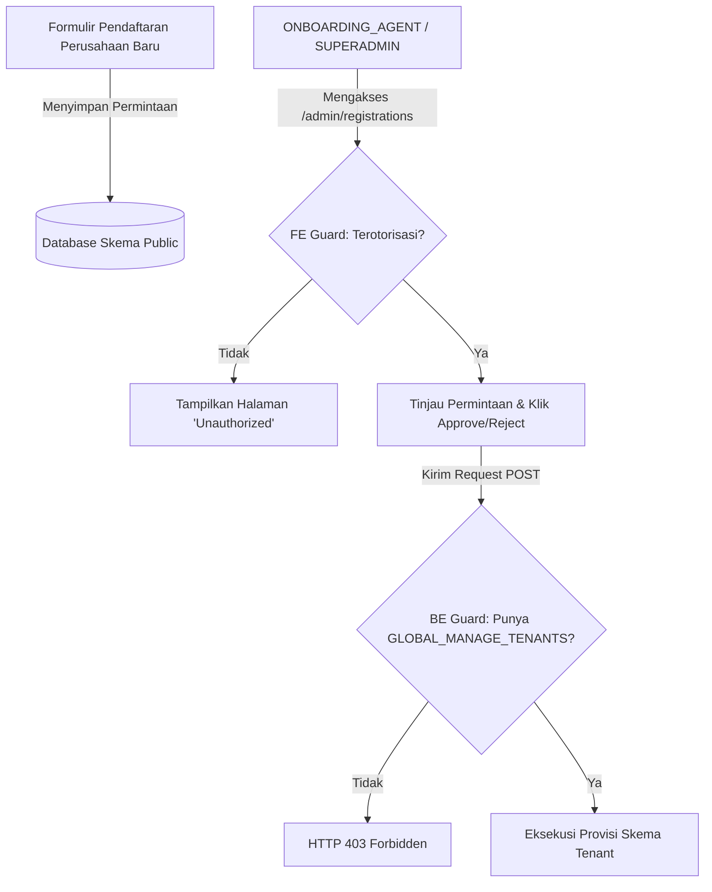
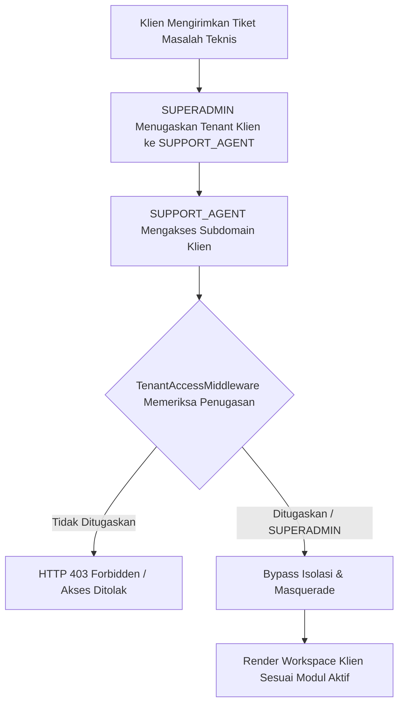
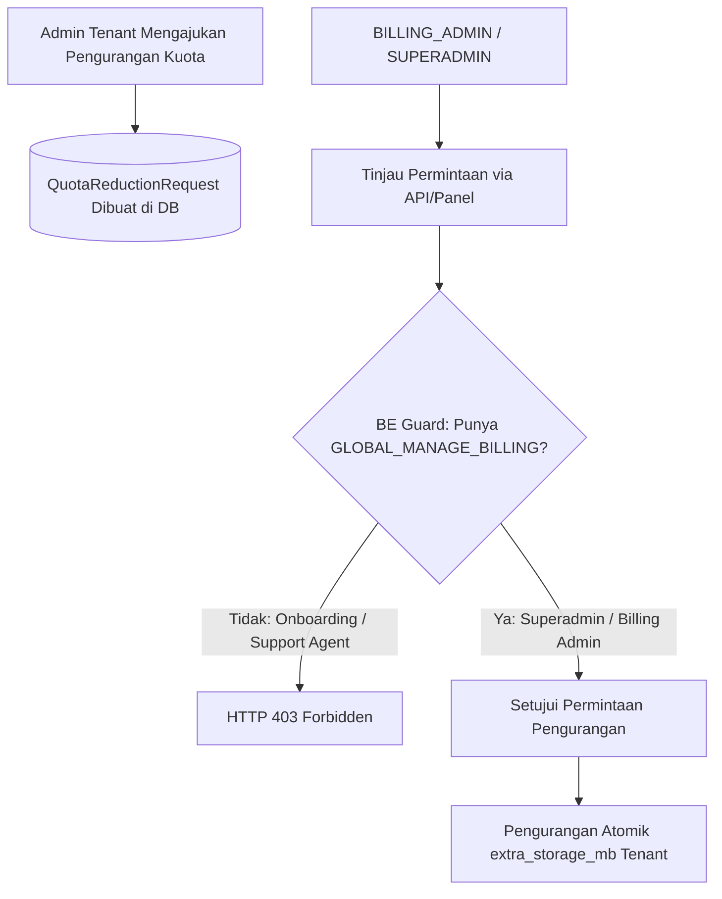
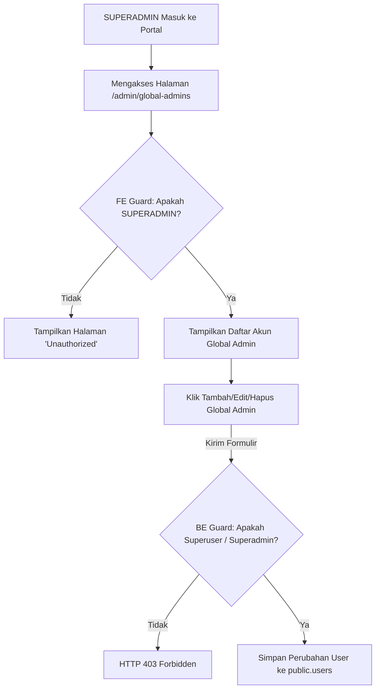

# Dokumentasi Global Admin (SUPERADMIN)

Dokumen ini menjelaskan peran, fungsionalitas, dan konfigurasi akun **Global Admin** pada platform HRMS.

---

## 1. Apa itu Global Admin?

**Global Admin** (berada di skema `public`) adalah entitas pengelola platform HRMS. Akun ini berada di atas tingkat organisasi (tenant) individual dan bertanggung jawab atas manajemen infrastruktur platform SaaS secara keseluruhan.

Sistem otorisasi tingkat master ini diatur menggunakan **Global RBAC (SaaS-Level RBAC)** melalui atribut `global_role` pada model `User`. Atribut ini menggantikan pengecekan boolean `is_global_admin` yang sudah usang (deprecated).

### Tipe Global Role
Platform mendukung pemisahan tugas (*Segregation of Duties*) melalui beberapa peran Global:
*   **`SUPERADMIN`**: Pengelola absolut. Memiliki hak penuh untuk konfigurasi, penagihan, dan *masquerade* ke semua tenant klien tanpa batas.
*   **`ONBOARDING_AGENT`**: Tim sales/onboarding yang berhak menyetujui pendaftaran tenant baru, tetapi **tidak** berhak masuk ke data internal klien.
*   **`SUPPORT_AGENT`**: Tim dukungan teknis yang hanya boleh melakukan *masquerade* ke tenant klien yang secara spesifik ditugaskan (di-*assign*) kepada mereka untuk keperluan *troubleshooting*.
*   **`BILLING_ADMIN`**: Tim finansial yang mengatur tagihan SaaS dan paket langganan, tanpa hak akses ke data HR klien.

#### Matriks Perbandingan Peran Global Admin

| Aspek | `SUPERADMIN` | `ONBOARDING_AGENT` | `SUPPORT_AGENT` | `BILLING_ADMIN` |
| :--- | :--- | :--- | :--- | :--- |
| **Fokus Utama** | Manajemen absolut & pengawasan infrastruktur SaaS. | Siklus awal tenant (pendaftaran, validasi & aktivasi baru). | Dukungan teknis & pemecahan masalah (*troubleshooting*) klien. | Siklus keuangan, penagihan, & kuota langganan platform. |
| **Izin Global** | Semua izin (`GLOBAL_MANAGE_ADMINS`, `GLOBAL_MANAGE_TENANTS`, `GLOBAL_MANAGE_BILLING`, `GLOBAL_MASQUERADE`). | `GLOBAL_MANAGE_TENANTS` | `GLOBAL_MASQUERADE` (terbatas pada tenant yang ditugaskan). | `GLOBAL_MANAGE_BILLING` |
| **Wewenang Utama** | • Mengelola admin global.<br>• Menyetujui/menolak registrasi.<br>• Masuk/penyamaran (*masquerade*) ke semua tenant.<br>• Mengatur billing & kuota. | • Melihat daftar registrasi.<br>• Menyetujui/menolak registrasi tenant baru (memicu skema database). | • Masuk/penyamaran (*masquerade*) untuk membantu/troubleshoot masalah internal tenant klien. | • Melihat & mengelola invoice.<br>• Meninjau/memproses permohonan penyesuaian kuota (`QuotaReductionRequest`). |
| **Batasan Akses** | Tidak ada batasan akses (akses penuh di semua lingkup platform). | Tidak memiliki hak akses untuk mengelola tagihan/invoice keuangan, tidak dapat melakukan penyamaran (*masquerade*) ke tenant klien. | Tidak memiliki hak akses untuk melihat/menolak pendaftaran tenant baru, tidak dapat melihat data billing/tagihan, tidak dapat mengakses tenant yang tidak ditugaskan. | Tidak memiliki hak akses untuk menyetujui/menolak registrasi tenant baru, tidak dapat melakukan penyamaran (*masquerade*) ke tenant klien. |

### Alur Kerja (Workflow) Tiap Peran Global Admin

#### 1. Alur Pendaftaran & Aktivasi Tenant (Tenant Onboarding & Activation Flow)
* **Pengajuan (Submission)**: Perusahaan baru melakukan pendaftaran melalui halaman pendaftaran publik. Permintaan pendaftaran disimpan di bawah basis data skema `public` dengan status `PENDING`.
* **Peninjauan (Review)**: Peran `ONBOARDING_AGENT` atau `SUPERADMIN` masuk ke portal admin global di `/login/portal-admin`.
* **Proteksi Frontend (FE Guard)**: Item menu sidebar dan rute `/admin/registrations` dibatasi secara ketat sehingga hanya peran `SUPERADMIN` dan `ONBOARDING_AGENT` yang dapat melihat atau mengaksesnya. Peran lainnya akan melihat halaman pemblokiran "Unauthorized".
* **Penegakan Backend (BE Enforcement)**: Ketika mengeklik tombol `Approve` atau `Reject`, permintaan dikirim ke `/internal/registrations/...`. Endpoint ini menerapkan verifikasi izin `GLOBAL_MANAGE_TENANTS` via `RegistrationApprovalViewSet` untuk memastikan peran yang tidak sah ditolak di tingkat basis data dan API.
* **Provisi (Provisioning)**: Begitu disetujui, backend secara otomatis memicu migrasi skema PostgreSQL untuk memprovisikan workspace penyewa baru secara dinamis dan mengisi data master penting.



#### 2. Alur Dukungan Teknis & Penyamaran (Troubleshooting & Masquerade Flow)
* **Permintaan Bantuan**: Perusahaan klien mengalami kendala teknis dan memerlukan bantuan troubleshooting.
* **Penugasan (Assignment)**: Peran `SUPERADMIN` menugaskan tenant klien tertentu kepada peran `SUPPORT_AGENT` yang ditunjuk melalui pemetaan relasi data user-tenant.
* **Kontrol Akses**: Setelah ditugaskan, `SUPPORT_AGENT` memperoleh hak untuk memintas batasan isolasi multi-tenant untuk tenant spesifik tersebut.
* **Bypass Isolasi**: Middleware keamanan (`TenantAccessMiddleware`) memungkinkan `SUPPORT_AGENT` yang ditugaskan untuk melakukan *masquerade* ke subdomain perusahaan klien. Saat mengakses URL perusahaan klien (misalnya `perusahaan.harikerja.web.id`), menu sidebar dan komponen dimuat sesuai modul aktif klien, sehingga debugging dapat dilakukan tanpa membahayakan data klien lain.



#### 3. Alur Penagihan SaaS & Pengurangan Kuota (SaaS Billing & Quota Reduction Flow)
* **Pengajuan Kuota**: Administrator tenant mengajukan pengurangan kuota penyimpanan ekstra (untuk menekan biaya langganan bulanan) dari panel langganan lokal mereka.
* **Peninjauan (Review)**: `QuotaReductionRequest` dibuat dan masuk ke dalam antrean tinjauan admin platform.
* **Pembatasan Backend (BE Restriction)**: Endpoint peninjauan/persetujuan pengurangan kuota di `QuotaReductionRequestViewSet` memverifikasi izin `GLOBAL_MANAGE_BILLING`. Hak akses ini dibatasi secara ketat hanya untuk peran `SUPERADMIN` dan `BILLING_ADMIN`. Peran `ONBOARDING_AGENT` dan `SUPPORT_AGENT` tidak memiliki wewenang untuk melihat atau memproses permintaan ini.
* **Eksekusi Pengurangan**: Begitu disetujui, backend melakukan pembaruan atomik terhadap limit penyimpanan `extra_storage_mb` milik tenant yang bersangkutan.



#### 4. Alur Administrasi Platform & Manajemen Pengguna Global (Platform Administration & Global User Management Flow)
* **Inisiasi**: Peran `SUPERADMIN` masuk ke portal admin global.
* **Kontrol Akses**: Peran `SUPERADMIN` membuka halaman `/admin/global-admins`. Proteksi navigasi frontend membatasi halaman ini secara eksklusif hanya untuk pengguna `SUPERADMIN`; setiap peran global admin lain yang mencoba mengunjungi URL ini diblokir dan diarahkan ke halaman "Unauthorized".
* **Operasi Manajemen**: Di halaman ini, `SUPERADMIN` dapat melakukan operasi CRUD: menambahkan pengguna global admin baru, memodifikasi detail admin yang ada (seperti mengubah email atau peran global mereka menjadi `ONBOARDING_AGENT`, `SUPPORT_AGENT`, atau `BILLING_ADMIN`), atau menghapus akun global admin.
* **Penegakan Backend (BE Enforcement)**: Permintaan API ke `/internal/global-admins/` dicegat oleh pemeriksaan izin backend (`IsSuperUserOrSelf`), memastikan hanya `SUPERADMIN` atau superuser legacy yang dapat menulis atau mengubah data akun global admin.



---

## 2. Hubungan dengan Tenant Master (Public Schema)

Sistem HRMS ini menggunakan arsitektur *PostgreSQL Schema-Based Multi-Tenancy*.
* **Tenant Master** dilambangkan oleh skema khusus bernama **`public` schema**.
* Data global, termasuk daftar tenant, manajemen domain, dan permintaan pendaftaran tenant baru, disimpan di skema `public`.
* Kredensial login untuk Global Admin disimpan di dalam skema `public` ini.
* Hanya akun dengan status `is_global_admin` atau `is_superuser` yang diperbolehkan mengakses portal administrasi utama yang berada di bawah domain publik (diakses melalui `/en/login/portal-admin`).

---

## 3. Fungsionalitas & Hak Istimewa

### A. Bypass Pembatasan Multi-Tenant
Berdasarkan `TenantAccessMiddleware`, pengguna standar hanya dapat mengakses tenant tempat mereka terdaftar secara eksplisit. Global Admin memiliki pengecualian:
```python
# Terletak di backend/users/middleware.py
user = request.user
is_legacy_internal = getattr(user, 'is_global_admin', False) or user.is_superuser

if user.global_role or is_legacy_internal:
    from users.global_constants import GLOBAL_MASQUERADE, GLOBAL_ROLE_PERMISSIONS
    user_perms = GLOBAL_ROLE_PERMISSIONS.get(user.global_role, [])
    
    if user.global_role == 'SUPERADMIN' or is_legacy_internal:
        return self.get_response(request)
```
Hal ini memungkinkan tim pengembang atau pengelola sistem untuk dengan bebas melihat dan menelusuri data di seluruh database tenant untuk keperluan audit maupun debugging.

### B. Akses saat Langganan Kedaluwarsa/Ditangguhkan (Suspended)
Berdasarkan `SubscriptionMiddleware`, ketika langganan sebuah tenant kedaluwarsa atau ditangguhkan, modul operasional HRMS akan dikunci bagi pengguna biasa. Namun, Global Admin tetap dapat mengakses penuh tenant tersebut:
```python
# Terletak di backend/users/middleware.py
user = request.user
if user.is_authenticated and (user.is_superuser or getattr(user, 'is_global_admin', False) or user.global_role):
    return self.get_response(request)
```

### C. Pengelolaan Permintaan Pendaftaran (*Registration Request*)
Fungsi bisnis utama dari Global Admin di portal admin global adalah meninjau (`REVIEW`), menyetujui (`APPROVE`), atau menolak (`REJECT`) calon tenant/perusahaan baru yang mendaftar ke platform SaaS. Ketika pendaftaran disetujui, backend akan secara otomatis melakukan migrasi skema baru untuk penyewa tersebut.

## 4. Perbandingan dengan Admin Biasa (Tenant Admin)

Berikut adalah ringkasan perbedaan mendasar antara peran **Global Admin** (SaaS Platform Operator) dengan **Admin Biasa** (Company Admin):

| Fitur / Sifat | **Global Admin** (`SUPERADMIN`) | **Admin Biasa** (`ADMIN`) |
| :--- | :--- | :--- |
| **Lokasi Database** | Terdaftar di Master Tenant (`public` schema) | Terdaftar di tenant perusahaan spesifik (misal: `tenant_a`) |
| **Cakupan Akses** | **Lintas-Tenant (Global)**. Bisa mengakses seluruh database perusahaan. | **Tunggal (Lokal)**. Terisolasi ketat hanya pada data perusahaannya sendiri. |
| **Akses Portal Admin** | Mengakses portal infrastruktur SaaS (`/login/portal-admin`). | Hanya bisa mengakses dasbor HR internal masing-masing perusahaan. |
| **Tanggung Jawab Utama** | • Validasi & Provisi Tenant baru.<br>• Pemantauan infrastruktur global.<br>• Debugging root system. | • Administrasi data Karyawan.<br>• Rekap Kehadiran (*Attendance*).<br>• Proses Gaji (*Payroll*) & Reimbursement. |
| **Kebijakan Lisensi** | **Kebal**. Tetap memiliki akses penuh saat tenant ditangguhkan (*Suspended*). | **Terpengaruh**. Hak modifikasi data dikunci jika langganan perusahaan kedaluwarsa. |
| **Bypass Middleware** | **Bergantung Role** (misal: `SUPERADMIN` atau `SUPPORT_AGENT` terkait), bisa melewati pembatasan relasi multi-tenant. | **Tidak**. Terikat validasi database schema middleware. |

---

## 5. Visibilitas Menu (Sidebar Filtering)

Sistem menggunakan logika **Module-Based Menu Visibility** di `Sidebar.tsx`. Menu operasional HR (seperti *Payroll*, *Attendance*, *Performance*, dll.) hanya akan muncul jika modul yang bersangkutan terdaftar di dalam `enabledModules` milik *Tenant* yang sedang diakses.

Implikasi bagi Global Admin:
1. **Saat Berada di Public Tenant (`harikerja.web.id`)**: Karena *Public Tenant* tidak dikonfigurasi untuk memiliki karyawan (dan `enabledModules` di-*hardcode* sebagai array kosong `[]`), maka seluruh menu HR operasional tersebut **akan disembunyikan** dari *sidebar*. Tampilan akan lebih bersih dan fokus pada *Overview*, *Profile*, dan konfigurasi *Settings* platform.
2. **Saat Melakukan *Masquerade* ke Tenant Klien (`klien.harikerja.web.id`)**: Karena Global Admin menembus batasan otentikasi tenant, mereka dapat masuk ke *dashboard* klien. Saat berada di sini, *sidebar* akan merender seluruh menu operasional HR **yang aktif** untuk paket berlangganan perusahaan klien tersebut (berdasarkan data `enabledModules` klien dari backend).

---

## 6. Konfigurasi Default (Seeded Admin)

Untuk keperluan pengembangan (*development*) dan pengujian otomatis (*automated tests*), akun Global Admin perdana telah diinisialisasi melalui database seeding.

**Informasi Akun Seeded Global Admin:**
* **Email**: `superadmin@harikerja.com`
* **Password**: `password123`
* **Lokasi Penyimpanan**: Skema database `public`.

### Cara Kerja Otomatisasi `superuser`
Setiap kali Anda menjalankan perintah Django `createsuperuser`, sistem secara otomatis akan memberikan atribut `global_role='SUPERADMIN'` melalui `UserManager`:
```python
def create_superuser(self, email, password=None, **extra_fields):
    extra_fields.setdefault('is_staff', True)
    extra_fields.setdefault('is_superuser', True)
    extra_fields.setdefault('is_global_admin', True)
    extra_fields.setdefault('global_role', 'SUPERADMIN') # Otomatis disematkan
    return self.create_user(email, password, **extra_fields)
```

---

## 7. Cara Membuat Akun Superadmin Baru di Server (Manual)

Karena skrip deployment pada server remote (seperti QA/Production) secara default **tidak** menjalankan database seeding demi keamanan, Anda harus membuat akun Global Admin pertama kali secara manual menggunakan tool terminal Django.

Ikuti langkah-langkah berikut pada terminal VPS Anda:

1. **Akses Server via SSH** dan pindah ke folder root proyek (biasanya `/opt/hrms`).
2. **Jalankan Perintah Django Shell** di dalam kontainer docker backend dengan file `.env` yang sesuai:

   **Untuk Lingkungan QA (`harikerja.web.id`):**
   ```bash
   docker compose -f deploy/qa/docker-compose.qa.yml --env-file deploy/environments/.env.qa exec backend python manage.py createsuperuser
   ```

   **Untuk Lingkungan Lokal / Produksi Utama:**
   ```bash
   docker compose exec backend python manage.py createsuperuser
   ```

3. **Isi Formulir Kredensial** yang muncul di layar interaktif:
   *   Masukkan Alamat Email baru Anda.
   *   Buat Password yang aman dan konfirmasikan.

Begitu proses selesai dengan pesan `Superuser created successfully.`, sistem secara otomatis akan menyematkan flag `global_role='SUPERADMIN'` pada akun tersebut, dan akun siap digunakan untuk login.

---

## 8. Referensi Berkas Terkait
* **Model Pengguna:** [users/models.py](file:///home/afdhal/data/hr/hrms/backend/users/models.py)
* **Middleware Keamanan:** [users/middleware.py](file:///home/afdhal/data/hr/hrms/backend/users/middleware.py)
* **Database Seeder:** [scripts/seeds/core.py](file:///home/afdhal/data/hr/hrms/backend/scripts/seeds/core.py)
* **E2E Test Suites:** [tests/superadmin.spec.ts](file:///home/afdhal/data/hr/hrms/frontend/tests/superadmin.spec.ts)


