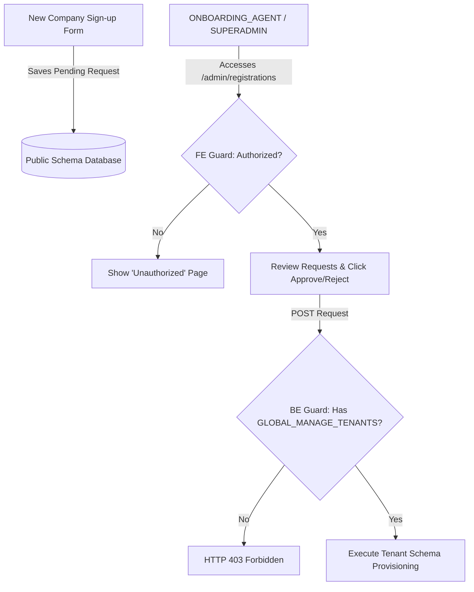
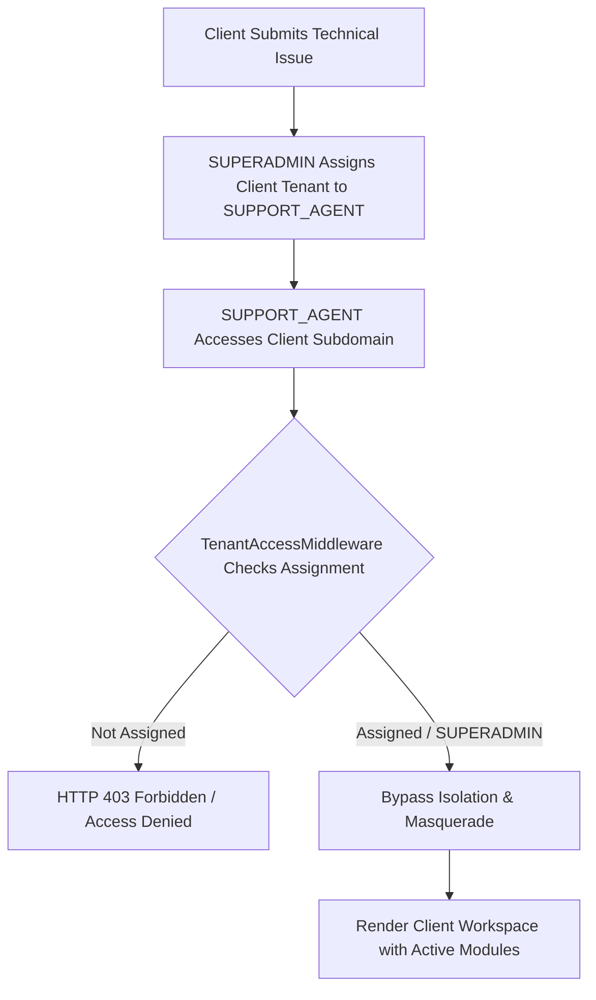
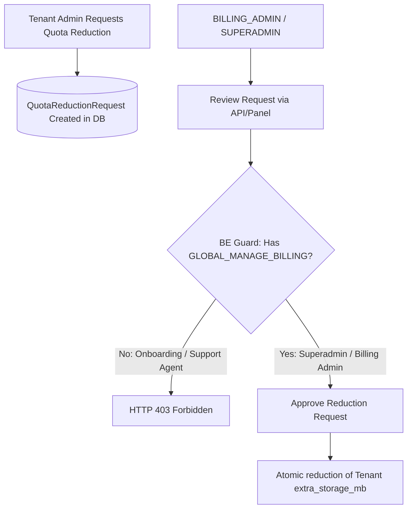
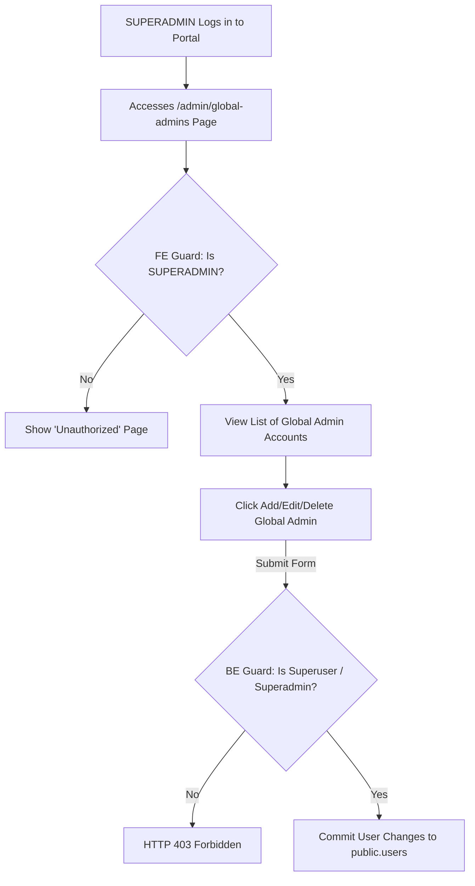

# Global Admin (SUPERADMIN) Documentation

This document outlines the roles, functionalities, and configurations of the **Global Admin** account within the HRMS platform.

---

## 1. What is a Global Admin?

**Global Admin** (located in the `public` schema) is the managing entity of the HRMS platform. This account functions above the scope of individual organizations (tenants) and is responsible for managing the SaaS platform's overall infrastructure.

This master-level authorization system is managed using **Global RBAC (SaaS-Level RBAC)** via the `global_role` attribute on the `User` model. This attribute replaces the deprecated `is_global_admin` boolean check.

### Global Role Types
The platform supports Segregation of Duties through several Global roles:
*   **`SUPERADMIN`**: Absolute manager. Has full rights for configuration, billing, and unrestricted *masquerade* access to all client tenants.
*   **`ONBOARDING_AGENT`**: Sales/onboarding team authorized to approve new tenant registrations, but **not** authorized to access internal client data.
*   **`SUPPORT_AGENT`**: Technical support team that is only allowed to *masquerade* into client tenants specifically assigned to them for troubleshooting purposes.
*   **`BILLING_ADMIN`**: Finance team managing SaaS billing and subscription plans, without access to client HR data.

#### Global Admin Roles Comparison Matrix

| Aspect | `SUPERADMIN` | `ONBOARDING_AGENT` | `SUPPORT_AGENT` | `BILLING_ADMIN` |
| :--- | :--- | :--- | :--- | :--- |
| **Primary Focus** | Absolute management & SaaS infrastructure supervision. | Tenant onboarding cycle (sign-ups, validation & activation). | Customer technical support & internal tenant troubleshooting. | SaaS billing cycle, payments, invoicing & subscription limits. |
| **Global Permission** | All permissions (`GLOBAL_MANAGE_ADMINS`, `GLOBAL_MANAGE_TENANTS`, `GLOBAL_MANAGE_BILLING`, `GLOBAL_MASQUERADE`). | `GLOBAL_MANAGE_TENANTS` | `GLOBAL_MASQUERADE` (restricted only to assigned client tenants). | `GLOBAL_MANAGE_BILLING` |
| **Core Privilege** | • Manage global admin users.<br>• Approve/reject registrations.<br>• Full masquerade access.<br>• Manage billing & quotas. | • View registration lists.<br>• Approve/reject tenant registrations (triggers new schema creation). | • Masquerade into assigned tenant's dashboard to troubleshoot technical issues. | • View & manage transaction invoices.<br>• Approve/reject quota reduction requests (`QuotaReductionRequest`). |
| **Access Restrictions** | No restrictions (full system context bypass). | Cannot manage billing/quotas, cannot masquerade into client tenants. | Cannot view/review registrations, cannot view billing data, cannot masquerade into unassigned tenants. | Cannot approve/reject registrations, cannot masquerade into client tenants. |

### Global Admin Role Workflows

#### 1. Tenant Onboarding & Activation Flow
* **Submission**: New companies sign up via the public sign-up page. The registration requests are initially saved under the `public` schema database with a `PENDING` status.
* **Review**: An `ONBOARDING_AGENT` or `SUPERADMIN` logs into the global admin portal at `/login/portal-admin`. 
* **FE Guard**: The sidebar menu item and the route `/admin/registrations` are restricted so that only `SUPERADMIN` and `ONBOARDING_AGENT` roles can view or access them. All other roles see an "Unauthorized" block page.
* **BE Enforcement**: When clicking `Approve` or `Reject`, the request is sent to `/internal/registrations/...`. The endpoint enforces `GLOBAL_MANAGE_TENANTS` permissions via `RegistrationApprovalViewSet`, ensuring unauthorized roles are blocked at the database and API level.
* **Provisioning**: Upon approval, the backend automatically triggers PostgreSQL schema migrations to dynamically provision the new tenant's workspace and pre-populate essential master data.



#### 2. Troubleshooting & Masquerade Flow
* **Support Request**: A client experiences technical issues and requests technical assistance.
* **Assignment**: A `SUPERADMIN` assigns the specific client tenant to a designated `SUPPORT_AGENT`.
* **Access Control**: Once assigned, the `SUPPORT_AGENT` gains the privilege to bypass multi-tenant isolation for that specific tenant.
* **Bypass Isolation**: The security middleware (`TenantAccessMiddleware`) allows the assigned `SUPPORT_AGENT` to masquerade into the client's subdomain. When accessing the client's URL (e.g. `company.harikerja.web.id`), the sidebar and components render according to the client's active modules, enabling complete troubleshooting without compromising other clients' security.



#### 3. SaaS Billing & Quota Reduction Flow
* **Quota Request**: A tenant administrator requests a reduction in their extra storage quota (e.g. to lower monthly costs) from their local subscription panel.
* **Review**: The `QuotaReductionRequest` is created and queued for platform admin review.
* **BE Restriction**: The view/approval endpoint for quota reduction requests in `QuotaReductionRequestViewSet` checks for the `GLOBAL_MANAGE_BILLING` permission. Access is strictly limited to `SUPERADMIN` and `BILLING_ADMIN`. `ONBOARDING_AGENT` and `SUPPORT_AGENT` roles are completely unauthorized to view or review these requests.
* **Reduction Execution**: Once approved, the backend executes an atomic operation updating the tenant's `extra_storage_mb` storage limits.



#### 4. Platform Administration & Global User Management Flow
* **Initiation**: The `SUPERADMIN` logs into the global admin portal.
* **Access Control**: The `SUPERADMIN` navigates to `/admin/global-admins`. The frontend routing guards restrict this page specifically to `SUPERADMIN` users; any other global admin role attempting to visit this URL is blocked and redirected to the "Unauthorized" page.
* **Management Operations**: On this page, the `SUPERADMIN` can perform CRUD operations: adding a new global admin user, modifying an existing admin's details (such as changing their email or global role to `ONBOARDING_AGENT`, `SUPPORT_AGENT`, or `BILLING_ADMIN`), or deleting a global admin account.
* **BE Enforcement**: API requests to `/internal/global-admins/` are intercepted by backend permission checks (`IsSuperUserOrSelf`), ensuring only `SUPERADMIN` or legacy superusers can write or mutate global admin accounts.



---

## 2. Relationship with Master Tenant (Public Schema)

This HRMS system utilizes a *PostgreSQL Schema-Based Multi-Tenancy* architecture.
* **Master Tenant** is represented by a special schema named the **`public` schema**.
* Global data, including the list of registered tenants, domain management, and registration requests, is stored in the `public` schema.
* Login credentials for the Global Admin are stored within this `public` schema database.
* Only accounts with `is_global_admin` or `is_superuser` status are authorized to access the primary platform administration portal located under the public domain (accessed via `/en/login/portal-admin`).

---

## 3. Functionality & Privileges

### A. Bypass Multi-Tenant Isolation
Based on `TenantAccessMiddleware`, standard users are restricted only to tenants where they are explicitly registered. Global Admins are an exception:
```python
# Located in backend/users/middleware.py
user = request.user
is_legacy_internal = getattr(user, 'is_global_admin', False) or user.is_superuser

if user.global_role or is_legacy_internal:
    from users.global_constants import GLOBAL_MASQUERADE, GLOBAL_ROLE_PERMISSIONS
    user_perms = GLOBAL_ROLE_PERMISSIONS.get(user.global_role, [])
    
    if user.global_role == 'SUPERADMIN' or is_legacy_internal:
        return self.get_response(request)
```
This empowers developers and system operators to freely inspect and troubleshoot data across different tenant databases for auditing and debugging purposes.

### B. Access Suspended/Expired Tenants
Based on `SubscriptionMiddleware`, when a tenant's subscription expires or gets suspended, operational HRMS modules are locked for normal employees. However, a Global Admin retains full accessibility:
```python
# Located in backend/users/middleware.py
user = request.user
if user.is_authenticated and (user.is_superuser or getattr(user, 'is_global_admin', False) or user.global_role):
    return self.get_response(request)
```

### C. Processing Registration Requests
The primary business function of a Global Admin in the global portal is to review (`REVIEW`), approve (`APPROVE`), or reject (`REJECT`) newly registered companies applying to join the SaaS platform. Upon approval, the backend automatically triggers schema migrations to provision the new tenant.

## 4. Comparison with Regular Admin (Tenant Admin)

Below is a summary of the core differences between the **Global Admin** (SaaS Platform Operator) and **Regular Admin** (Company HR Admin):

| Feature / Characteristic | **Global Admin** (`SUPERADMIN`) | **Regular Admin** (`ADMIN`) |
| :--- | :--- | :--- |
| **Database Location** | Stored in the Master Tenant (`public` schema) | Stored within a specific company tenant (e.g., `tenant_a`) |
| **Access Context** | **Cross-Tenant (Global)**. Unrestricted access to all active companies. | **Single-Tenant (Local)**. Strictly isolated only to their own data. |
| **Admin Portal Access** | Logs into the global SaaS operator portal (`/login/portal-admin`). | Logs into their specific company's HR dashboard. |
| **Primary Duty** | • Approve & Provision new Tenants.<br>• Platform global health monitoring.<br>• High-level infrastructure debugging. | • Employee records management.<br>• Monthly Payroll processing.<br>• Attendance & Leave tracking. |
| **Subscription Rules** | **Immune**. Bypasses expiration lockouts and suspended states. | **Affected**. Modification features are frozen upon plan expiration. |
| **Middleware Check** | **Role-Dependent** (e.g., `SUPERADMIN` or assigned `SUPPORT_AGENT`) can bypass multi-tenant constraints. | **Enforced**. Confined by standard security middleware rules. |

---

## 5. Default Configuration (Seeded Admin)

For both development environments and automated test suites, an initial Global Admin account has been seeded.

**Seeded Global Admin Account Info:**
* **Email**: `superadmin@harikerja.com`
* **Password**: `password123`
* **Storage Context**: `public` schema database.

### Automation via `superuser` Creation
Every time you invoke Django's default `createsuperuser` utility, the custom `UserManager` automatically appends the `global_role='SUPERADMIN'` attribute to ensure full platform authorization:
```python
def create_superuser(self, email, password=None, **extra_fields):
    extra_fields.setdefault('is_staff', True)
    extra_fields.setdefault('is_superuser', True)
    extra_fields.setdefault('is_global_admin', True)
    extra_fields.setdefault('global_role', 'SUPERADMIN') # Automatically attached
    return self.create_user(email, password, **extra_fields)
```

---

## 6. How to Manually Create a Superadmin Account on the Server

Since production or remote deployment scripts (like QA) **do not** seed databases by default for security purposes, you must provision the initial Global Admin account manually via the Django terminal utilities.

Follow these steps on your remote server terminal:

1. **Log into your Server via SSH** and navigate to the project root (usually `/opt/hrms`).
2. **Execute the Django command** inside the backend docker container using the matching env file:

   **For QA Environment (`harikerja.web.id`):**
   ```bash
   docker compose -f deploy/qa/docker-compose.qa.yml --env-file deploy/environments/.env.qa exec backend python manage.py createsuperuser
   ```

   **For Standard Local / Production:**
   ```bash
   docker compose exec backend python manage.py createsuperuser
   ```

3. **Enter the Credentials** in the interactive shell prompts:
   *   Input your desired email address.
   *   Type and confirm a strong password.

Once complete, you should see the `Superuser created successfully.` confirmation. The system will automatically apply the `global_role='SUPERADMIN'` tag, rendering the account immediately operational for logins.

---

## 7. Related File References
* **Detailed Role & Permission Matrix (Web & Mobile):** [docs/workflows_features/rbac_matrix_details.md](file:///home/afdhal/data/hr/hrms/docs/workflows_features/rbac_matrix_details.md)
* **User Model:** [users/models.py](file:///home/afdhal/data/hr/hrms/backend/users/models.py)
* **Security Middleware:** [users/middleware.py](file:///home/afdhal/data/hr/hrms/backend/users/middleware.py)
* **Database Seeder:** [scripts/seeds/core.py](file:///home/afdhal/data/hr/hrms/backend/scripts/seeds/core.py)
* **E2E Test Suites:** [tests/superadmin.spec.ts](file:///home/afdhal/data/hr/hrms/frontend/tests/superadmin.spec.ts)


