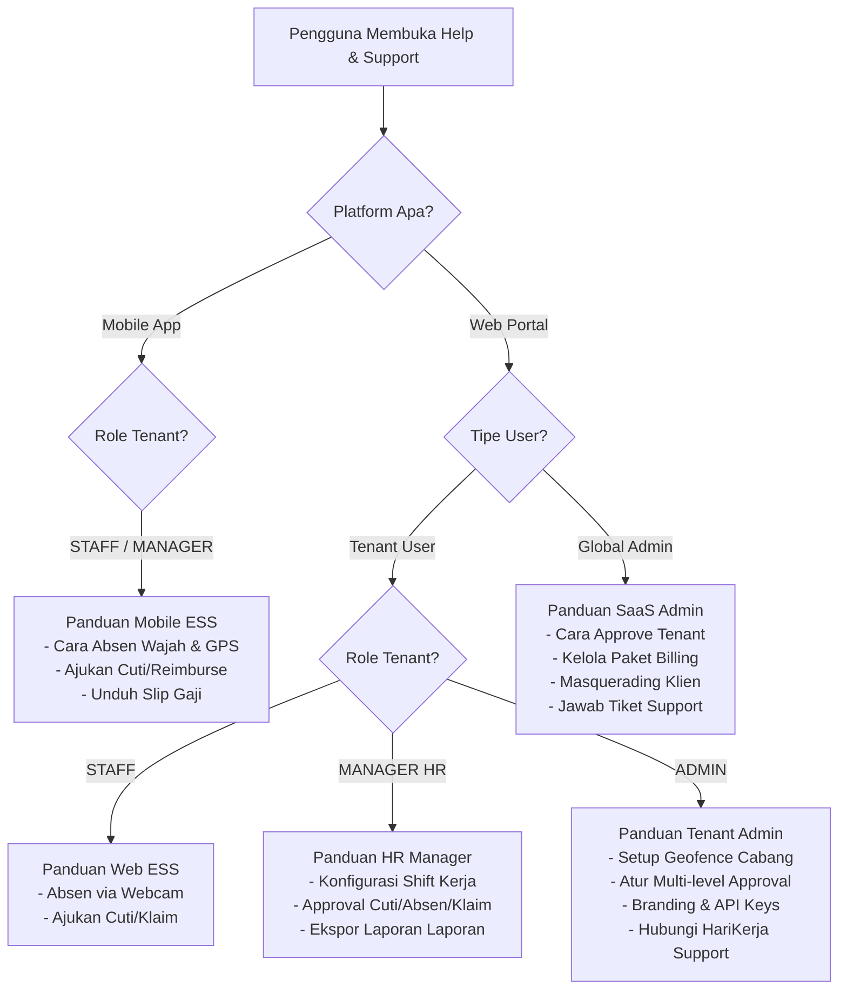
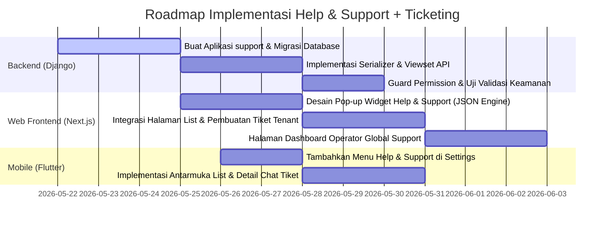

# Desain & Panduan Implementasi: Modul Help & Support dan Ticketing

Dokumen ini menjelaskan rancangan arsitektur, skema data, alur kerja (workflow), serta panduan implementasi untuk modul **Help & Support** (Panduan Pengguna Dinamis) dan **Ticketing System** pada platform **HariKerja HRMS** (Web Frontend Next.js, Django Backend, dan Mobile Flutter).

---

## 💬 1. Keputusan Desain & Konsultasi (Menjawab Pertanyaan User)

### Pertanyaan A: Apakah semua role bisa membuat tiket atau user role tertentu saja?
**Rekomendasi Solusi:** Ya, semua role dapat membuat tiket, tetapi dengan **pemisahan lingkup (scope) yang jelas** agar tim teknis SaaS tidak dibanjiri oleh masalah operasional internal perusahaan klien. Kami membaginya menjadi dua jenis tiket:

1. **Tiket Internal Perusahaan (Internal Tenant Ticket):**
   - **Pembuat (Creator):** Semua role di dalam tenant (`STAFF`, `MANAGER HR`, `ADMIN`).
   - **Tujuan/Topik:** Pertanyaan atau masalah operasional internal perusahaan (misal: "Mengapa gaji saya bulan ini ada selisih?", "Sisa kuota cuti melahirkan salah", "Jadwal shift tertukar").
   - **Penyelesai (Resolver):** HR Manager atau Tenant Admin dari perusahaan itu sendiri.
   - **Keamanan:** Terisolasi penuh di dalam skema database tenant masing-masing.

2. **Tiket Layanan/Platform SaaS (Platform Support Ticket):**
   - **Pembuat (Creator):** Hanya Tenant **`ADMIN`** (dan opsional `MANAGER HR` dengan izin khusus).
   - **Tujuan/Topik:** Masalah teknis platform, bug sistem, kendala tagihan/billing, atau permintaan fitur custom (misal: "Sistem absensi wajah tidak merespons", "Metode pembayaran subscription gagal", "Pengurangan kuota storage gagal").
   - **Penyelesai (Resolver):** SaaS Global Support (`SUPPORT_AGENT` atau `SUPERADMIN`).
   - **Keamanan:** Disimpan di skema `public` dengan relasi ke data `Tenant`.

### Pertanyaan B: Apakah global admin user perlu ticketing semacam ini?
**Rekomendasi Solusi:** Ya, sangat perlu, tetapi **bukan sebagai pembuat tiket**, melainkan sebagai **Operator/Penyelesai (Resolver)**.
- Global Admin (khususnya role `SUPPORT_AGENT` dan `SUPERADMIN`) memerlukan dashboard khusus (**Global Support Dashboard**) untuk melihat daftar tiket platform yang dikirim oleh para Tenant Admin, membalas chat/pesan tiket, mengubah status tiket (`Open`, `In Progress`, `Resolved`, `Closed`), dan menetapkan tingkat prioritas tiket berdasarkan SLA (Service Level Agreement).

---

## 🏗️ 2. Arsitektur Data & Model Django (Multi-Tenant)

Untuk mendukung pemisahan lingkup di atas dalam arsitektur multi-tenant Django, model database dirancang sebagai berikut:

### A. Model Skema Tenant (Tenant Schema - `InternalTicket`)
Model ini dibuat di dalam aplikasi `core` atau modul baru `support` di tingkat tenant. Digunakan untuk tiket internal perusahaan (Karyawan $\rightarrow$ HR).

```python
# backend/support/models.py (Tenant Schema)
from django.db import models
from core.models import Employee, AuditModel
from django.utils.translation import gettext_lazy as _

class InternalTicket(AuditModel):
    CATEGORY_CHOICES = [
        ('PAYROLL', _('Payroll & Compensation')),
        ('ATTENDANCE', _('Attendance & Correction')),
        ('LEAVE', _('Leaves & Overtime')),
        ('TECHNICAL', _('Device & Login Issues')),
        ('GENERAL', _('General Inquiry')),
    ]
    
    PRIORITY_CHOICES = [
        ('LOW', _('Low')),
        ('MEDIUM', _('Medium')),
        ('HIGH', _('High')),
        ('URGENT', _('Urgent')),
    ]

    STATUS_CHOICES = [
        ('OPEN', _('Open')),
        ('IN_PROGRESS', _('In Progress')),
        ('RESOLVED', _('Resolved')),
        ('CLOSED', _('Closed')),
    ]

    creator = models.ForeignKey(Employee, on_delete=models.CASCADE, related_name='internal_tickets')
    title = models.CharField(max_length=255)
    description = models.TextField()
    category = models.CharField(max_length=20, choices=CATEGORY_CHOICES, default='GENERAL')
    priority = models.CharField(max_length=10, choices=PRIORITY_CHOICES, default='LOW')
    status = models.CharField(max_length=15, choices=STATUS_CHOICES, default='OPEN')
    assigned_to = models.ForeignKey(Employee, on_delete=models.SET_NULL, null=True, blank=True, related_name='assigned_internal_tickets')
    
    def __str__(self):
        return f"#{self.id} - {self.title} ({self.status})"

class InternalTicketMessage(AuditModel):
    ticket = models.ForeignKey(InternalTicket, on_delete=models.CASCADE, related_name='messages')
    sender = models.ForeignKey(Employee, on_delete=models.CASCADE)
    message = models.TextField()
    is_internal = models.BooleanField(default=False, help_text="Catatan internal khusus HR, karyawan tidak bisa melihat")

class InternalTicketAttachment(AuditModel):
    ticket = models.ForeignKey(InternalTicket, on_delete=models.CASCADE, related_name='attachments')
    file = models.FileField(upload_to='tickets/internal/')
    uploaded_at = models.DateTimeField(auto_now_add=True)
```

### B. Model Skema Publik (Public Schema - `PlatformTicket`)
Model ini dibuat di dalam aplikasi `tenants` atau modul `billing` di tingkat master/SaaS. Digunakan untuk tiket platform (Tenant Admin $\rightarrow$ SaaS Support).

```python
# backend/tenants/models.py (atau backend/support_global/models.py - Public Schema)
from django.db import models
from django.conf import settings
from tenants.models import Tenant
from django.utils.translation import gettext_lazy as _

class PlatformTicket(models.Model):
    CATEGORY_CHOICES = [
        ('BILLING', _('Billing & Subscription')),
        ('BUG', _('System Bug / Error')),
        ('FEATURE_REQUEST', _('Feature Request')),
        ('ONBOARDING', _('Onboarding Assistance')),
        ('OTHER', _('Other Technical Support')),
    ]
    
    PRIORITY_CHOICES = [
        ('LOW', _('Low')),
        ('MEDIUM', _('Medium')),
        ('HIGH', _('High')),
        ('URGENT', _('Urgent')),
    ]

    STATUS_CHOICES = [
        ('OPEN', _('Open')),
        ('IN_PROGRESS', _('In Progress')),
        ('RESOLVED', _('Resolved')),
        ('CLOSED', _('Closed')),
    ]

    tenant = models.ForeignKey(Tenant, on_delete=models.CASCADE, related_name='platform_tickets')
    creator_email = models.EmailField() # Email Tenant Admin
    title = models.CharField(max_length=255)
    description = models.TextField()
    category = models.CharField(max_length=20, choices=CATEGORY_CHOICES, default='OTHER')
    priority = models.CharField(max_length=10, choices=PRIORITY_CHOICES, default='LOW')
    status = models.CharField(max_length=15, choices=STATUS_CHOICES, default='OPEN')
    
    # Ditugaskan ke Global Support Agent
    assigned_agent = models.ForeignKey(
        settings.AUTH_USER_MODEL, 
        on_delete=models.SET_NULL, 
        null=True, 
        blank=True, 
        related_name='assigned_platform_tickets',
        limit_choices_to={'global_role__in': ['SUPERADMIN', 'SUPPORT_AGENT']}
    )
    
    created_at = models.DateTimeField(auto_now_add=True)
    updated_at = models.DateTimeField(auto_now=True)

    def __str__(self):
        return f"Tenant {self.tenant.name} - #{self.id} {self.title} ({self.status})"

class PlatformTicketMessage(models.Model):
    ticket = models.ForeignKey(PlatformTicket, on_delete=models.CASCADE, related_name='messages')
    sender = models.ForeignKey(settings.AUTH_USER_MODEL, on_delete=models.CASCADE)
    message = models.TextField()
    created_at = models.DateTimeField(auto_now_add=True)
```

---

## 📘 3. Engine Guideline & User Journey Dinamis

Modul **Help & Support** akan menampilkan daftar panduan (user journey) secara dinamis sesuai dengan kombinasi **Platform** dan **Role** pengguna.



### Matriks Panduan Penggunaan Aplikasi (Guidelines Matrix)

| Platform | Role / Tipe User | Judul Panduan (User Journey) | Deskripsi Detail Panduan |
| :--- | :--- | :--- | :--- |
| **Mobile (Flutter)** | **STAFF / MANAGER** | 📸 Cara Clock In/Out dengan Face ID | Langkah-langkah melakukan absensi menggunakan deteksi wajah liveness dan GPS presisi. Tips mengatasi masalah akurasi GPS. |
| | | 📅 Mengajukan Cuti & Izin | Cara memilih tipe cuti, mengunggah bukti surat dokter (menggunakan kamera HP), dan melihat sisa saldo cuti. |
| | | 💸 Klaim Reimbursement | Langkah mengambil foto struk pembayaran secara langsung dan mengisi nominal reimbursement. |
| | | 📄 Unduh Payslip Bulanan | Cara melihat rincian gaji bulanan secara aman dan mengunduh file PDF ke memori HP. |
| | | 🎫 Membuat Tiket Bantuan HR | Panduan mengirim aduan operasional internal ke tim HR perusahaan. |
| **Web (Next.js)** | **STAFF** | 💻 Absensi via Web Browser | Cara melakukan clock-in menggunakan webcam laptop dan memberikan izin lokasi browser. |
| | | 📊 Dashboard Self-Service | Penjelasan menu pengajuan klaim, cuti, dan koreksi kehadiran di layar lebar. |
| **Web (Next.js)** | **MANAGER HR** | 👥 Mengatur Roster & Shift Karyawan | Cara mendistribusikan jadwal kerja mingguan/bulanan karyawan. |
| | | ⚡ Approval Cepat Pengajuan | Cara menyetujui/menolak pengajuan cuti, lembur, klaim biaya, dan koreksi absen tim secara kolektif. |
| | | 📈 Analitik & Laporan Kehadiran | Cara membaca grafik demografi, tingkat keterlambatan karyawan, dan ekspor file Excel. |
| **Web (Next.js)** | **TENANT ADMIN** | 🗺️ Setup Geofencing Kantor Cabang | Panduan memetakan koordinat latitude/longitude kantor serta mengatur batas radius absensi (meter). |
| | | 🔗 Alur Workflow Approval (N-Level) | Mengatur rantai persetujuan berjenjang (misal: Supervisor $\rightarrow$ HRD $\rightarrow$ Direktur). |
| | | 🎨 Custom Branding & API Keys | Panduan mengubah logo, warna tema aplikasi, serta integrasi webhook/API Key. |
| | | 🛠️ Hubungi Support HariKerja | Cara membuat tiket pengaduan teknis/billing langsung ke admin SaaS. |
| **Web (Next.js)** | **GLOBAL ADMIN** | 📝 Validasi Pendaftaran Klien Baru | Langkah memeriksa berkas registrasi tenant dan menyetujui pembuatan skema database otomatis. |
| | | 👥 Masquerade (Impersonasi Karyawan) | Panduan meniru masuk ke dashboard penyewa tertentu untuk melakukan investigasi bug/troubleshooting. |
| | | 💳 Manajemen Billing & Kuota | Cara mengubah batasan maksimal jumlah karyawan dan kapasitas storage dari suatu tenant. |
| | | ✉️ Penyelesaian Tiket Klien | Cara merespons keluhan teknis dari para Tenant Admin. |

---

## 🛠️ 4. Alur Kerja (Workflows) & Integrasi API

### A. API Endpoints (Django)

#### 1. Tiket Internal Tenant (Akses: Semua Karyawan dalam Tenant)
- `GET /api/tickets/internal/`: Mengambil daftar tiket (Karyawan hanya melihat tiketnya; HR melihat semua tiket di tenant tersebut).
- `POST /api/tickets/internal/`: Membuat tiket bantuan internal baru.
- `GET /api/tickets/internal/{id}/`: Melihat detail chat/pesan tiket.
- `POST /api/tickets/internal/{id}/messages/`: Mengirim pesan balasan di utas tiket.
- `POST /api/tickets/internal/{id}/resolve/`: HR menyetujui penyelesaian tiket (mengubah status ke `RESOLVED` / `CLOSED`).

#### 2. Tiket Platform SaaS (Akses: Tenant Admin & Global Support)
- `GET /api/tickets/platform/`:
  - Jika diakses dari **Tenant Admin**: Mengembalikan daftar tiket platform milik tenant-nya saja.
  - Jika diakses dari **Global Admin/Support**: Mengembalikan daftar tiket dari seluruh tenant di platform.
- `POST /api/tickets/platform/`: Tenant Admin membuat tiket baru yang diarahkan ke Global Support.
- `GET /api/tickets/platform/{id}/`: Detail utas tiket platform.
- `POST /api/tickets/platform/{id}/messages/`: Kirim pesan balasan (bisa dikirim oleh Tenant Admin maupun Global Support Agent).
- `POST /api/tickets/platform/{id}/assign/`: (Hanya Global Support) Menugaskan tiket ke support agent tertentu.
- `POST /api/tickets/platform/{id}/status/`: Mengubah status/prioritas tiket.

### B. Integrasi UI/UX

1. **Tombol "Help & Support" Melayang (Floating Support Widget):**
   - Di pojok kanan bawah Dashboard Web (Next.js) dan di menu `Settings` Mobile (Flutter).
   - Menampilkan modal pop-up yang terbagi menjadi 2 tab:
     - **Tab 1: Panduan Pengguna (Guidelines):** Berisi daftar artikel panduan dinamis sesuai platform + role saat itu.
     - **Tab 2: Tiket Bantuan (Ticketing):** List tiket aktif atau tombol "Buat Tiket Baru" (`New Ticket`).

2. **Dashboard Operator Global Admin (SaaS Support):**
   - Halaman khusus di `/admin/support` pada Web Portal Admin.
   - Kolom status tiket (`Open`, `In Progress`, `Resolved`), filter berdasarkan Tenant, prioritas SLA, dan fitur delegasi tugas ke agen support tertentu.

---

## 📝 5. Langkah-langkah Implementasi (Roadmap)



1. **Fase 1: Backend Django Setup**
   - Buat aplikasi baru `support` (`python manage.py startapp support`).
   - Terapkan skema `InternalTicket` (pada tenant) dan `PlatformTicket` (pada public).
   - Set up API views menggunakan Django REST Framework dengan pengecekan RBAC yang ketat (`is_staff`, `global_role`, kepemilikan data).

2. **Fase 2: Pembuatan Guideline Engine di Frontend & Mobile**
   - Sediakan bank data panduan berupa berkas JSON statis atau database-backed di backend.
   - Tambahkan component widget floating `HelpWidget` pada layout dashboard web Next.js (`DashboardLayout.tsx`) yang membaca context user (`user.role`, `user.permissions`).
   - Integrasikan menu support di Flutter `settings_screen.dart`.

3. **Fase 3: Implementasi UI Ticketing**
   - Hubungkan form pembuatan tiket ke API.
   - Sediakan chat thread UI sederhana dengan bubbles percakapan dan timestamp agar user dan admin/HR bisa berinteraksi secara real-time.
   - Sediakan tombol resolve tiket.

---

## 🚀 6. Status Eksekusi & Penyelesaian Backend (Selesai)

Seluruh komponen backend Django untuk modul Help & Support serta Sistem Ticketing telah **100% diimplementasikan dan diverifikasi** dengan sukses.

### A. Lokasi File & Kode Program
- **Model Database & Migrasi**:
  - Tiket Internal Tenant (`InternalTicket`, `InternalTicketMessage`, `InternalTicketAttachment`) dikonfigurasi di dalam [core/models.py](file:///home/afdhal/data/hr/hrms/backend/core/models.py).
  - Tiket Platform SaaS (`PlatformTicket`, `PlatformTicketMessage`) dikonfigurasi di dalam [tenants/models.py](file:///home/afdhal/data/hr/hrms/backend/tenants/models.py).
- **Serializer & REST API views**:
  - Didefinisikan di dalam [core/views.py](file:///home/afdhal/data/hr/hrms/backend/core/views.py) (termasuk `HelpGuidelineAPIView`) dan [tenants/views.py](file:///home/afdhal/data/hr/hrms/backend/tenants/views.py) (termasuk `PlatformTicketViewSet`).
- **Registrasi Routing URL**:
  - Didaftarkan secara terpusat di dalam [config/urls.py](file:///home/afdhal/data/hr/hrms/backend/config/urls.py).

### B. Daftar API Endpoints yang Siap Digunakan
1. **Engine Panduan Pengguna (Guidelines)**:
   - `GET /api/help/guidelines/?platform={web|mobile}`: Mengembalikan daftar panduan (user journey) yang disesuaikan secara dinamis berdasarkan role user yang aktif (Employee, HR Admin, atau SaaS Support) dan jenis platform yang sedang digunakan.
2. **Sistem Tiket Internal Tenant (Karyawan <-> HR)**:
   - `GET /api/internal-tickets/`: Mendapatkan daftar tiket bantuan internal perusahaan.
   - `POST /api/internal-tickets/`: Membuat tiket baru.
   - `GET /api/internal-tickets/{id}/`: Detail utas tiket beserta percakapan lengkap.
   - `POST /api/internal-tickets/{id}/add_message/`: Membalas chat tiket (termasuk deteksi `is_internal` khusus konsumsi HR).
   - `POST /api/internal-tickets/{id}/resolve/`: HR menandai tiket telah selesai.
3. **Sistem Tiket Platform SaaS (Tenant Admin <-> Global Support)**:
   - `GET /api/platform-tickets/`: Mendapatkan tiket layanan SaaS.
   - `POST /api/platform-tickets/`: Tenant Admin membuat tiket baru.
   - `POST /api/platform-tickets/{id}/assign/`: Global Support menugaskan tiket ke diri sendiri.
   - `POST /api/platform-tickets/{id}/add-message/`: Balas percakapan tiket platform.
   - `POST /api/platform-tickets/{id}/resolve/`: Menandai tiket platform selesai.

### C. Hasil Pengujian Unit Test (`pytest`)
Semua fungsionalitas di atas telah diuji secara menyeluruh di [core/tests/test_support.py](file:///home/afdhal/data/hr/hrms/backend/core/tests/test_support.py). Hasil running tes menunjukkan status **100% PASSED** untuk skenario berikut:
- **`test_internal_ticket_lifecycle`**: Validasi siklus tiket karyawan $\rightarrow$ HR, pembatasan hak akses antar karyawan, serta pengisolasian catatan internal HR.
- **`test_platform_ticket_lifecycle`**: Validasi siklus tiket Tenant Admin $\rightarrow$ Global Support, pembatasan hak akses standard staff, dan otorisasi khusus support agent.
- **`test_dynamic_guidelines`**: Menguji kembalian JSON matriks panduan dinamis secara tepat sesuai kombinasi role & platform.

---

## 🚀 7. Status Eksekusi & Penyelesaian Frontend (Selesai)

Seluruh fungsionalitas antarmuka (UI/UX) web untuk modul Help, Support & Ticketing telah **100% diimplementasikan dan diverifikasi** dengan sukses.

### A. Lokasi File & Kode Program Frontend
- **Widget Bantuan Melayang (Floating Help & Support Widget)**:
  - Diimplementasikan di [frontend/src/components/shared/HelpSupportWidget.tsx](file:///home/afdhal/data/hr/hrms/frontend/src/components/shared/HelpSupportWidget.tsx). Widget ini mendeteksi role pengguna yang aktif dan platform secara otomatis untuk merender panduan dinamis serta daftar/form pembuatan tiket.
  - Diintegrasikan secara global pada [frontend/src/components/layout/DashboardLayout.tsx](file:///home/afdhal/data/hr/hrms/frontend/src/components/layout/DashboardLayout.tsx).
- **Halaman Manajemen Tiket Tenant (Workspace Ticketing)**:
  - Diimplementasikan di [frontend/src/app/[locale]/tickets/page.tsx](file:///home/afdhal/data/hr/hrms/frontend/src/app/[locale]/tickets/page.tsx). Menyediakan antarmuka chat threaded lengkap untuk karyawan (Internal Tickets) dan Tenant Admin (Internal Tickets & Platform Tickets). Mendukung catatan internal terproteksi (`is_internal`) khusus bagi HR Admin.
- **Halaman Antrean Dukungan SaaS Global (Global Support Dashboard)**:
  - Diimplementasikan di [frontend/src/app/[locale]/admin/support/page.tsx](file:///home/afdhal/data/hr/hrms/frontend/src/app/[locale]/admin/support/page.tsx). Khusus digunakan oleh Global Superadmin dan Support Agent untuk menugaskan, membalas, dan menyelesaikan tiket platform dari tenant pelanggan.
- **File Lokalisasi (Indonesian & English Translation Keys)**:
  - Ditambahkan di [frontend/messages/id.json](file:///home/afdhal/data/hr/hrms/frontend/messages/id.json) dan [frontend/messages/en.json](file:///home/afdhal/data/hr/hrms/frontend/messages/en.json) di bawah namespace `HelpSupport`.

### B. Hasil Pengujian E2E (`Playwright`)
Seluruh skenario fungsionalitas dari ujung ke ujung telah dibuat dan berhasil diuji di [frontend/tests/support.spec.ts](file:///home/afdhal/data/hr/hrms/frontend/tests/support.spec.ts), mencakup:
1. **Employee Flow**: Membuka widget melayang, mencari artikel panduan dinamis, beralih ke tab tiket, lalu membuat tiket internal baru.
2. **HR Admin Flow**: Membuka `/tickets`, meninjau aduan karyawan, membalas chat aduan, dan menandai tiket selesai.
3. **Platform Bug Flow**: HR Admin mengirim tiket bantuan SaaS (Platform Ticket) ke admin global.
4. **Superadmin Flow**: Superadmin global login ke `/admin/support`, menugaskan tiket platform ke diri sendiri, mengirim balasan solusi, dan menandai tiket platform selesai.

---

## 🚀 8. Status Eksekusi & Penyelesaian Mobile (Selesai)

Seluruh fitur antarmuka (UI/UX) mobile Flutter untuk modul Help, Support & Ticketing telah **100% diimplementasikan dan diverifikasi** dengan sukses.

### A. Lokasi File & Kode Program Mobile (Flutter)
- **Settings Screen Integration (`settings_screen.dart`)**:
  - Dikonfigurasi di [mobile/lib/screens/settings_screen.dart](file:///home/afdhal/data/hr/hrms/mobile/lib/screens/settings_screen.dart). Menambahkan item menu pengaturan baru **"Bantuan & Tiket Bantuan"** untuk mengarahkan pengguna ke halaman bantuan & support.
- **Help Support Screen (`help_support_screen.dart`)**:
  - Diimplementasikan di [mobile/lib/screens/help_support_screen.dart](file:///home/afdhal/data/hr/hrms/mobile/lib/screens/help_support_screen.dart). Halaman ini terbagi menjadi dua tab utama:
    - **Tab Panduan (Guidelines)**: Menarik panduan dinamis platform mobile secara real-time dari backend, dilengkapi kolom pencarian client-side dan pop-up dialog detail.
    - **Tab Tiket Saya (Ticketing)**: Menampilkan antrean status tiket internal karyawan dan form pembuatan tiket operasional baru.
- **Ticket Detail Screen (`ticket_detail_screen.dart`)**:
  - Diimplementasikan di [mobile/lib/screens/ticket_detail_screen.dart](file:///home/afdhal/data/hr/hrms/mobile/lib/screens/ticket_detail_screen.dart). Menyediakan ruang obrolan obrolan utas (*chat room*) terproteksi antara karyawan dan tim HRD, dilengkapi kontrol input balasan dan fungsionalitas bagi karyawan untuk menandai tiket selesai.
- **Service API Client (`api_service.dart`)**:
  - Ditambahkan metode baru di [mobile/lib/api/api_service.dart](file:///home/afdhal/data/hr/hrms/mobile/lib/api/api_service.dart) (`getHelpGuidelines`, `getInternalTickets`, `getInternalTicketDetail`, `createInternalTicket`, `replyInternalTicket`, `resolveInternalTicket`) untuk berkomunikasi dengan REST API Django secara aman menggunakan otentikasi JWT.

### B. Hasil Pengujian Unit & Widget Test
- Seluruh logika UI, manipulasi state, dan integrasi Mock API diuji di [mobile/test/help_support_test.dart](file:///home/afdhal/data/hr/hrms/mobile/test/help_support_test.dart).
- Menjalankan perintah `flutter test test/help_support_test.dart` memberikan hasil **100% PASSED** untuk:
  - `HelpSupportScreen renders guidelines and tickets tabs`: Memvalidasi perenderan panduan dinamis, penyaringan pencarian, dan transisi ke tab tiket bantuan.
  - `TicketDetailScreen renders and displays message thread`: Menguji rendering chat bubble dan detail subjek tiket secara akurat.


