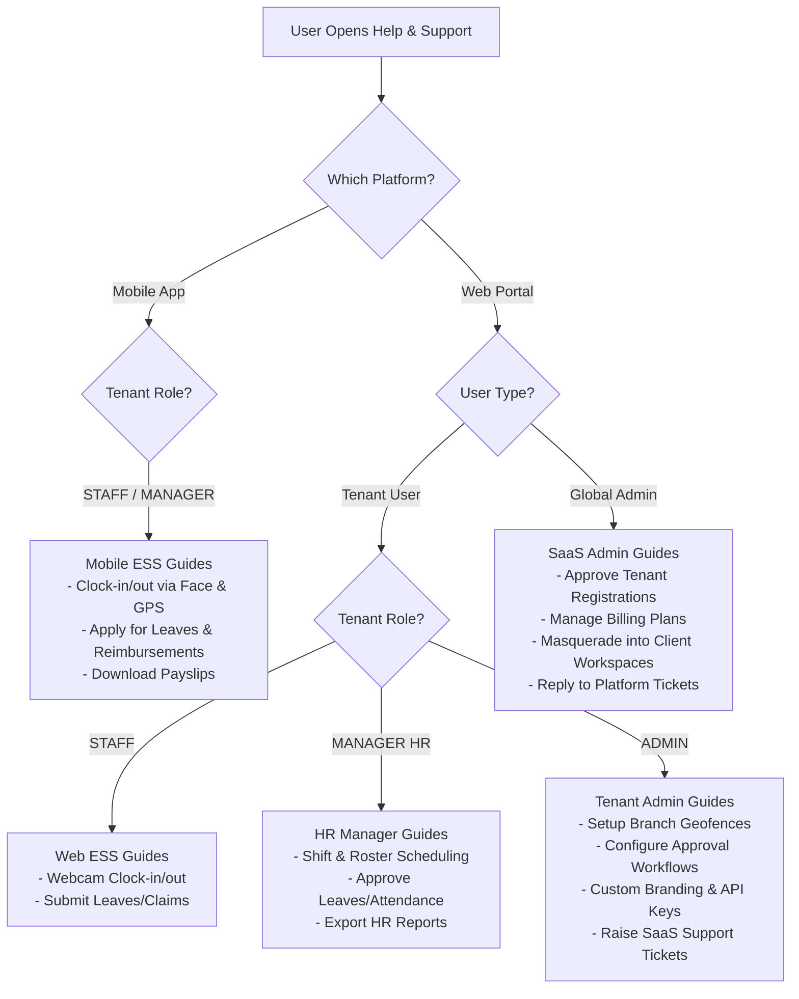

# Design & Implementation Guide: Help & Support and Ticketing Module

This document outlines the architecture, database schema, workflow models, and implementation steps for the **Help & Support** (Dynamic User Journey Guidelines) and **Ticketing System** modules across the **HariKerja HRMS** platform (Next.js Web, Django Backend, and Flutter Mobile).

---

## 💬 1. Design Decisions & Recommendations (Answering User Questions)

### Question A: Should all user roles be able to create tickets or only specific ones?
**Recommended Solution:** Yes, all roles should be allowed to create tickets, but with a **clear separation of scopes** to prevent SaaS platform support agents from being overwhelmed by company-specific HR operational issues. We divide ticketing into two distinct categories:

1. **Internal Tenant Tickets (Employee $\rightarrow$ Internal HR Admin):**
   - **Creator:** All roles within a tenant (`STAFF`, `MANAGER HR`, `ADMIN`).
   - **Scope:** Internal company issues and operational inquiries (e.g., "Why is my monthly salary draft incorrect?", "My leave balance quota is wrong", "Incorrect shift scheduling").
   - **Resolver:** HR Managers or Tenant Admins of that specific company.
   - **Security:** Completely isolated within each tenant's PostgreSQL database schema.

2. **Platform/SaaS Support Tickets (Tenant Admin $\rightarrow$ SaaS Global Support):**
   - **Creator:** Tenant **`ADMIN`** (and optionally `MANAGER HR` with specific configurations).
   - **Scope:** Technical system bugs, SaaS billing issues, account upgrades, or custom feature requests (e.g., "Face liveness verification fails on Android", "Subscription payment failed to clear", "Failed to shrink storage quota").
   - **Resolver:** SaaS Global Support (`SUPPORT_AGENT` or `SUPERADMIN`).
   - **Security:** Saved in the `public` schema with foreign keys referencing the `Tenant` model.

### Question B: Do Global Admin users need a ticketing system like this?
**Recommended Solution:** Yes, but **not to create tickets** for themselves. Instead, they need an operator dashboard (**Global Support Dashboard**) to **manage, assign, and resolve** platform support tickets submitted by Tenant Admins.
- Global Admins (`SUPPORT_AGENT` and `SUPERADMIN`) require a ticketing interface to read customer issues, send chat responses, assign tickets to agents, track SLA (Service Level Agreement) deadlines, and update ticket statuses (`Open`, `In Progress`, `Resolved`, `Closed`).

---

## 🏗️ 2. Data Architecture & Django Models (Multi-Tenant)

To support the scoping rules described above, database models are structured as follows:

### A. Tenant Schema Models (Tenant Schema - `InternalTicket`)
These models are defined inside a new `support` or existing `core` module at the tenant level for internal employee-to-HR tickets.

```python
# backend/support/models.py (Tenant Schema)
from django.db import models
from core.models import Employee, AuditModel
from django.utils.translation import gettext_lazy as _

class InternalTicket(AuditModel):
    CATEGORY_CHOICES = [
        ('PAYROLL', _('Payroll & Compensation')),
        ('ATTENDANCE', _('Attendance & Correction')),
        ('LEAVE', _('Leaves & Overtime')),
        ('TECHNICAL', _('Device & Login Issues')),
        ('GENERAL', _('General Inquiry')),
    ]
    
    PRIORITY_CHOICES = [
        ('LOW', _('Low')),
        ('MEDIUM', _('Medium')),
        ('HIGH', _('High')),
        ('URGENT', _('Urgent')),
    ]

    STATUS_CHOICES = [
        ('OPEN', _('Open')),
        ('IN_PROGRESS', _('In Progress')),
        ('RESOLVED', _('Resolved')),
        ('CLOSED', _('Closed')),
    ]

    creator = models.ForeignKey(Employee, on_delete=models.CASCADE, related_name='internal_tickets')
    title = models.CharField(max_length=255)
    description = models.TextField()
    category = models.CharField(max_length=20, choices=CATEGORY_CHOICES, default='GENERAL')
    priority = models.CharField(max_length=10, choices=PRIORITY_CHOICES, default='LOW')
    status = models.CharField(max_length=15, choices=STATUS_CHOICES, default='OPEN')
    assigned_to = models.ForeignKey(Employee, on_delete=models.SET_NULL, null=True, blank=True, related_name='assigned_internal_tickets')
    
    def __str__(self):
        return f"#{self.id} - {self.title} ({self.status})"

class InternalTicketMessage(AuditModel):
    ticket = models.ForeignKey(InternalTicket, on_delete=models.CASCADE, related_name='messages')
    sender = models.ForeignKey(Employee, on_delete=models.CASCADE)
    message = models.TextField()
    is_internal = models.BooleanField(default=False, help_text="Private notes visible only to HR Admins, hidden from standard employees")

class InternalTicketAttachment(AuditModel):
    ticket = models.ForeignKey(InternalTicket, on_delete=models.CASCADE, related_name='attachments')
    file = models.FileField(upload_to='tickets/internal/')
    uploaded_at = models.DateTimeField(auto_now_add=True)
```

### B. Public Schema Models (Public Schema - `PlatformTicket`)
These models are defined at the master level to support Tenant Admin-to-SaaS Support interactions.

```python
# backend/tenants/models.py (or backend/support_global/models.py - Public Schema)
from django.db import models
from django.conf import settings
from tenants.models import Tenant
from django.utils.translation import gettext_lazy as _

class PlatformTicket(models.Model):
    CATEGORY_CHOICES = [
        ('BILLING', _('Billing & Subscription')),
        ('BUG', _('System Bug / Error')),
        ('FEATURE_REQUEST', _('Feature Request')),
        ('ONBOARDING', _('Onboarding Assistance')),
        ('OTHER', _('Other Technical Support')),
    ]
    
    PRIORITY_CHOICES = [
        ('LOW', _('Low')),
        ('MEDIUM', _('Medium')),
        ('HIGH', _('High')),
        ('URGENT', _('Urgent')),
    ]

    STATUS_CHOICES = [
        ('OPEN', _('Open')),
        ('IN_PROGRESS', _('In Progress')),
        ('RESOLVED', _('Resolved')),
        ('CLOSED', _('Closed')),
    ]

    tenant = models.ForeignKey(Tenant, on_delete=models.CASCADE, related_name='platform_tickets')
    creator_email = models.EmailField() # Email of the Tenant Admin
    title = models.CharField(max_length=255)
    description = models.TextField()
    category = models.CharField(max_length=20, choices=CATEGORY_CHOICES, default='OTHER')
    priority = models.CharField(max_length=10, choices=PRIORITY_CHOICES, default='LOW')
    status = models.CharField(max_length=15, choices=STATUS_CHOICES, default='OPEN')
    
    # Assigned SaaS Support Agent
    assigned_agent = models.ForeignKey(
        settings.AUTH_USER_MODEL, 
        on_delete=models.SET_NULL, 
        null=True, 
        blank=True, 
        related_name='assigned_platform_tickets',
        limit_choices_to={'global_role__in': ['SUPERADMIN', 'SUPPORT_AGENT']}
    )
    
    created_at = models.DateTimeField(auto_now_add=True)
    updated_at = models.DateTimeField(auto_now=True)

    def __str__(self):
        return f"Tenant {self.tenant.name} - #{self.id} {self.title} ({self.status})"

class PlatformTicketMessage(models.Model):
    ticket = models.ForeignKey(PlatformTicket, on_delete=models.CASCADE, related_name='messages')
    sender = models.ForeignKey(settings.AUTH_USER_MODEL, on_delete=models.CASCADE)
    message = models.TextField()
    created_at = models.DateTimeField(auto_now_add=True)
```

---

## 📘 3. Dynamic Help & Support Guideline Engine

The **Help & Support** module renders a structured set of guidelines (user journeys) tailored to the combination of the current **Platform** and **User Role**.



### Guidelines Mapping Matrix

| Platform | Role / User Type | Guide Title (User Journey) | Guideline Content |
| :--- | :--- | :--- | :--- |
| **Mobile (Flutter)** | **STAFF / MANAGER** | 📸 Clocking In/Out with Face ID | Instructions on performing attendance clocking using liveness face detection and GPS. Troubleshooting GPS location issues. |
| | | 📅 Submitting Leaves & Permits | Selecting leave types, uploading medical certificates via device camera, and tracking leave balance. |
| | | 💸 Submitting Expense Claims | How to take receipt snapshots using native camera and input claim details. |
| | | 📄 View & Download Payslips | Securely viewing monthly payslips and downloading PDFs to secure local storage. |
| | | 🎫 Internal HR Ticket | Creating a support ticket directed to the company's internal HR team. |
| **Web (Next.js)** | **STAFF** | 💻 Clocking In via Web Browser | Allowing webcam permissions and web geolocation to clock in from a desktop computer. |
| | | 📊 Self-Service Dashboard | Overview of desktop features for leave, overtime, and reimbursement submissions. |
| **Web (Next.js)** | **MANAGER HR** | 👥 Roster & Shift Scheduling | Configuring and editing shifts and schedules for departments/employees. |
| | | ⚡ Bulk Approvals | Speeding up operations by bulk approving leave, reimbursement, and correction requests. |
| | | 📈 HR Analytics & Export | Understanding demographic/attendance analytics and exporting spreadsheet reports. |
| **Web (Next.js)** | **TENANT ADMIN** | 🗺️ Branch Geofencing Setup | Configuring company branch coordinates (latitude/longitude) and maximum attendance radius. |
| | | 🔗 Multi-Level Approval Workflows | Setting up sequential approval hierarchies (e.g., Supervisor $\rightarrow$ HRD $\rightarrow$ Executive). |
| | | 🎨 Branding & Integration | Adjusting corporate logos, theme colors, and managing API credentials/Webhooks. |
| | | 🛠️ Contact HariKerja Support | Raising a technical support ticket directly to SaaS platform administrators. |
| **Web (Next.js)** | **GLOBAL ADMIN** | 📝 Reviewing Tenant Registrations | Steps to validate incoming registrations, approve schemas, and spin up databases. |
| | | 👥 Tenant Masquerading | Instructions on entering a client's tenant workspace to assist with troubleshooting. |
| | | 💳 Quotas & Subscription Billing | Modifying employee counts, storage quotas, and managing active subscription packages. |
| | | ✉️ Resolving Client Support Tickets | Managing, responding to, and resolving platform tickets submitted by Tenant Admins. |

---

## 🛠️ 4. API & Integration Workflow

### A. Django API Endpoints

#### 1. Internal Tenant Tickets (Scope: All Tenant Employees)
- `GET /api/tickets/internal/`: Lists tickets (employees see their own; HR/Admin see all within the tenant).
- `POST /api/tickets/internal/`: Creates a new internal support request.
- `GET /api/tickets/internal/{id}/`: Fetches the message history of the ticket.
- `POST /api/tickets/internal/{id}/messages/`: Posts a new reply to the ticket thread.
- `POST /api/tickets/internal/{id}/resolve/`: Marks the ticket as resolved/closed (restricted to HR Managers/Admins).

#### 2. Platform SaaS Tickets (Scope: Tenant Admins & SaaS Global Support)
- `GET /api/tickets/platform/`:
  - **For Tenant Admins**: Returns platform tickets for their specific company.
  - **For SaaS Global Support**: Returns platform tickets for all tenants.
- `POST /api/tickets/platform/`: Tenant Admins create a ticket directed to HariKerja Support.
- `GET /api/tickets/platform/{id}/`: Fetches the conversation thread.
- `POST /api/tickets/platform/{id}/messages/`: Sends a reply in the platform ticket thread.
- `POST /api/tickets/platform/{id}/assign/`: (Global Admin only) Assigns the ticket to a Support Agent.
- `POST /api/tickets/platform/{id}/status/`: Updates status or priority.

### B. User Interface Integration

1. **Floating Help Widget (Web & Mobile):**
   - Renders as a floating button in the bottom right corner of the Next.js Dashboard Layout, and as a dedicated route or settings tile in Flutter.
   - Upon clicking, opens a card with two tabs:
     - **Tab 1: Guidelines:** A searchable list of user guides matching the user's role and device.
     - **Tab 2: Helpdesk:** Shows ticket list and a "Submit Ticket" button.
2. **SaaS Support Dashboard (Web Admin Portal):**
   - Rendered at `/admin/support` for Global Admins.
   - Provides an inbox style interface displaying tickets ordered by SLA priority, category tags, tenant details, and active chat widgets.
