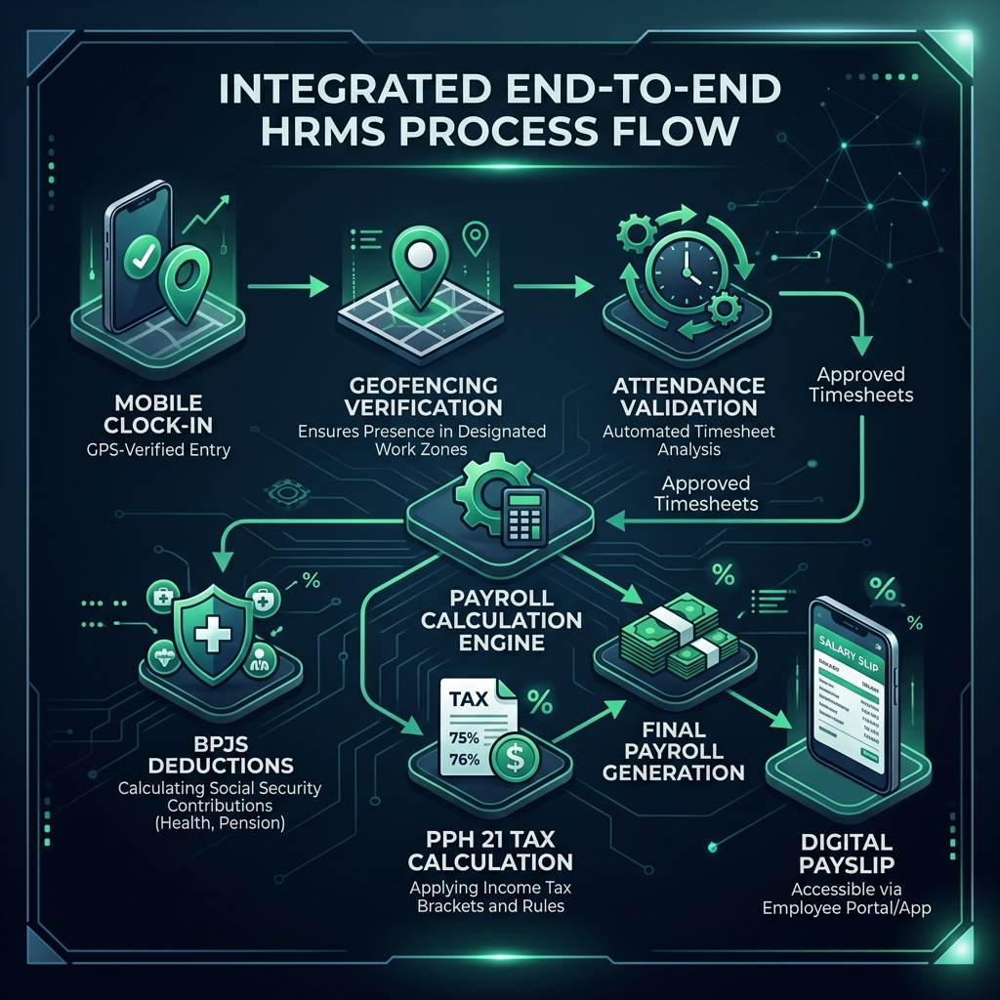
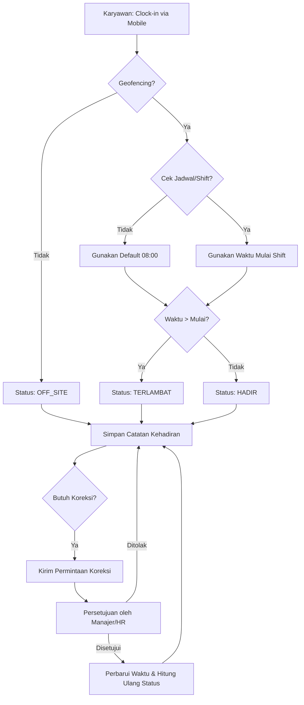
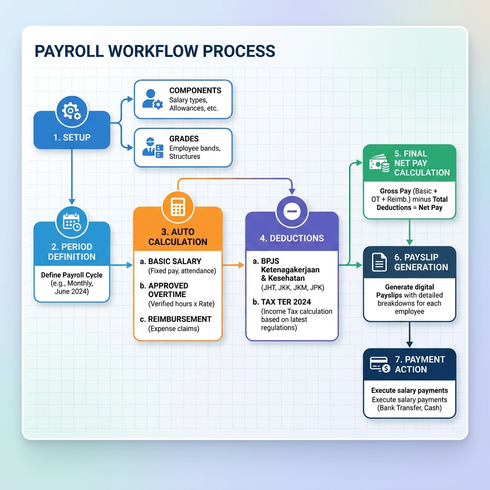
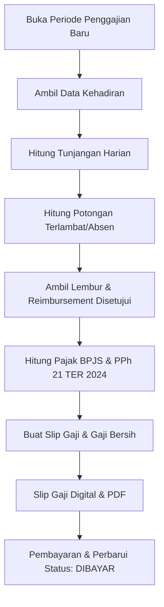

# Alur Kerja Operasional HRMS: Kehadiran & Penggajian

Dokumen ini menjelaskan alur kerja operasional yang terintegrasi antara sistem Kehadiran dan Penggajian dalam platform HRMS.

---

## Tinjauan Proses

---

## 1. Alur Kerja Kehadiran

Sistem kehadiran menggunakan validasi berbasis lokasi (Geofencing) dan pengenalan wajah (Biometrik) untuk memastikan integritas data.

### Diagram Alir Kehadiran

### Detail Logika
*   **Geofencing**: Validasi dilakukan terhadap radius koordinat cabang (`branch.radius_meters`). Jika karyawan berada di luar radius ini, status secara otomatis diatur ke `OFF_SITE`.
*   **Pemetaan Shift**: Jika tidak ada `Jadwal` (Schedule) spesifik yang ada, sistem menetapkan batas toleransi default pukul 08:00 AM.
*   **Penanganan Keterlambatan & Ketidakhadiran**: Status `TERLAMBAT` (LATE) adalah hasil otomatis dari aturan bisnis. Untuk menyelesaikan denda keterlambatan (misalnya, karena tugas lapangan atau masalah teknis), karyawan harus menggunakan alur kerja **Koreksi Kehadiran**. Setelah disetujui, status dihitung ulang, dan potongan gaji yang terkait akan dibatalkan.

---

## 2. Alur Kerja Penggajian

Data kehadiran mengalir langsung ke modul penggajian sebagai dasar untuk menghitung tunjangan harian dan denda potongan.

### Diagram Alir Penggajian

### Integrasi Kehadiran-ke-Penggajian
Sistem menggunakan parameter yang dapat dikonfigurasi oleh Admin Tenant di menu Pengaturan:
*   **Potongan Terlambat**: Dipotong untuk setiap kejadian status `TERLAMBAT`.
*   **Potongan Absen**: Dipotong setiap hari untuk status `ALFA` (ABSENT).
*   **Tunjangan Harian**: Tunjangan makan dan transportasi hanya diberikan untuk jumlah hari kerja (`HADIR` + `TERLAMBAT`).

---

## 3. Komponen Perhitungan (Aturan Bisnis)

### Konfigurasi Gaji
*   **Gaji Pokok**: Diambil berdasarkan **Grade (Golongan)** karyawan.
*   **Komponen Kustom**: Tunjangan tetap, bonus, atau potongan pinjaman yang dikonfigurasi per individu melalui `EmployeeSalaryComponent`.

### Kepatuhan Pajak & BPJS
*   **Kesehatan (BPJS Kesehatan)**: 4% Pemberi Kerja, 1% Karyawan (Batas atas: upah 12jt).
*   **Ketenagakerjaan (BPJS Ketenagakerjaan)**: JKK, JKM, JHT (3,7% / 2%), JP (2% / 1%).
*   **PPh 21 (TER 2024)**: Perhitungan pajak otomatis menggunakan kategori TER (A, B, C) berdasarkan status PTKP Indonesia terbaru.

---

## 4. Output & Pelaporan
*   **Slip Gaji Digital**: Karyawan dapat melihat rincian gaji mendalam melalui portal layanan mandiri mereka.
*   **Penyimpanan Dokumen**: Versi PDF dari slip gaji dibuat secara otomatis dan disimpan dalam penyimpanan cloud yang aman.
*   **Jejak Audit**: Setiap perubahan pada jam kerja (koreksi) atau perhitungan gaji dicatat untuk tujuan audit internal.

---
> [!IMPORTANT]
> Semua tarif potongan (Terlambat & Absen) dapat disesuaikan oleh Admin Tenant melalui Pengaturan Dasbor untuk menyelaraskan dengan kebijakan internal perusahaan.
