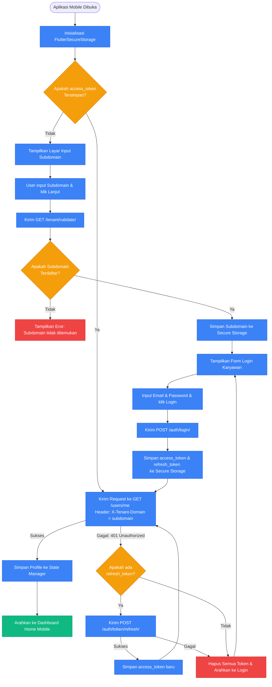

# Panduan Alur Kerja & Diagram Alir Aplikasi Mobile (ESS Flutter App)

Dokumen ini menjelaskan arsitektur, alur kerja operasional, dan diagram keputusan (*flowcharts*) untuk aplikasi mobile **HariKerja ESS (Employee Self-Service)** yang dikembangkan menggunakan **Flutter**.

---

## 🏗️ 1. Startup & Alur Manajemen Sesi (Session Management)

Karena aplikasi mobile didistribusikan secara terpusat untuk semua tenant, alur identifikasi tenant dan sesi terproteksi berjalan sebagai berikut:

*   **Identifikasi Tenant**: Saat pertama kali dibuka (atau setelah logout), karyawan wajib memasukkan **Subdomain Perusahaan** secara manual (misal: `ptmaju`).
*   **Keamanan Token**: Token JWT (`access_token` dan `refresh_token`) disimpan dengan enkripsi hardware di `FlutterSecureStorage`.
*   **Resolusi Endpoint**: Setiap panggilan API dari model Flutter secara otomatis menginjeksi header `X-Tenant-Domain` dengan subdomain terdaftar agar backend mengetahui schema PostgreSQL tujuan.



---

## 📸 2. Alur Absensi AI (Liveness Face ID & Geofencing)

Proses absensi harian karyawan (Clock-in & Clock-out) dilindungi oleh verifikasi ganda: Geofencing GPS dan Face Recognition Liveness Detection.

### Langkah Pembatasan:
1.  **Validasi Geofencing**: Aplikasi mengambil koordinat GPS terkini. Menggunakan formula *Haversine*, jarak dihitung dari titik koordinat cabang terdaftar:
    $$d = 2r \arcsin\left(\sqrt{\sin^2\left(\frac{\Delta \phi}{2}\right) + \cos(\phi_1)\cos(\phi_2)\sin^2\left(\frac{\Delta \lambda}{2}\right)}\right)$$
    Jika jarak $d > \text{radius\_meters}$, status disetel ke `OFF_SITE` (atau diblokir jika tenant memberlakukan aturan absensi *Strict Branch Only*).
2.  **Verifikasi Liveness (Google ML Kit)**: Karyawan wajib melakukan deteksi liveness (berkedip atau tersenyum) di depan kamera depan untuk mencegah manipulasi menggunakan foto/video statis.
3.  **Pengenalan Wajah AI**: Wajah yang tertangkap dicocokkan dengan **Foto Referensi Wajah** yang diunggah saat onboarding.
4.  **Bypass Penyimpanan Penuh**: Jika kapasitas penyimpanan cloud tenant penuh (`storage_limit_mb` tercapai), sistem backend secara otomatis mengizinkan absensi diproses **tanpa mengunggah file foto** (`biometric_skipped = True`) untuk menghindari kemacetan operasional.

```mermaid
flowchart TD
    Start[Karyawan klik Tombol Absen] --> CheckLock{Apakah Hari Ini Ada \nCuti APPROVED?}
    
    CheckLock -- Ya --> BlockAttendance[Blokir Absen: Anda terdaftar \ncuti untuk hari ini]
    CheckLock -- Tidak --> GetGPS[Ambil Koordinat GPS Pengguna \nLatitude, Longitude]
    
    GetGPS --> CalcDistance[Hitung Jarak ke Koordinat Cabang \nmenggunakan Formula Haversine]
    CalcDistance --> CheckGeofence{Apakah Jarak \n<= Radius Cabang?}
    
    CheckGeofence -- Tidak --> CheckStrict{Apakah Tenant Menerapkan \nAturan Absen Harus di Kantor?}
    CheckStrict -- Ya --> BlockGeofence[Blokir Absen: \nAnda di luar radius cabang]
    CheckStrict -- Tidak --> SetOffsite[Set Status Kehadiran = OFF_SITE]
    
    CheckGeofence -- Ya --> SetPresent[Set Status Kehadiran = PRESENT / LATE]
    
    SetOffsite --> StartLiveness[Buka Kamera Depan:\nMulai Liveness Detection ML Kit]
    SetPresent --> StartLiveness
    
    StartLiveness --> DetectLiveness{Apakah Pengguna Berkedip / \nTersenyum Sesuai Prompt?}
    
    DetectLiveness -- Tidak / Timeout --> FailLiveness[Absen Gagal: \nDeteksi Kehidupan Gagal]
    DetectLiveness -- Ya --> PostBiometric[Kirim Data Absen & Foto Wajah \nke Backend via API]
    
    PostBiometric --> CheckStorage{Apakah Kapasitas \nPenyimpanan Tenant Penuh?}
    
    CheckStorage -- Ya --> SaveNoPhoto[Simpan Log Kehadiran \nSet biometric_skipped = True \n(Foto Wajah Dilewati)]
    CheckStorage -- Tidak --> MatchFace[Backend: Cocokkan Wajah dengan \nFoto Referensi Karyawan]
    
    MatchFace --> CheckMatch{Apakah Wajah Cocok?}
    CheckMatch -- Tidak --> FailMatch[Absen Gagal: \nIdentitas Wajah Tidak Sesuai]
    CheckMatch -- Ya --> SaveWithPhoto[Simpan Log Kehadiran \n& Simpan File Foto Absen]
    
    SaveNoPhoto --> SuccessEnd[Absen Berhasil Dicatat]
    SaveWithPhoto --> SuccessEnd
    SuccessEnd --> End([Selesai])

    classDef success fill:#10B981,stroke:#059669,color:#fff;
    classDef fail fill:#EF4444,stroke:#DC2626,color:#fff;
    classDef step fill:#3B82F6,stroke:#2563EB,color:#fff;
    classDef decision fill:#F59E0B,stroke:#D97706,color:#fff;
    
    class SuccessEnd success;
    class BlockAttendance,BlockGeofence,FailLiveness,FailMatch fail;
    class GetGPS,CalcDistance,SetOffsite,SetPresent,StartLiveness,PostBiometric,SaveNoPhoto,MatchFace,SaveWithPhoto step;
    class CheckLock,CheckGeofence,CheckStrict,DetectLiveness,CheckStorage,CheckMatch decision;
```

---

## 📅 3. Alur Pengajuan Cuti (Leave Request)

Karyawan dapat mengajukan permohonan cuti langsung dari aplikasi mobile.

1.  **Pilih Jenis & Tanggal**: Memilih tanggal mulai/selesai dan tipe cuti (Tahunan, Melahirkan, dsb.).
2.  **Validasi Saldo**: Aplikasi memverifikasi sisa saldo cuti (`leave_balance`). Jika sisa saldo tidak mencukupi untuk jenis cuti tahunan, pengajuan diblokir di tingkat frontend.
3.  **Unggah Lampiran**: Untuk cuti sakit atau khusus, wajib melampirkan foto dokumen (surat dokter).
4.  **Workflow Persetujuan**: Pengajuan dikirim ke backend dan masuk antrean persetujuan berjenjang sesuai konfigurasi tenant. Karyawan menerima notifikasi push setelah disetujui/ditolak.

```mermaid
flowchart TD
    Start[Karyawan Membuka Layar Cuti] --> ShowBalance[Tampilkan Sisa Saldo Cuti Aktual]
    ShowBalance --> FillForm[Isi Formulir Pengajuan:\n- Pilih Tipe Cuti\n- Pilih Tanggal Mulai & Selesai\n- Tulis Alasan Pengajuan]
    
    FillForm --> CheckBalance{Apakah Sisa Saldo \nCuti Mencukupi?}
    CheckBalance -- Tidak --> ShowBalanceError[Tampilkan Eror: Saldo cuti \ntidak mencukupi]
    CheckBalance -- Ya --> CheckAttachment{Apakah Tipe Cuti \nMemerlukan Lampiran?}
    
    CheckAttachment -- Ya --> UploadAttachment[Ambil Foto Surat Keterangan \n(Dokter / Bukti Pendukung)]
    CheckAttachment -- Tidak --> SubmitLeave[Kirim Pengajuan via POST /leave-requests/]
    UploadAttachment --> SubmitLeave
    
    SubmitLeave --> TriggerWorkflow[Inisialisasi Approval Workflow \ndan Kirim Notifikasi ke Supervisor]
    TriggerWorkflow --> End([Selesai])

    classDef success fill:#10B981,stroke:#059669,color:#fff;
    classDef fail fill:#EF4444,stroke:#DC2626,color:#fff;
    classDef step fill:#3B82F6,stroke:#2563EB,color:#fff;
    classDef decision fill:#F59E0B,stroke:#D97706,color:#fff;
    
    class TriggerWorkflow success;
    class ShowBalanceError fail;
    class ShowBalance,FillForm,UploadAttachment,SubmitLeave step;
    class CheckBalance,CheckAttachment decision;
```

---

## 💸 4. Alur Klaim Reimbursement (Expense Claims)

Mempermudah karyawan melakukan klaim biaya operasional kantor.

*   **Pengisian Klaim**: Mengisi judul klaim, nominal, dan kategori (Transportasi, Medis, Operasional).
*   **Foto Bukti Kuitansi**: Wajib melampirkan foto kuitansi/struk belanja asli.
*   **Validasi File**: Jika file terlalu besar atau format tidak didukung, aplikasi menampilkan peringatan.
*   **Proses Persetujuan**: Setelah dikirim, pengajuan masuk ke antrean persetujuan tim Finance. Setelah disetujui, nominal ditambahkan otomatis pada komponen slip gaji bulan berjalan.

```mermaid
flowchart TD
    Start[Karyawan Membuka Layar Reimbursement] --> InputClaim[Input Rincian Klaim:\n- Judul Pengeluaran\n- Nominal (Rupiah)\n- Pilih Kategori Klaim]
    InputClaim --> CameraCapture[Ambil Foto Kuitansi / Struk Pembayaran]
    CameraCapture --> CheckFile{Apakah Validasi \nFile Sukses?}
    
    CheckFile -- Tidak --> ShowFileError[Tampilkan Eror: Format tidak didukung \natau ukuran file terlalu besar]
    CheckFile -- Ya --> SubmitClaim[Kirim Klaim via POST /reimbursements/]
    
    SubmitClaim --> TriggerApproval[Kirim ke Workflow Persetujuan Finance \ndan Kirim Notifikasi Push]
    TriggerApproval --> End([Selesai])

    classDef success fill:#10B981,stroke:#059669,color:#fff;
    classDef fail fill:#EF4444,stroke:#DC2626,color:#fff;
    classDef step fill:#3B82F6,stroke:#2563EB,color:#fff;
    classDef decision fill:#F59E0B,stroke:#D97706,color:#fff;
    
    class TriggerApproval success;
    class ShowFileError fail;
    class InputClaim,CameraCapture,SubmitClaim step;
    class CheckFile decision;
```

---

## 📄 5. Alur Unduh Slip Gaji (Payslip Access)

Mekanisme perlindungan data sensitif gaji karyawan pada aplikasi mobile.

1.  **Daftar Periode**: Menampilkan riwayat bulan gaji yang telah berstatus `APPROVED` dan `PAID` dari HR.
2.  **Verifikasi Keamanan**: Sebelum membuka rincian slip gaji, aplikasi mewajibkan verifikasi PIN atau Biometrik (Fingerprint/Face ID lokal perangkat) untuk mencegah kebocoran data jika hp dipinjam.
3.  **Render & Unduh**: Aplikasi menampilkan ringkasan gaji (Gaji Bersih, Rincian Pendapatan, Rincian Potongan) dan menyediakan tombol download file PDF.
