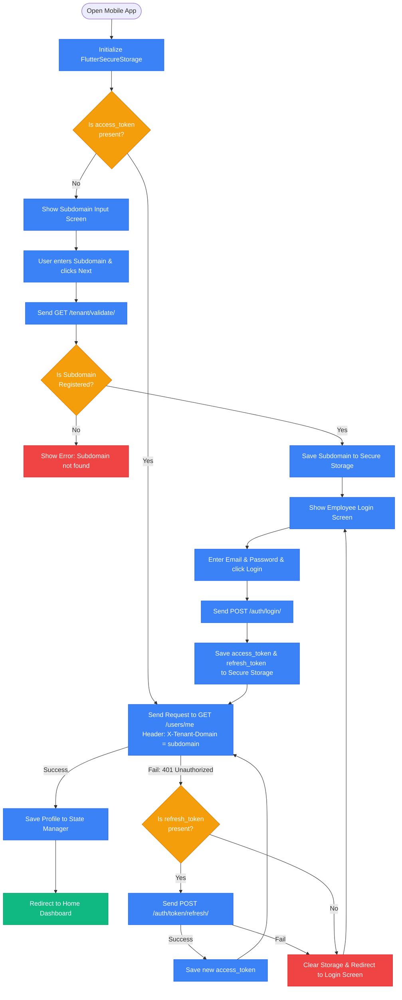

# Mobile Application Workflows & Flowcharts (ESS Flutter App)

This document details the mobile application architecture, operational workflows, and flowcharts of the **HariKerja ESS (Employee Self-Service)** mobile app, developed using **Flutter**.

---

## 🏗️ 1. Startup & Session Management Flow

Since the mobile app is distributed as a single application package for all clients, the tenant identification and protected session resolution flow is established as follows:

*   **Tenant Identification**: Upon first open (or after logging out), the employee is required to manually input their **Company Subdomain** (e.g., `ptmaju`).
*   **Token Security**: JWT credentials (`access_token` and `refresh_token`) are stored securely using hardware-backed encryption via `FlutterSecureStorage`.
*   **Endpoint Resolution**: All outbound API requests from the Flutter network clients inject the `X-Tenant-Domain` header with the saved subdomain, allowing the backend to route database transactions to the appropriate postgres schema.



---

## 📸 2. AI Attendance Flow (Liveness Face ID & Geofencing)

The daily attendance log verification process (Clock-in & Clock-out) enforces two layers of validation: GPS Geofencing and AI Face Recognition with Liveness Detection.

### Validation Steps:
1.  **Geofencing Validation**: The mobile app fetches the device's current GPS coordinates. Using the *Haversine* formula, it calculates the distance to the registered company branch office:
    $$d = 2r \arcsin\left(\sqrt{\sin^2\left(\frac{\Delta \phi}{2}\right) + \cos(\phi_1)\cos(\phi_2)\sin^2\left(\frac{\Delta \lambda}{2}\right)}\right)$$
    If the calculated distance $d > \text{radius\_meters}$, the attendance status is marked as `OFF_SITE` (or blocked if the tenant enforces a *Strict Geofence* policy).
2.  **Liveness Verification (Google ML Kit)**: The employee must pass a real-time liveness prompt (blinking or smiling) to prevent static spoofing (using photos or video playback).
3.  **AI Face Matching**: The captured selfie is matched against the **Face Reference Photo** uploaded during employee onboarding.
4.  **Full Storage Fallback**: If the tenant's cloud storage (`storage_limit_mb`) is full, the backend automatically flags the record as `biometric_skipped = True` and allows the log to save **without uploading the photo file** to keep business operations running.

```mermaid
flowchart TD
    Start[Employee Clicks Attendance Button] --> CheckLock{Is There an APPROVED \nLeave Request Today?}
    
    CheckLock -- Yes --> BlockAttendance[Block Attendance: You are registered \nas on leave today]
    CheckLock -- No --> GetGPS[Fetch GPS Coordinates \nLatitude, Longitude]
    
    GetGPS --> CalcDistance[Calculate Distance to Office Branch \nvia Haversine Formula]
    CalcDistance --> CheckGeofence{Is Jarak \n<= Branch Radius?}
    
    CheckGeofence -- No --> CheckStrict{Does Tenant Enforce \nStrict Office geofencing?}
    CheckStrict -- Yes --> BlockGeofence[Block Attendance: \nYou are outside the branch geofence]
    CheckStrict -- No --> SetOffsite[Set Attendance Status = OFF_SITE]
    
    CheckGeofence -- Yes --> SetPresent[Set Attendance Status = PRESENT / LATE]
    
    SetOffsite --> StartLiveness[Open Front Camera:\nStart Google ML Kit Liveness Detection]
    SetPresent --> StartLiveness
    
    StartLiveness --> DetectLiveness{Did User Blink / \nSmile as Prompted?}
    
    DetectLiveness -- No / Timeout --> FailLiveness[Attendance Failed: \nLiveness Verification Failed]
    DetectLiveness -- Yes --> PostBiometric[Post Attendance log & Selfie \nto Backend via API]
    
    PostBiometric --> CheckStorage{Is Tenant Cloud \nStorage Limit Reached?}
    
    CheckStorage -- Yes --> SaveNoPhoto[Save Attendance Log \nSet biometric_skipped = True \n(Bypass photo upload)]
    CheckStorage -- No --> MatchFace[Backend: Compare Selfie with \nFace Reference Photo]
    
    MatchFace --> CheckMatch{Do Faces Match?}
    CheckMatch -- No --> FailMatch[Attendance Failed: \nIdentity Match Mismatch]
    CheckMatch -- Yes --> SaveWithPhoto[Save Attendance Log \n& Save Photo File]
    
    SaveNoPhoto --> SuccessEnd[Attendance Successfully Recorded]
    SaveWithPhoto --> SuccessEnd
    SuccessEnd --> End([Finish])

    classDef success fill:#10B981,stroke:#059669,color:#fff;
    classDef fail fill:#EF4444,stroke:#DC2626,color:#fff;
    classDef step fill:#3B82F6,stroke:#2563EB,color:#fff;
    classDef decision fill:#F59E0B,stroke:#D97706,color:#fff;
    
    class SuccessEnd success;
    class BlockAttendance,BlockGeofence,FailLiveness,FailMatch fail;
    class GetGPS,CalcDistance,SetOffsite,SetPresent,StartLiveness,PostBiometric,SaveNoPhoto,MatchFace,SaveWithPhoto step;
    class CheckLock,CheckGeofence,CheckStrict,DetectLiveness,CheckStorage,CheckMatch decision;
```

---

## 📅 3. Leave Request Flow

Employees can request leaves of absence directly from their mobile app interface.

1.  **Form Input**: Selects leave type (Annual, Medical, Maternity, etc.) and date range.
2.  **Balance Validation**: The app fetches the current `leave_balance`. If the requested annual leave duration exceeds the balance, the submission is blocked on the frontend.
3.  **Attachments**: For medical or special leaves, the employee must upload a supporting document (e.g., doctor's note).
4.  **Workflow Processing**: The request is posted to the backend and routes through the tenant's custom approval config. The employee receives a push notification on approval or rejection.

```mermaid
flowchart TD
    Start[Employee Opens Leave Screen] --> ShowBalance[Display Current Leave Balance]
    ShowBalance --> FillForm[Fill Request Form:\n- Select Leave Type\n- Select Start & End Dates\n- Input Reason]
    
    FillForm --> CheckBalance{Is Balance \nSufficient?}
    CheckBalance -- No --> ShowBalanceError[Show Error: Insufficient \nleave balance]
    CheckBalance -- Yes --> CheckAttachment{Does Leave Type \nRequire Attachment?}
    
    CheckAttachment -- Yes --> UploadAttachment[Capture Photo of Document \n(Doctor's note / proof)]
    CheckAttachment -- No --> SubmitLeave[Post Request via POST /leave-requests/]
    UploadAttachment --> SubmitLeave
    
    SubmitLeave --> TriggerWorkflow[Initialize Approval Workflow \nand notify supervisor]
    TriggerWorkflow --> End([Finish])

    classDef success fill:#10B981,stroke:#059669,color:#fff;
    classDef fail fill:#EF4444,stroke:#DC2626,color:#fff;
    classDef step fill:#3B82F6,stroke:#2563EB,color:#fff;
    classDef decision fill:#F59E0B,stroke:#D97706,color:#fff;
    
    class TriggerWorkflow success;
    class ShowBalanceError fail;
    class ShowBalance,FillForm,UploadAttachment,SubmitLeave step;
    class CheckBalance,CheckAttachment decision;
```

---

## 💸 4. Reimbursement Flow (Expense Claims)

Enables employees to report and submit expense claims directly.

*   **Expense Details**: Inputs expense name, amount, and category (Transport, Medical, Office Equipment).
*   **Receipt Capture**: Uploading a photo of the receipt is mandatory.
*   **File Checks**: The mobile client checks file sizes and formats, alerting the user of any errors.
*   **Approval Pipeline**: The claim routes through the company's financial approval hierarchy. Once fully approved, the amount is automatically scheduled as an addition in the employee's next pay slip.

```mermaid
flowchart TD
    Start[Employee Opens Reimbursement Screen] --> InputClaim[Input Claim Details:\n- Expense Name\n- Claim Amount (IDR)\n- Select Category]
    InputClaim --> CameraCapture[Take Photo of Receipt / Invoice]
    CameraCapture --> CheckFile{Is File Validation \nSuccessful?}
    
    CheckFile -- No --> ShowFileError[Show Error: Format not supported \nor file size too large]
    CheckFile -- Yes --> SubmitClaim[Post Claim via POST /reimbursements/]
    
    SubmitClaim --> TriggerApproval[Route to Finance Approval Workflow \nand send push alert]
    TriggerApproval --> End([Finish])

    classDef success fill:#10B981,stroke:#059669,color:#fff;
    classDef fail fill:#EF4444,stroke:#DC2626,color:#fff;
    classDef step fill:#3B82F6,stroke:#2563EB,color:#fff;
    classDef decision fill:#F59E0B,stroke:#D97706,color:#fff;
    
    class TriggerApproval success;
    class ShowFileError fail;
    class InputClaim,CameraCapture,SubmitClaim step;
    class CheckFile decision;
```

---

## 📄 5. Payslip Access Flow

Enforces security protections for viewing confidential payroll details on mobile.

1.  **Retrieve Periods**: Displays a list of monthly payroll cycles marked as `APPROVED` and `PAID` by HR.
2.  **Local Authentication**: Before revealing payroll numbers, the app requires local device verification (PIN or fingerprint/Face ID) to prevent unauthorized viewing.
3.  **Render & Download**: Displays net salary, detailed earnings, and detailed deductions. Provides a download button to export the payslip as a PDF file.
