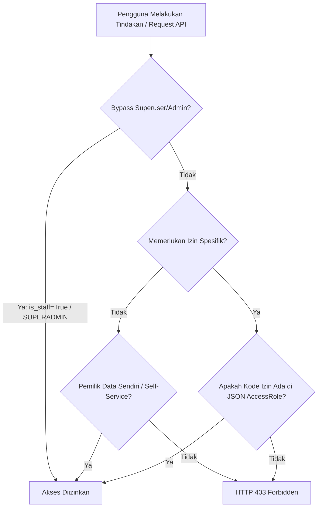

# Matriks Detail Peran & Hak Akses (RBAC) - Web & Mobile

Dokumen ini merupakan panduan referensi utama mengenai hak akses (*Role-Based Access Control* / RBAC) pada platform HRMS. Dokumen ini menguraikan secara spesifik halaman, menu, dan fungsionalitas yang dapat diakses atau dilarang bagi setiap peran (*role*) baik pada aplikasi Web (Frontend Next.js) maupun Aplikasi Mobile (Flutter).

---

## 1. Pembagian Cakupan Peran (Scope Segmentation)

Platform HRMS menggunakan segmentasi ketat berdasarkan arsitektur multi-tenant:
1.  **Global Admin (Skema `public`)**: Mengelola infrastruktur platform SaaS secara keseluruhan, siklus hidup penyewa (tenant), penagihan lintas perusahaan, dan bantuan teknis lintas tenant.
2.  **Tenant User (Skema Penyewa individual)**: Beroperasi sepenuhnya di dalam skema basis data terisolasi milik perusahaan masing-masing. Terbagi menjadi Admin Perusahaan, Manajer HR, dan Staf.

---

## 2. Matriks Peran Global Admin (SaaS Platform Operator)

Pengguna Global Admin hanya beroperasi di bawah skema `public` (melalui domain utama `/login/portal-admin`). Mereka tidak terikat pada satu profil karyawan perusahaan tertentu.

### Tabel Akses Menu & Tindakan - Global Admin

| Peran (Global Role) | Fokus Utama | Halaman Web yang Diakses | Akses Aplikasi Mobile | Tindakan yang Diperbolehkan | Tindakan yang Dilarang |
| :--- | :--- | :--- | :--- | :--- | :--- |
| **`SUPERADMIN`** | Manajemen absolut & pengawasan infrastruktur SaaS. | • Dasbor Utama (`/`)  • Manajemen Registrasi (`/admin/registrations`)  • Manajemen Admin Global (`/admin/global-admins`) | Tidak ditujukan untuk penggunaan operasional mobile (Bypass pemeriksaan jika login). | • Mengelola akun Global Admin lainnya (CRUD). • Menyetujui/menolak registrasi tenant baru. • Melakukan *masquerade* (penyamaran) ke semua tenant klien. • Mengatur billing, invoice, & batas kuota. | Tidak ada batasan sistem. |
| **`ONBOARDING_AGENT`**| Validasi & aktivasi tenant baru. | • Dasbor Utama (`/`)  • Manajemen Registrasi (`/admin/registrations`) | Tidak memiliki akses fungsional. | • Melihat daftar registrasi masuk. • Menyetujui atau menolak registrasi tenant baru (memicu otomatisasi PostgreSQL schema sync). | • Mengelola admin global lainnya. • Melakukan *masquerade* ke tenant klien. • Mengakses modul penagihan & keuangan. |
| **`SUPPORT_AGENT`** | Dukungan teknis & pemecahan masalah (*troubleshooting*) klien. | • Dasbor Utama (`/`)  • Penyamaran ke workspace tenant klien yang ditugaskan. | Tidak memiliki akses fungsional. | • Melakukan *masquerade* ke tenant perusahaan klien yang **secara spesifik ditugaskan** kepadanya untuk membantu troubleshooting. | • Menyetujui/menolak registrasi tenant. • Mengelola admin global lainnya. • Mengakses menu penagihan. • Masuk ke tenant klien yang tidak ditugaskan. |
| **`BILLING_ADMIN`** | Siklus keuangan, penagihan & kuota langganan platform. | • Dasbor Utama (`/`)  • Halaman Manajemen Penagihan (Invoices, Subscription packages) | Tidak memiliki akses fungsional. | • Mengelola paket langganan. • Melihat & memproses invoice penagihan. • Memproses pengajuan pengurangan kuota (`QuotaReductionRequest`). | • Menyetujui/menolak registrasi tenant. • Mengelola admin global lainnya. • Melakukan *masquerade* ke tenant klien. |

---

## 3. Matriks Peran Tenant User (Company Workspace)

Pengguna Tenant beroperasi di dalam workspace perusahaan masing-masing (misal: `perusahaan.harikerja.web.id`). Hak akses mereka dikendalikan oleh flag bawaan Django (`is_staff` untuk Admin) atau melalui penugasan `AccessRole` dinamis yang tersimpan di kolom JSON database.

### Tabel Akses Menu & Tindakan - Tenant User

| Peran (Tenant Role) | Flag / Izin Inti | Halaman Web yang Diakses | Akses Aplikasi Mobile (Menu & Tab) | Tindakan yang Diperbolehkan | Tindakan yang Dilarang |
| :--- | :--- | :--- | :--- | :--- | :--- |
| **`ADMIN`**  (Tenant Admin) | `is_staff = True`  (Bypass otomatis seluruh pemeriksaan RBAC lokal) | **Semua Halaman:** • Dashboard • Profile • Employees • Branches • Attendance • Leaves • Reimbursements • Payroll • Workflows • Analytics • Reports • Settings (Audit Logs, API Keys, Branding) | **Akses Penuh:** • Tab: Home, Schedule, Payslip, Settings. • Quick Access: Leaves, Payslip, Reimbursement, Profile, Documents, Correction, Performance, Reports. | • Mengelola semua data karyawan, departemen, & cabang. • Konfigurasi sistem (Branding, API Keys, Workflows, Audit Logs). • Menyetujui semua jenis cuti, reimbursement, & koreksi kehadiran. • Menjalankan proses & ekspor penggajian (*Payroll*). | • Tidak dapat mengakses data di luar tenant perusahaannya sendiri. |
| **`MANAGER HR`** | Peran dengan izin: `tenant_manage_hr`, `tenant_manage_attendance`, `tenant_manage_payroll`, & semua izin persetujuan (`tenant_approve_*`). | **Sebagian Besar Halaman:** • Dashboard • Profile • Employees • Branches • Attendance • Leaves • Reimbursements • Payroll (Admin mode) • Reports • Analytics (jika diberi akses) | **Akses Manajerial:** • Tab: Home, Schedule, Payslip, Settings. • Quick Access: Leaves, Payslip, Reimbursement, Profile, Documents, Correction, Reports, Performance (jika memiliki `tenant_view_performance_report`). | • Menambah/mengedit data karyawan. • Mengelola kehadiran, shift, & jadwal karyawan. • Memproses pengajuan cuti, reimbursement, & koreksi absensi. • Menjalankan penggajian (Payroll) & mengekspor laporan rekapitulasi. | • Mengubah setelan sistem utama (Branding, API Keys, Workflow config). • Melihat *Audit Logs* sistem (kecuali diberi izin `tenant_view_audit_logs`). • Menghapus peran default sistem (`Admin`, `HR Manager`, `Staff`). |
| **`STAF`**  (Standard Employee) | Tidak memiliki izin administratif (Izin kosong/default). | **Akses Mandiri (Self-Service):** • Dashboard (Tanpa statistik global) • Profile (Hanya data pribadi) • Attendance (Hanya clock-in/out) • Leaves (Hanya pengajuan pribadi) • Reimbursements (Hanya pengajuan pribadi) *(Halaman administratif tersembunyi)* | **Akses Terbatas:** • Tab: Home, Schedule, Payslip, Settings. • Quick Access: Leaves, Payslip, Reimbursement, Profile, Documents, Correction. *(Menu Reports & Performance disembunyikan)* | • Melakukan absensi masuk/pulang (*Clock In/Out*) mandiri. • Mengajukan cuti dan reimbursement pribadi. • Mengajukan koreksi absensi pribadi. • Melihat slip gaji bulanan pribadi. • Mengubah sebagian informasi profil mandiri. | • Melihat data karyawan lain (gaji, profil, alamat, dsb.). • Menyetujui permintaan cuti/reimbursement/koreksi orang lain. • Mengakses dasbor analitik & laporan SDM. • Mengakses rute pengaturan/settings. |

---

## 4. Matriks Rute Navigasi Web vs Izin RBAC

Logika rendering menu di `Sidebar.tsx` menyaring visibilitas rute berdasarkan izin pengguna dari API. Jika pengguna tidak memiliki izin yang diperlukan, menu akan disembunyikan dari sidebar.

| Rute Frontend Next.js | Deskripsi Halaman | Kunci Izin Backend yang Dibutuhkan | Penjaga Keamanan Frontend (Sidebar Guard) |
| :--- | :--- | :--- | :--- |
| `/` | Ringkasan dasbor operasional & statistik. | N/A (Dasbor menyesuaikan isi data berdasarkan hak akses pengguna) | Terbuka untuk semua pengguna terautentikasi. |
| `/profile` | Informasi profil pribadi pengguna/karyawan. | N/A (Akses Mandiri) | Terbuka untuk semua, disembunyikan di Public Tenant. |
| `/employees` | CRUD data Karyawan, Departemen, & Peran. | `tenant_manage_hr` | `requiredPermission: 'tenant_manage_hr'` |
| `/branches` | Manajemen lokasi cabang & koordinat GPS absensi. | `tenant_manage_hr` | `requiredPermission: 'tenant_manage_hr'` |
| `/attendance` | Pengaturan shift, jadwal kerja global, & riwayat absensi. | `tenant_manage_attendance` (untuk manajemen); Layanan Mandiri (untuk clock-in/out) | Terbuka untuk Staf (akses absensi mandiri). Tab Persetujuan memerlukan `tenant_approve_attendance_correction`. |
| `/leaves` | Pengajuan cuti & persetujuan cuti karyawan. | `tenant_approve_leave` (untuk persetujuan); Layanan Mandiri (untuk pengajuan pribadi) | Terbuka untuk Staf. Tab Persetujuan disembunyikan jika tidak memiliki izin persetujuan cuti. |
| `/reimbursements` | Klaim biaya & persetujuan reimbursement. | `tenant_approve_reimbursement` (untuk persetujuan); Layanan Mandiri (untuk pengajuan pribadi) | Terbuka untuk Staf. Tab Persetujuan disembunyikan jika tidak memiliki izin persetujuan reimbursement. |
| `/payroll` | Pembuatan slip gaji bulanan, ekspor rekap, & kelola gaji. | `tenant_manage_payroll` (untuk kelola); `tenant_view_all_payslips` (untuk melihat semua) | `requiredPermission: 'tenant_manage_payroll'` (Staf hanya bisa melihat slip miliknya via menu pop-up/profil). |
| `/workflows` | Konfigurasi alur kerja persetujuan berjenjang. | `tenant_manage_settings` | `requiredPermission: 'tenant_manage_settings'` |
| `/analytics` | Dasbor visual & statistik grafik kehadiran. | `tenant_manage_hr` | `requiredPermission: 'tenant_manage_hr'` |
| `/reports` | Laporan data operasional SDM historis. | `tenant_manage_hr` | `requiredPermission: 'tenant_manage_hr'` |
| `/settings` | Pengaturan umum tenant & penambahan modul. | `tenant_manage_settings` | `requiredPermission: 'tenant_manage_settings'` |
| `/settings/audit-logs` | Rekam jejak aktivitas sistem (*Audit Trails*). | `tenant_view_audit_logs` | `requiredPermission: 'tenant_view_audit_logs'` |
| `/settings/api-keys` | Pengelolaan kunci API pihak ketiga. | `tenant_manage_settings` | `requiredPermission: 'tenant_manage_settings'` |
| `/settings/branding` | Kustomisasi logo & tema warna perusahaan. | `tenant_manage_settings` | `requiredPermission: 'tenant_manage_settings'` |

---

## 5. Logika Izin pada Aplikasi Mobile (Flutter)

Aplikasi Mobile menyaring fitur yang ditampilkan pada dasbor berdasarkan hak akses yang dikirim dari API melalui metode pembantu `hasPermission` pada model `User`.

### Menu Quick Access di Mobile (`home_screen.dart`):

1.  **Cuti / Leaves (`qa_leaves`)**: **Selalu Terlihat** (Akses Layanan Mandiri untuk semua karyawan).
2.  **Slip Gaji / Payslip (`qa_payslip`)**: **Selalu Terlihat** (Karyawan dapat mengunduh slip gajinya sendiri secara mandiri).
3.  **Klaim / Reimbursement (`qa_reimbursement`)**: **Selalu Terlihat** (Pengajuan reimbursement pribadi).
4.  **Profil Saya / My Profile (`qa_profile`)**: **Selalu Terlihat** (Pembaruan data pribadi mandiri).
5.  **Dokumen / Documents (`qa_documents`)**: **Selalu Terlihat** (Mengakses/mengunggah dokumen pendukung pribadi seperti KTP, NPWP).
6.  **Koreksi Absensi / Correction (`qa_correction`)**: **Selalu Terlihat** (Mengajukan koreksi absensi pribadi).
7.  **Kinerja / Performance (`qa_performance`)**: **Terbatas**. Hanya terlihat jika pengguna memiliki izin `view_performance_report` (dipetakan dari `tenant_view_performance_report`).
8.  **Laporan / Reports (`qa_reports`)**: **Terbatas**. Hanya terlihat jika pengguna memiliki izin `manage_hr` (dipetakan dari `tenant_manage_hr`).

---

## 6. Prinsip Penegakan Keamanan (Security Enforcement)

Sistem menerapkan prinsip *Defense in Depth*, di mana validasi hak akses tidak hanya dilakukan di sisi tampilan (Frontend/Mobile), melainkan wajib diverifikasi di sisi server (Backend Django).

### A. Kebijakan Layanan Mandiri (Self-Service Owner Bypass)
Pada viewset backend, bahkan jika karyawan biasa tidak memiliki izin administratif (misal `tenant_manage_hr`), backend tetap meloloskan permintaan (`AllowSelfService`) jika tindakan tersebut memenuhi kondisi kepemilikan data:
*   Melihat profilnya sendiri (`User` / `Employee` yang cocok dengan token aktif).
*   Melihat absensi, slip gaji, cuti, reimbursement, dan riwayat miliknya sendiri.
*   Mengajukan cuti/reimbursement pribadi (membuat data baru yang terikat ke ID karyawannya sendiri).

### B. Atasan Langsung (Direct Supervisor Bypass)
Untuk beberapa alur kerja persetujuan (seperti cuti atau koreksi absensi), backend juga memperbolehkan tindakan persetujuan jika karyawan yang mengajukan adalah bawahan langsung (`Supervisor` dari karyawan tersebut), meskipun atasan tersebut tidak memiliki peran administrasi global `Admin` atau `HR Manager`.
