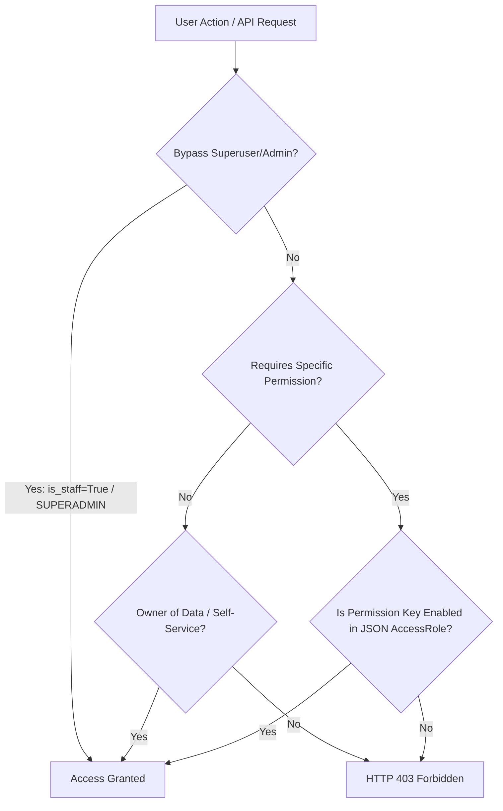

# Detailed Role & Permission Matrix (RBAC) - Web & Mobile

This document serves as the primary reference guide for Role-Based Access Control (RBAC) across the HRMS platform. It outlines the specific pages, menus, and functionalities that can be accessed or are restricted for each role on both the Web Application (Next.js Frontend) and Mobile Application (Flutter).

---

## 1. Scope Segmentation

The HRMS platform enforces a strict security boundary based on a multi-tenant architecture:
1.  **Global Admin (`public` schema)**: Manages overall SaaS platform infrastructure, tenant lifecycles, cross-company billing, and cross-tenant technical support.
2.  **Tenant User (Individual Tenant schema)**: Operates entirely within the isolated database schema of their respective company. Roles include Company Admin, HR Manager, and Staff.

---

## 2. Global Admin Role Matrix (SaaS Platform Operator)

Global Admin users operate solely under the `public` schema (accessed via the main domain `/login/portal-admin`). They are not bound to an individual company's employee profile.

### Menu Access & Actions Table - Global Admin

| Role (Global Role) | Core Focus | Web Pages Accessed | Mobile App Access | Allowed Actions | Restricted Actions |
| :--- | :--- | :--- | :--- | :--- | :--- |
| **`SUPERADMIN`** | Absolute management & SaaS infrastructure oversight. | • Main Dashboard (`/`)  • Registration Management (`/admin/registrations`)  • Global Admin Management (`/admin/global-admins`) | Not intended for operational mobile use (bypasses checks if logged in). | • Manage other Global Admin accounts (CRUD). • Approve/reject new tenant registration requests. • Perform *masquerade* (impersonation) into any client tenant. • Manage billing plans, invoices, & storage quotas. | No system restrictions. |
| **`ONBOARDING_AGENT`**| Tenant onboarding and activation. | • Main Dashboard (`/`)  • Registration Management (`/admin/registrations`) | No functional access. | • View incoming registration list. • Approve or reject new tenant registration requests (triggering auto PostgreSQL schema sync). | • Manage other global admins. • Perform *masquerade* into client tenants. • Access billing/financial modules. |
| **`SUPPORT_AGENT`** | Technical support & client troubleshooting. | • Main Dashboard (`/`)  • Masquerade into assigned tenant workspaces. | No functional access. | • Perform *masquerade* into client company tenant workspaces that are **specifically assigned** to them for troubleshooting. | • Approve/reject tenant registrations. • Manage other global admins. • Access billing/finances. • Access unassigned tenant workspaces. |
| **`BILLING_ADMIN`** | SaaS subscription billing & platform quotas. | • Main Dashboard (`/`)  • Billing Management page (Invoices, subscription packages) | No functional access. | • Manage subscription plans. • View & process billing invoices. • Review & approve/reject quota reduction requests (`QuotaReductionRequest`). | • Approve/reject tenant registrations. • Manage other global admins. • Perform *masquerade* into client tenants. |

---

## 3. Tenant User Role Matrix (Company Workspace)

Tenant users operate inside their respective company workspace (e.g., `company.harikerja.web.id`). Access is governed either by Django's native `is_staff` flag (for Admins) or dynamic capability keys in the JSON permissions field of the user's active `AccessRole`.

### Menu Access & Actions Table - Tenant User

| Role (Tenant Role) | Flag / Core Permission | Web Pages Accessed | Mobile App Access (Menus & Tabs) | Allowed Actions | Restricted Actions |
| :--- | :--- | :--- | :--- | :--- | :--- |
| **`ADMIN`**  (Tenant Admin) | `is_staff = True`  (Bypasses all local RBAC checks) | **All Pages:** • Dashboard • Profile • Employees • Branches • Attendance • Leaves • Reimbursements • Payroll • Workflows • Analytics • Reports • Settings (Audit Logs, API Keys, Branding) | **Full Access:** • Tabs: Home, Schedule, Payslip, Settings. • Quick Access: Leaves, Payslip, Reimbursement, Profile, Documents, Correction, Performance, Reports. | • Manage all employees, departments, and branches. • System configurations (Branding, API Keys, Workflows, Audit Logs). • Approve all leave, reimbursement, and attendance corrections. • Run payroll cycles and export reports. | • Cannot access data outside their own company tenant. |
| **`MANAGER HR`** | Role with permissions: `tenant_manage_hr`, `tenant_manage_attendance`, `tenant_manage_payroll`, & all approval permissions (`tenant_approve_*`). | **Most Pages:** • Dashboard • Profile • Employees • Branches • Attendance • Leaves • Reimbursements • Payroll (Admin mode) • Reports • Analytics (if explicitly granted) | **Manager Access:** • Tabs: Home, Schedule, Payslip, Settings. • Quick Access: Leaves, Payslip, Reimbursement, Profile, Documents, Correction, Reports, Performance (if granted `tenant_view_performance_report`). | • Create & edit employee records. • Manage global attendance schedules, shifts, and check-ins. • Approve leave requests, reimbursements, and attendance corrections. • Execute payroll and export payroll recap sheets. | • Modify primary tenant configurations (Branding, API Keys, Workflow config). • View system *Audit Logs* (unless granted `tenant_view_audit_logs`). • Delete system default roles (`Admin`, `HR Manager`, `Staff`). |
| **`STAFF`**  (Standard Employee) | No administrative privileges (empty/default permissions JSON). | **Self-Service Only:** • Dashboard (No global stats) • Profile (Own data only) • Attendance (Self clock-in/out) • Leaves (Self requests) • Reimbursements (Self claims) *(Admin pages are hidden)* | **Restricted Access:** • Tabs: Home, Schedule, Payslip, Settings. • Quick Access: Leaves, Payslip, Reimbursement, Profile, Documents, Correction. *(Reports & Performance menus are hidden)* | • Clock in/out using face verification/GPS location. • Submit leave and reimbursement requests. • Request attendance corrections. • View monthly payslips. • Modify personal profile information. | • View other employees' records (salary, documents, addresses). • Approve other users' requests. • Access HR reports & company analytics dashboards. • View settings and system configurations. |

---

## 4. Web Navigation Routes vs RBAC Permissions

The navigation sidebar (`Sidebar.tsx`) dynamically renders routes based on permission keys returned from the API.

| Next.js Frontend Route | Page Description | Required Backend Permission Key | Frontend Guard Config |
| :--- | :--- | :--- | :--- |
| `/` | Operational dashboard overview & metrics. | N/A (Adapts statistics display depending on user access) | Open to all authenticated users. |
| `/profile` | User/employee personal profile info. | N/A (Self-service access) | Open to all, hidden on Public Tenant. |
| `/employees` | CRUD for Employees, Departments, & Roles. | `tenant_manage_hr` | `requiredPermission: 'tenant_manage_hr'` |
| `/branches` | Manage branch offices & coordinates. | `tenant_manage_hr` | `requiredPermission: 'tenant_manage_hr'` |
| `/attendance` | Shift schedules & attendance history. | `tenant_manage_attendance` (for management); Self-Service (for check-in) | Open to Staff for self clock-in. Approval tab requires `tenant_approve_attendance_correction`. |
| `/leaves` | Leave request submission & approval. | `tenant_approve_leave` (for approval); Self-Service (for own requests) | Open to Staff. Approval tab is hidden without approval permission. |
| `/reimbursements` | Expense claims & reimbursement approval. | `tenant_approve_reimbursement` (for approval); Self-Service (for own requests) | Open to Staff. Approval tab is hidden without approval permission. |
| `/payroll` | Monthly payslip generation & recap exports. | `tenant_manage_payroll` (to manage); `tenant_view_all_payslips` (to view all) | `requiredPermission: 'tenant_manage_payroll'` (Staff view their own payslips via profile/pop-ups). |
| `/workflows` | Configure multi-level approval lines. | `tenant_manage_settings` | `requiredPermission: 'tenant_manage_settings'` |
| `/analytics` | Interactive charts and attendance graphs. | `tenant_manage_hr` | `requiredPermission: 'tenant_manage_hr'` |
| `/reports` | Export historical HR data. | `tenant_manage_hr` | `requiredPermission: 'tenant_manage_hr'` |
| `/settings` | General tenant settings & module management. | `tenant_manage_settings` | `requiredPermission: 'tenant_manage_settings'` |
| `/settings/audit-logs` | System audit trails. | `tenant_view_audit_logs` | `requiredPermission: 'tenant_view_audit_logs'` |
| `/settings/api-keys` | Manage API keys. | `tenant_manage_settings` | `requiredPermission: 'tenant_manage_settings'` |
| `/settings/branding` | Corporate logos and UI customizer. | `tenant_manage_settings` | `requiredPermission: 'tenant_manage_settings'` |

---

## 5. Mobile Application Permissions (Flutter)

The mobile dashboard hides or shows quick-access widgets using the `hasPermission` helper method on the mobile `User` model.

### Quick Access Menu Configuration (`home_screen.dart`):

1.  **Leaves (`qa_leaves`)**: **Always Visible** (Self-service leave requests).
2.  **Payslip (`qa_payslip`)**: **Always Visible** (View and download self payslips).
3.  **Reimbursement (`qa_reimbursement`)**: **Always Visible** (Self expense claims).
4.  **My Profile (`qa_profile`)**: **Always Visible** (Update own contact details).
5.  **Documents (`qa_documents`)**: **Always Visible** (Upload/view own ID, Tax certificates).
6.  **Correction (`qa_correction`)**: **Always Visible** (Request clock-in corrections).
7.  **Performance (`qa_performance`)**: **Conditional**. Only rendered if the user has `view_performance_report` (mapped to backend `tenant_view_performance_report`).
8.  **Reports (`qa_reports`)**: **Conditional**. Only rendered if the user has `manage_hr` (mapped to backend `tenant_manage_hr`).

---

## 6. Security Enforcement Principles

The system adopts a *Defense in Depth* strategy. Verification of permissions is enforced at the Django Backend API, meaning frontend styling restrictions are merely for UX polish.

### A. Self-Service Override (Ownership Check)
On the Django backend, even if a standard employee lacks administrative permissions (e.g., `tenant_manage_hr`), the backend allows requests through if `allow_self_service` is set and:
*   The action is querying or updating their own `User`/`Employee` record.
*   The query is fetching their own payslips, leaves, attendance records, or reimbursements.

### B. Direct Line Supervisor Override
For approvals (such as leaves or attendance correction requests), the backend permits supervisors to approve requests originating from their direct subordinates, even if the supervisor does not hold a global `Admin` or `HR Manager` role.
