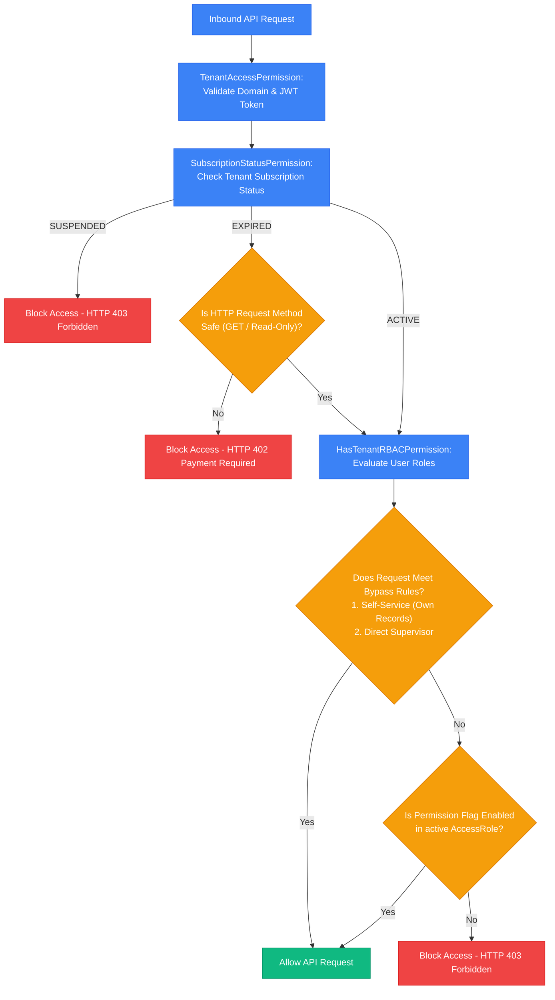

# Authorization System (RBAC) & Security Classification

This document outlines the **Role-Based Access Control (RBAC)** architecture, security policies, scope segmentation, and route/permission mapping matrix across the **HariKerja HRMS** platform (both global SaaS platform level and individual company tenant schemas).

---

## 🏗️ 1. SaaS-Level Authorization (Global RBAC - `public` Schema)

Global admin users operate solely under the `public` schema (accessed via the main domain `/login/portal-admin`) to manage overall SaaS platform infrastructure. Global roles are configured using the `global_role` column of the `User` model.

### Menu Access & Actions Table - Global Admin

| Role (Global Role) | Core Focus | Web Pages Accessed | Mobile App Access | Allowed Actions | Restricted Actions |
| :--- | :--- | :--- | :--- | :--- | :--- |
| **`SUPERADMIN`** | Absolute management & SaaS infrastructure oversight. | • Main Dashboard (`/`)  • Registration Management (`/admin/registrations`)  • Global Admin Management (`/admin/global-admins`)  • Billing Configuration (`/admin/billing`) | Not intended for operational mobile use. | • Manage other Global Admin accounts (CRUD). • Approve/reject new tenant registration requests. • Perform *masquerade* (impersonation) into any client tenant. • Manage billing plans, invoices, & storage quotas. | No system restrictions. |
| **`ONBOARDING_AGENT`**| Tenant onboarding and activation. | • Main Dashboard (`/`)  • Registration Management (`/admin/registrations`) | No functional access. | • View incoming registration list. • Approve or reject new tenant registration requests (triggering auto PostgreSQL schema sync). | • Manage other global admins. • Perform *masquerade* into client tenants. • Access billing/financial modules. |
| **`SUPPORT_AGENT`** | Technical support & client troubleshooting. | • Main Dashboard (`/`)  • Masquerade into assigned tenant workspaces. | No functional access. | • Perform *masquerade* into client company tenant workspaces that are **specifically assigned** to them for troubleshooting. | • Approve/reject tenant registrations. • Manage other global admins. • Access billing/finances. • Access unassigned tenant workspaces. |
| **`BILLING_ADMIN`** | SaaS subscription billing & platform quotas. | • Main Dashboard (`/`)  • Billing Management page (Invoices, subscription packages) | No functional access. | • Manage subscription plans. • View & process billing invoices. • Review & approve/reject quota reduction requests (`QuotaReductionRequest`). | • Approve/reject tenant registrations. • Manage other global admins. • Perform *masquerade* into client tenants. |

---

## 🏢 2. Client-Level Authorization (Tenant RBAC - Tenant Schema)

Inside the tenant's individual database schema, user permissions are determined by the `AccessRole` and `Employee` models. Access is governed either by Django's native `is_staff` flag (for Admins) or dynamic capability keys in the JSON permissions field of the user's active `AccessRole`.

### 2.1 Canonical Permission Pool
Permissions are defined as boolean flags inside the `AccessRole` model:
*   `tenant_manage_settings`: Modify branch coordinates, geofencing limits, late penalties, and BPJS rates.
*   `tenant_manage_hr`: Manage employee profiles, NIK, salary grades, branches, and account deactivations.
*   `tenant_manage_attendance`: Configure shifts, view/adjust log sheets, and approve clock-in corrections.
*   `tenant_manage_leaves`: Administer leave types, set balances, and process leave requests.
*   `tenant_manage_payroll`: Create/lock payroll periods, run PPh 21 tax calculations, and publish pay slips.
*   `tenant_view_analytics`: Access visual graphs for attendance patterns, demographic charts, and financial analytics.

### 2.2 System Default Roles
When a client tenant is first created, the system seeds non-deletable default roles:

| Role (Tenant Role) | Flag / Core Permission | Web Pages Accessed | Mobile App Access (Menus & Tabs) | Allowed Actions | Restricted Actions |
| :--- | :--- | :--- | :--- | :--- | :--- |
| **`ADMIN`**  (Tenant Admin) | `is_staff = True`  (Bypasses all local RBAC checks) | **All Pages:** • Dashboard • Profile • Employees • Branches • Attendance • Leaves • Reimbursements • Payroll • Workflows • Analytics • Reports • Settings (Audit Logs, API Keys, Branding) | **Full Access:** • Tabs: Home, Settings. • Quick Access: Leaves, Payslip, Reimbursement, Profile, Documents, Correction, Performance, Reports. | • Manage all employees, departments, and branches. • System configurations (Branding, API Keys, Workflows, Audit Logs). • Approve all leave, reimbursement, and attendance corrections. • Run payroll cycles and export reports. | • Cannot access data outside their own company tenant. |
| **`MANAGER HR`** | Role with permissions: `tenant_manage_hr`, `tenant_manage_attendance`, `tenant_manage_payroll`, & all approval permissions (`tenant_approve_*`). | **Most Pages:** • Dashboard • Profile • Employees • Branches • Attendance • Leaves • Reimbursements • Payroll (Admin mode) • Reports • Analytics (if explicitly granted) | **Manager Access:** • Tabs: Home, Settings. • Quick Access: Leaves, Payslip, Reimbursement, Profile, Documents, Correction, Reports, Performance (if granted `tenant_view_performance_report`). | • Create & edit employee records. • Manage global attendance schedules, shifts, and check-ins. • Approve leave requests, reimbursements, and attendance corrections. • Execute payroll and export payroll recap sheets. | • Modify primary tenant configurations (Branding, API Keys, Workflow config). • View system *Audit Logs* (unless granted `tenant_view_audit_logs`). • Delete system default roles (`Admin`, `HR Manager`, `Staff`). |
| **`STAFF`**  (Standard Employee) | No administrative privileges (empty/default permissions JSON). | **Self-Service Only:** • Dashboard (No global stats) • Profile (Own data only) • Attendance (Self clock-in/out) • Leaves (Self requests) • Reimbursements (Self claims) *(Admin pages are hidden)* | **Restricted Access:** • Tabs: Home, Settings. • Quick Access: Leaves, Payslip, Reimbursement, Profile, Documents, Correction. *(Reports & Performance menus are hidden)* | • Clock in/out using face verification/GPS location. • Submit leave and reimbursement requests. • Request attendance corrections. • View monthly payslips. • Modify personal profile information. | • View other employees' records (salary, documents, addresses). • Approve other users' requests. • Access HR reports & company analytics dashboards. • View settings and system configurations. |

---

## 🛡️ 3. Security Enforcement Mechanisms

The system adopts a *Defense in Depth* strategy. Verification of permissions is enforced at the Django Backend API, meaning frontend styling restrictions are merely for UX polish.

### 3.1 Security Bypass Exception Rules

1.  **Self-Service Override (Ownership Check)**:
    Employees without administrative roles are allowed to read or write their own records.
    *   *Example*: An employee can view their own payslips (`GET /api/payslips/`), edit their avatar (`PUT /api/users/me/`), and file a leave request (`POST /api/leave-requests/`). The backend permits this if the resource's owner ID matches `request.user.id`.
2.  **Direct Line Supervisor Override**:
    A designated supervisor can approve workflow items for their direct reports without holding global HR permissions.
    *   *Example*: The system checks if the applicant's `employee.supervisor_id` matches the current user's ID (`request.user.id`). If they match, the action is allowed.

---

## 📊 4. Web Navigation Routes vs RBAC Permissions

The navigation sidebar (`Sidebar.tsx`) dynamically renders routes based on permission keys returned from the API.

| Next.js Frontend Route | Page Description | Required Backend Permission Key | Frontend Guard Config |
| :--- | :--- | :--- | :--- |
| `/` | Operational dashboard overview & metrics. | N/A (Adapts statistics display depending on user access) | Open to all authenticated users. |
| `/profile` | User/employee personal profile info. | N/A (Self-service access) | Open to all, hidden on Public Tenant. |
| `/employees` | CRUD for Employees, Departments, & Roles. | `tenant_manage_hr` | `requiredPermission: 'tenant_manage_hr'` |
| `/branches` | Manage branch offices & coordinates. | `tenant_manage_hr` | `requiredPermission: 'tenant_manage_hr'` |
| `/attendance` | Shift schedules & attendance history. | `tenant_manage_attendance` (for management); Self-Service (for check-in) | Open to Staff for self clock-in. Approval tab requires `tenant_approve_attendance_correction`. |
| `/leaves` | Leave request submission & approval. | `tenant_approve_leave` (for approval); Self-Service (for own requests) | Open to Staff. Approval tab is hidden without approval permission. |
| `/reimbursements` | Expense claims & reimbursement approval. | `tenant_approve_reimbursement` (for approval); Self-Service (for own requests) | Open to Staff. Approval tab is hidden without approval permission. |
| `/payroll` | Monthly payslip generation & recap exports. | `tenant_manage_payroll` (to manage); `tenant_view_all_payslips` (to view all) | `requiredPermission: 'tenant_manage_payroll'` (Staff view their own payslips via profile/pop-ups). |
| `/workflows` | Configure multi-level approval lines. | `tenant_manage_settings` | `requiredPermission: 'tenant_manage_settings'` |
| `/analytics` | Interactive charts and attendance graphs. | `tenant_manage_hr` | `requiredPermission: 'tenant_manage_hr'` |
| `/reports` | Export historical HR data. | `tenant_manage_hr` | `requiredPermission: 'tenant_manage_hr'` |
| `/settings` | General tenant settings & module management. | `tenant_manage_settings` | `requiredPermission: 'tenant_manage_settings'` |
| `/settings/audit-logs` | System audit trails. | `tenant_view_audit_logs` | `requiredPermission: 'tenant_view_audit_logs'` |
| `/settings/api-keys` | Manage API keys. | `tenant_manage_settings` | `requiredPermission: 'tenant_manage_settings'` |
| `/settings/branding` | Corporate logos and UI customizer. | `tenant_manage_settings` | `requiredPermission: 'tenant_manage_settings'` |

---

## 📱 5. Mobile Application Permissions (Flutter)

The ESS Flutter app aligns with the backend's RBAC settings to adjust UI rendering:
*   **Module Visibility**: The mobile dashboard queries the tenant's active modules (`enabledModules`) from `TenantContext` on load. If the `payroll` module is inactive, the **Salary & Slips** menu is hidden.
*   **Supervisor Check**: The **Team Approvals** panel is only rendered if the employee profile has `is_supervisor = True` (having at least 1 direct report).

### Quick Access Menu Configuration (`home_screen.dart`):

1.  **Leaves (`qa_leaves`)**: **Always Visible** (Self-service leave requests).
2.  **Payslip (`qa_payslip`)**: **Always Visible** (View and download self payslips).
3.  **Reimbursement (`qa_reimbursement`)**: **Always Visible** (Self expense claims).
4.  **My Profile (`qa_profile`)**: **Always Visible** (Update own contact details).
5.  **Documents (`qa_documents`)**: **Always Visible** (Upload/view own ID, Tax certificates).
6.  **Correction (`qa_correction`)**: **Always Visible** (Request clock-in corrections).
7.  **Performance (`qa_performance`)**: **Conditional**. Only rendered if the user has `view_performance_report` (mapped to backend `tenant_view_performance_report`).
8.  **Reports (`qa_reports`)**: **Conditional**. Only rendered if the user has `manage_hr` (mapped to backend `tenant_manage_hr`).
