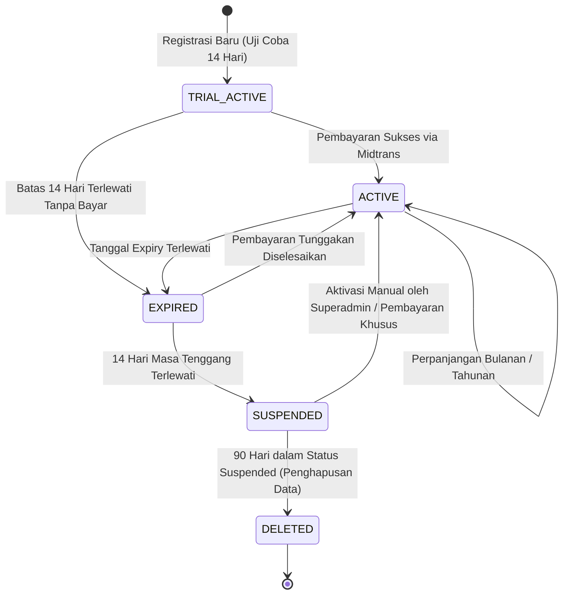
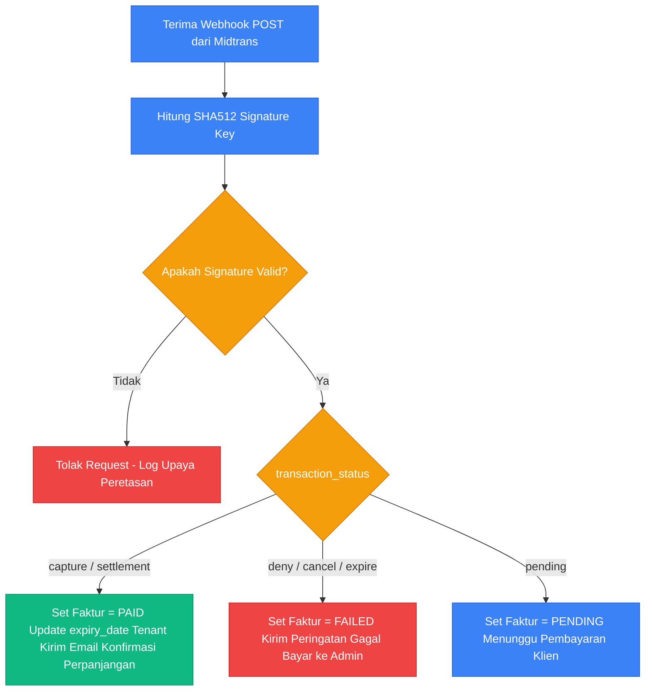

# Dokumentasi Registrasi, Siklus Hidup Langganan & Integrasi Penagihan (Billing)

Dokumen ini menjelaskan arsitektur terintegrasi untuk registrasi tenant baru, manajemen siklus hidup langganan (*subscription lifecycles*), pembatasan kuota (karyawan dan penyimpanan), serta integrasi teknis dengan **Midtrans Payment Gateway** pada platform **HariKerja HRMS**.

---

## 🏗️ 1. Alur Registrasi & Provisi Database (Tenant Onboarding)

Sistem menggunakan model multi-tenant SaaS berbasis **PostgreSQL Schema Separation** untuk memastikan isolasi data yang aman bagi setiap perusahaan klien.

### Tahap 1: Registrasi Mandiri (Self-Service Signup)
*   **Aksi**: Calon klien mengisi formulir di landing page publik (Nama Perusahaan, Domain Klien yang diinginkan, Email Administrator Utama).
*   **Proses**: API `/api/public/signup/` memvalidasi ketersediaan subdomain dan menyimpan rekaman baru di model `RegistrationRequest` skema `public` dengan status `PENDING`.
*   **Notifikasi**: Sistem mengirimkan email konfirmasi bahwa permintaan registrasi telah diterima dan sedang ditinjau.

### Tahap 2: Pembayaran Awal (Midtrans Snap Checkout)
*   Sebelum registrasi disetujui, admin tenant diarahkan ke halaman checkout pembayaran untuk paket pilihan mereka (Essential / Professional / Premium).
*   Sistem memanggil API Midtrans Snap untuk membuat `snap_token` unik. Pengguna menyelesaikan transaksi menggunakan Virtual Account, kartu kredit, atau e-wallet.
*   Begitu Midtrans mengirim webhook sukses (`settlement`), status faktur diperbarui menjadi `PAID` di skema `public`.

### Tahap 3: Provisi Database otomatis (Schema Provisioning)
Setelah status pembayaran berhasil, Global Admin (atau otomatisasi webhook) menyetujui pendaftaran. Backend memicu serangkaian aksi terstruktur:
1.  **Pembuatan Skema**: Backend mengeksekusi `CREATE SCHEMA [schema_name]` (misal: `ptmaju`).
2.  **Migrasi Tabel**: Menjalankan migrasi database Django khusus untuk skema baru agar tabel internal HR (kehadiran, cuti, penggajian, reimbursement) terbentuk.
3.  **Inisialisasi Master Data**: Mengisi skema baru dengan data default:
    *   Departemen utama: *Management*, *HR*, *Finance*.
    *   Peran akses (RBAC): *Tenant Admin*, *HR Staff*, *Karyawan*.
    *   Jadwal shift dasar: *Standard Shift* (08:00 - 17:00).
4.  **Aktivasi Admin**: Akun pengguna utama didaftarkan di skema `public` dan dikaitkan sebagai pemilik skema tenant baru tersebut. Klien menerima email aktivasi dengan tautan workspace mereka (`https://[subdomain].harikerja.com`).

---

## 💎 2. Siklus Hidup Langganan (Subscription Lifecycles)

Sistem memantau tanggal kedaluwarsa langganan (`expiry_date`) tenant secara real-time melalui middleware global (`SubscriptionMiddleware`).



### Penjelasan Status & Pembatasan API:

1.  **`ACTIVE` (Aktif / Trial Aktif)**:
    *   *Akses*: Penuh (Read & Write).
    *   *Deskripsi*: Pembayaran terverifikasi atau tenant sedang berada dalam masa uji coba 14 hari pertama.
2.  **`EXPIRED` (Kedaluwarsa / Masa Tenggang)**:
    *   *Pemicu*: Tanggal `expiry_date` terlewati. Sistem memberikan masa tenggang (grace period) selama **14 hari**.
    *   *Akses*: **Hanya-Baca (Read-Only)**.
    *   *Respons API*: Setiap request POST/PUT/DELETE ke modul operasional (seperti absensi, cuti, payroll) ditolak oleh backend dengan kode status **`HTTP 402 Payment Required`**.
    *   *Tampilan UI*: Menampilkan banner peringatan pembayaran berwarna oranye di bagian atas dashboard web dan mobile.
3.  **`SUSPENDED` (Ditangguhkan / Blokir)**:
    *   *Pemicu*: Masa tenggang 14 hari terlewati tanpa transaksi pembayaran perpanjangan.
    *   *Akses*: **Blokir Total (Access Closed)**.
    *   *Respons API*: Semua request API (termasuk GET) ditolak dengan status **`HTTP 403 Forbidden`**. Karyawan tidak dapat melakukan clock-in.
    *   *Tampilan UI*: Mengarahkan pengguna langsung ke halaman pemblokiran "Layanan Ditangguhkan".
4.  **`DELETED` (Dihapus Permanen)**:
    *   *Pemicu*: 90 hari berada dalam status `SUSPENDED` tanpa ada pembayaran.
    *   *Akses*: Terhapus.
    *   *Proses*: Sistem cron menghapus skema PostgreSQL tenant secara permanen untuk mengosongkan ruang disk.

---

## 📈 3. Paket Penagihan & Manajemen Kuota (Resource Quotas)

Platform menggunakan **Tier-Based Pricing** (bukan biaya per kepala), dikombinasikan dengan **Kuota Elastis (Add-ons)**.

| Tingkat Paket | Kapasitas Karyawan | Batas Penyimpanan | Modul yang Terbuka |
| :--- | :--- | :--- | :--- |
| **FREE** | Maks 10 Karyawan | 50 MB | Core HR, Kehadiran Dasar |
| **ESSENTIAL** | Maks 25 Karyawan | 250 MB | Kehadiran + Geofencing, Cuti & Izin |
| **PROFESSIONAL** | Maks 100 Karyawan | 1 GB | Penggajian (PPh 21/BPJS), Reimbursement |
| **PREMIUM** | Maks 500 Karyawan | 5 GB | KPI & Performance, RBAC Lanjutan |
| **ENTERPRISE** | Kustom (2000+) | Kustom (20 GB+) | Semua Modul + Audit Logs & Dedicated SLA |

### 3.1 Kuota Elastis (Blok Add-on)
Tenant dapat membeli kuota tambahan tanpa perlu meningkatkan seluruh tingkat paket langganan mereka:
*   **Tambahan Karyawan**: Dijual per blok **+5 Karyawan** (Essential: Rp25.000, Professional: Rp50.000, Premium: Rp75.000 /bulan).
*   **Tambahan Penyimpanan**: Dijual per blok **+1 GB** seharga Rp50.000 /bulan.

### 3.2 Aturan Penurunan Paket (Downgrade Validation)
Sistem mencegah admin tenant menurunkan tingkat paket secara sewenang-wenang jika kapasitas aktual saat ini melebihi batas paket tujuan:
*   *Validasi Karyawan*: Jika perusahaan memiliki 45 karyawan aktif, mereka tidak dapat menurunkan paket dari Professional ke Essential (maks 25 karyawan) sebelum menonaktifkan 20 karyawan terlebih dahulu.
*   *Validasi Penyimpanan*: Jika penggunaan file adalah 800 MB, sistem memblokir downgrade ke paket Essential (maks 250 MB).

---

## 🛠️ 4. Penegakan Kuota & Mekanisme Cadangan Kehadiran

Sistem memverifikasi batas kuota secara ketat di backend untuk mencegah eksploitasi data.

### A. Penegakan Kuota Karyawan
Saat HR menambahkan karyawan baru (atau mengubah status karyawan dari non-aktif menjadi aktif), API backend menjalankan logika berikut:
```python
# backend/users/views.py atau models.py
active_employees_count = Employee.objects.filter(is_active=True).count()
allowed_capacity = tenant.base_employee_limit + tenant.addon_employee_limit

if active_employees_count >= allowed_capacity:
    raise PermissionDenied(
        detail="Batas kapasitas karyawan terlampaui. Silakan tingkatkan paket atau beli blok tambahan."
    )
```

### B. Penegakan Kuota Penyimpanan & Cadangan Biometrik (Storage Fallback)
Semua dokumen digital (scan KTP, NPWP, kuitansi reimbursement, lampiran cuti, dan foto absensi) dihitung kapasitas ukurannya (`storage_used_bytes`).
*   **Peringatan Warning**: Ketika kapasitas mencapai **90%**, sistem mengirimkan notifikasi administratif sistem ke dashboard Admin Tenant.
*   **Batas Kritis (100%)**: Jika kapasitas penyimpanan penuh, unggah dokumen (KTP, slip pengeluaran) baru akan diblokir dengan respons error `STORAGE_LIMIT_EXCEEDED`.
*   **Mekanisme Cadangan Kehadiran (Attendance Fallback)**:
    Agar karyawan tetap dapat mencatat kehadiran harian ketika kapasitas penyimpanan server tenant habis, sistem mengaktifkan alur bypass:
    1.  Karyawan melakukan clock-in di aplikasi mobile.
    2.  Backend mendeteksi penyimpanan penuh.
    3.  Backend **mengizinkan pencatatan kehadiran lolos**, tetapi **melewatkan penyimpanan berkas foto** absensi.
    4.  Log absensi dicatat di database dengan flag parameter **`biometric_skipped = True`**. Hal ini mencegah terganggunya operasional kantor akibat kegagalan server.

---

## 💳 5. Integrasi Pembayaran Midtrans Snap

Proses penagihan bulanan terotomatisasi penuh melalui integrasi API **Midtrans Snap Checkout** dan Webhook status.

### 5.1 Endpoint Webhook Penerima
Sistem backend mendengarkan status pembayaran dari server Midtrans pada rute endpoint:
`POST /api/billing/webhook/` (skema `public`).

### 5.2 Alur Validasi Tanda Tangan (Signature Key Verification)
Untuk menghindari manipulasi pembayaran palsu, backend memverifikasi signature key yang dikirim Midtrans di setiap request webhook:
$$\text{Signature Key} = \text{SHA512}(\text{order\\_id} + \text{status\\_code} + \text{gross\\_amount} + \text{Server Key})$$

```python
import hashlib
import hmac

calculated_signature = hashlib.sha512(
    f"{order_id}{status_code}{gross_amount}{settings.MIDTRANS_SERVER_KEY}".encode('utf-8')
).hexdigest()

if calculated_signature != received_signature:
    raise SuspiciousOperation("Validasi tanda tangan Midtrans gagal.")
```

### 5.3 Pemetaan Status Transaksi
Backend menerjemahkan status transaksi Midtrans ke status pembayaran langganan sistem:


