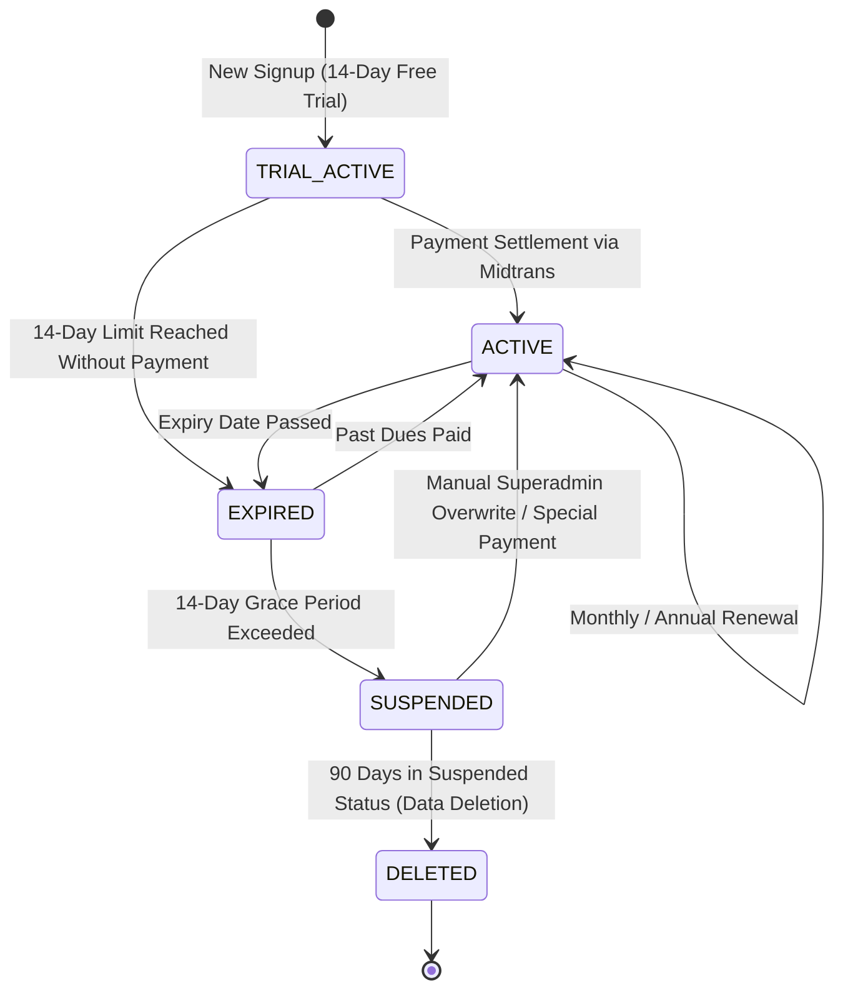
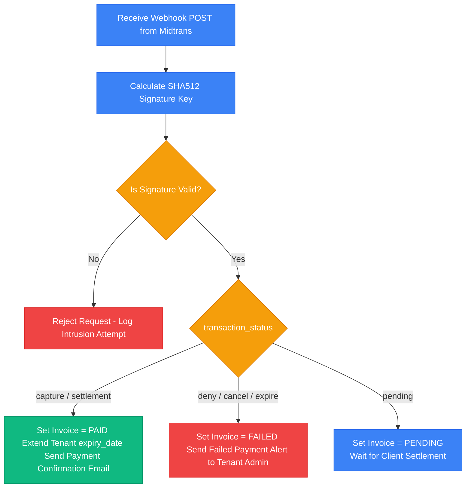

# Registration, Subscription Lifecycles & Billing Integration

This document outlines the integrated architecture for tenant registration, subscription lifecycles, resource quota enforcement (employee seats and disk storage), and the technical integration with **Midtrans Payment Gateway** on the **HariKerja HRMS** platform.

---

## 🏗️ 1. Registration & Schema Provisioning Flow (Tenant Onboarding)

The system uses a multi-tenant B2B SaaS model based on **PostgreSQL Schema Isolation** to guarantee secure data segregation for each corporate client.

### Stage 1: Self-Service Signup
*   **Action**: Prospective clients fill out the registration form on the public landing page (Company Name, Desired Subdomain, Primary Admin Email).
*   **Process**: The `/api/public/signup/` API validates subdomain availability and creates a record in the `RegistrationRequest` model under the `public` schema with a `PENDING` status.
*   **Notification**: The system sends an email confirming receipt of the registration request.

### Stage 2: Initial Payment (Midtrans Snap Checkout)
*   Before approval, the tenant admin is redirected to the checkout page for their selected plan (Essential / Professional / Premium).
*   The system calls the Midtrans Snap API to generate a unique `snap_token`. The user completes the transaction (Virtual Account, credit card, or e-wallet).
*   Upon receipt of the Midtrans success webhook (`settlement`), the invoice status is updated to `PAID` in the `public` schema.

### Stage 3: Automated Database Provisioning
Upon successful payment confirmation, the Global Admin (or automated webhook handler) approves the registration. The backend executes:
1.  **Schema Creation**: Generates a new PostgreSQL schema (e.g., `CREATE SCHEMA ptmaju`).
2.  **Table Migrations**: Executes Django migrations targeting the new local schema to build operational HR tables (attendance, leaves, payroll, reimbursements).
3.  **Master Data Seeding**: Seeds basic tables in the new schema:
    *   Core departments: *Management*, *HR*, *Finance*.
    *   Default RBAC roles: *Tenant Admin*, *HR Staff*, *Employee*.
    *   Standard work shift: *Standard Shift* (08:00 - 17:00).
4.  **Admin User Activation**: The primary tenant admin is registered in `public.users` and linked to the new schema. The client receives an activation email with their workspace URL (`https://[subdomain].harikerja.com`).

---

## 💎 2. Subscription Lifecycles

The system tracks tenant expiration dates (`expiry_date`) in real-time through the global `SubscriptionMiddleware`.



### Status Descriptions & API Restrictions:

1.  **`ACTIVE` (Active / Trial Active)**:
    *   *Access*: Full Read & Write privileges.
    *   *Description*: Verified active billing or active initial 14-day trial period.
2.  **`EXPIRED` (Expired / Grace Period)**:
    *   *Trigger*: `expiry_date` is in the past. The system grants a **14-day grace period**.
    *   *Access*: **Read-Only**.
    *   *API Response*: Any POST/PUT/DELETE calls to operational modules (attendance logs, leave requests, payroll periods) are rejected with **`HTTP 402 Payment Required`**.
    *   *UI Presentation*: Shows an orange payment warning banner at the top of the web and mobile interfaces.
3.  **`SUSPENDED` (Suspended / Blocked)**:
    *   *Trigger*: Grace period of 14 days is exceeded without renewal.
    *   *Access*: **Blocked**.
    *   *API Response*: All API calls (including GET requests) are rejected with **`HTTP 403 Forbidden`**. Employees cannot clock in.
    *   *UI Presentation*: Redirects the user directly to a "Service Suspended" landing screen.
4.  **`DELETED` (Deleted / Data Purge)**:
    *   *Trigger*: 90 days in `SUSPENDED` status without settlement.
    *   *Access*: None (Data completely purged).
    *   *Process*: A background Celery worker drops the tenant's PostgreSQL schema to free up database disk space.

---

## 📈 3. Plans & Quota Limits

The platform uses **Tier-Based Pricing** (flat cost per tier rather than pay-per-employee), combined with **Elastic Quotas (Add-ons)**.

| Plan Level | Employee Capacity | Storage Limit | Unlocked Modules |
| :--- | :--- | :--- | :--- |
| **FREE** | Max 10 Employees | 50 MB | Core HR, Basic Attendance |
| **ESSENTIAL** | Max 25 Employees | 250 MB | Geofenced Attendance, Leaves & Approvals |
| **PROFESSIONAL** | Max 100 Employees | 1 GB | Indonesian Payroll (PPh 21/BPJS), Reimbursements |
| **PREMIUM** | Max 500 Employees | 5 GB | KPI & Performance, Advanced RBAC |
| **ENTERPRISE** | Custom (2000+) | Custom (20 GB+) | Full Suite + Audit Logs & Dedicated SLA |

### 3.1 Elastic Quota Add-ons
Tenants can purchase incremental limits without upgrading their parent plan:
*   **Employee Seats**: Sold in blocks of **+5 Employees** (Essential: Rp25,000, Professional: Rp50,000, Premium: Rp75,000 /month).
*   **Disk Storage**: Sold in blocks of **+1 GB** for Rp50,000 /month.

### 3.2 Downgrade Validation Rules
The system blocks plan downgrades if the current consumption exceeds the destination plan limits:
*   *Employee Count*: If a tenant has 45 active employees, they cannot downgrade from Professional to Essential (max 25 employees) until they deactivate at least 20 employees.
*   *Storage Limit*: If file usage is 800 MB, the system blocks downgrades to Essential (max 250 MB).

---

## 🛠️ 4. Quota Enforcement & Storage Fallback Mechanisms

To prevent resources misuse, quota boundaries are validated strictly at the backend level.

### A. Employee Count Enforcement
When adding or activating an employee, the API validates:
```python
# backend/users/views.py
active_employees_count = Employee.objects.filter(is_active=True).count()
allowed_capacity = tenant.base_employee_limit + tenant.addon_employee_limit

if active_employees_count >= allowed_capacity:
    raise PermissionDenied(
        detail="Employee limit reached. Please upgrade your plan or purchase additional seats."
    )
```

### B. Storage Quotas & Attendance Fallback (Storage Fallback)
The total size of uploaded files (KTP scan, NPWP scan, receipts, leave attachments, and clock-in photos) is tracked as `storage_used_bytes`.
*   **Warning (90% capacity)**: Triggers an in-app system alert sent to the Tenant Admin.
*   **Critical (100% capacity)**: Rejects new file uploads (e.g., reimbursement receipts) with a `STORAGE_LIMIT_EXCEEDED` error.
*   **Attendance Storage Fallback**:
    To prevent employees from being unable to clock in due to full storage limits, the backend activates a bypass:
    1.  Employee clocks in on the mobile app.
    2.  The backend detects that storage capacity is exhausted.
    3.  The backend **allows the attendance log to save**, but **skips saving the photo attachment**.
    4.  The attendance record is stored with **`biometric_skipped = True`**, maintaining client operations.

---

## 💳 5. Midtrans Payment Gateway Integration

Subscription invoicing and payment resolution are fully automated via the **Midtrans Snap API** and secure webhook listener.

### 5.1 Webhook Endpoint
The backend listens for Midtrans payment updates at:
`POST /api/billing/webhook/` (public schema context).

### 5.2 Webhook Signature Verification
To prevent spoofed payment callbacks, the backend calculates and verifies the signature key on each webhook call:
$$\text{Signature Key} = \text{SHA512}(\text{order\\_id} + \text{status\\_code} + \text{gross\\_amount} + \text{Server Key})$$

```python
import hashlib

calculated_signature = hashlib.sha512(
    f"{order_id}{status_code}{gross_amount}{settings.MIDTRANS_SERVER_KEY}".encode('utf-8')
).hexdigest()

if calculated_signature != received_signature:
    raise SuspiciousOperation("Midtrans signature validation failed.")
```

### 5.3 Midtrans Transaction Status Mapping
Backend processes map Midtrans statuses as follows:


