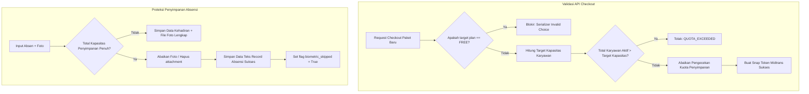

# Panduan Siklus Hidup Langganan dan Kebijakan Kuota (SaaS)

Dokumen ini menjelaskan secara mendalam arsitektur siklus hidup langganan, kebijakan manajemen paket (*Upgrade/Downgrade*), perlindungan validasi kuota karyawan, serta penanganan batasan penyimpanan pada platform HariKerja HRMS.

---

## 1. Alur Siklus Hidup Awal Tenant

### Pendaftaran & Pembuatan Otomatis (*Auto-Provisioning*)
Setiap pelanggan baru terintegrasi ke platform melalui mekanisme pendaftaran mandiri (*self-service*):
1. **Registrasi Publik**: Calon tenant mendaftar via `https://harikerja.web.id/signup`.
2. **Review & Persetujuan**: Super Admin meninjau pengajuan pendaftaran. Saat disetujui, sistem secara atomik mengeksekusi pembuatan skema basis data PostgreSQL khusus (*schema isolation*), memetakan subdomain unik, dan men-generate akun Admin Tenant awal.
3. **Aktivasi Trial Gratis**: Tenant baru otomatis mendapatkan paket **FREE** dengan durasi masa uji coba selama **14 hari** sejak tanggal persetujuan admin (`expiry_date = date.today() + 14`).

---

## 2. Siklus Status Operasional Tenant

Status akses platform dikendalikan secara ketat berdasarkan tanggal kedaluwarsa (`expiry_date`) yang tersimpan di tabel Tenant:

| Fase & Rentang Waktu | Status Sistem | Batas Operasional & Hak Akses |
| :--- | :--- | :--- |
| **Fase A**: Hari 1 s/d 14 | `ACTIVE` | Akses penuh (Baca & Tulis) untuk semua fitur yang didukung oleh jenis paket aktif. |
| **Fase B**: Hari 15 s/d 28 | `EXPIRED` | **Mode Baca-Saja (Read-Only)**. Karyawan dan Admin hanya dapat melihat data. Semua operasi penulisan (POST, PUT, PATCH, DELETE) akan diblokir dengan error `402 Payment Required`. |
| **Fase C**: Hari 29 dst. | `SUSPENDED` | **Blokir Akses Penuh**. Pengguna tidak dapat mengakses menu apa pun kecuali halaman Billing untuk pelunasan tagihan dan fitur Logout. |

---

## 3. Kebijakan Transisi Paket (Upgrade & Downgrade)

Tenant dapat melakukan perubahan paket kapan saja melalui halaman Pengaturan Billing.

### Aturan Paket FREE
* Paket **FREE** beroperasi secara eksklusif sebagai tier percobaan (*trial*) di awal pendaftaran.
* Tenant **tidak diperbolehkan** melakukan *downgrade* manual kembali ke paket **FREE** setelah beralih ke paket komersial (`ESSENTIAL`, `PROFESSIONAL`, `PREMIUM`). Serializer transaksi checkout secara ketat memblokir pilihan paket FREE.

### Validasi Kuota Karyawan saat Downgrade
Ketika beralih ke tipe paket yang lebih rendah (kapasitas SDM lebih sedikit), API Checkout menerapkan pengamanan kapasitas aktif:
* **Kondisi Gagal**: Jika jumlah karyawan aktif tenant (`employee_count`) melebihi batas dasar paket tujuan ditambah kuota Add-on yang aktif, permintaan checkout akan ditolak dengan kode kesalahan `QUOTA_EXCEEDED`.
* **Opsi Penyelesaian bagi Tenant**:
  1. **Beli Add-on Tambahan**: Memilih paket Add-on tambahan karyawan dalam kelipatan 10 pada antarmuka checkout untuk mencukupi kelebihan karyawan.
  2. **Manajemen Karyawan**: Masuk ke modul Karyawan dan menonaktifkan atau mengakhiri hubungan kerja (*Terminate/PHK*) karyawan lama sehingga total karyawan aktif turun di bawah kapasitas paket tujuan.

---

## 4. Kebijakan Kuota Penyimpanan (Data Storage)

Berbeda dengan kuota karyawan yang bersifat ketat, kapasitas penyimpanan data (*data disk quota*) dikelola secara asinkron untuk melindungi kelancaran proses bisnis operasional perusahaan.

### Kebijakan Downgrade Aman
* **Pengabaian Pembatasan**: Pengecekan kapasitas penyimpanan data **diabaikan sepenuhnya** saat melakukan transaksi downgrade paket. 
* Hal ini menjamin transisi tagihan langganan berjalan lancar 100% tanpa merusak, menghapus, atau memblokir akses data lama yang sudah tersimpan di sistem AWS S3/Cloud.

### Proteksi Penyimpanan Kehadiran (*Attendance Storage Fallback*)
Penyimpanan data umumnya digunakan untuk merekam berkas fisik seperti foto swafoto absensi. Apabila kuota penyimpanan tenant terdeteksi penuh (`storage_full`), sistem menerapkan mekanisme pengamanan cerdas:

1. **Proses Clock-In & Clock-Out**:
   * Alih-alih menggagalkan absensi dengan peringatan error yang menghalangi karyawan bekerja, sistem akan secara proaktif membuang transmisi foto (`photo_in` / `photo_out` diset menjadi `None`).
   * Sistem menetapkan tanda flag `biometric_skipped = True` di tabel kehadiran.
2. **Hasil Akhir**:
   * Record data teks kehadiran (Waktu Absen, Titik Koordinat GPS, Info Karyawan) **tetap tersimpan dengan sukses** di database.
   * Operasional pencatatan kehadiran perusahaan dijamin tidak terhambat walau kuota data telah habis.

---

## 5. Ringkasan Struktur Validasi (Logic Mapping)

---
*Dokumentasi ini diperbarui terakhir pada 14 Mei 2026 untuk mencerminkan integrasi validasi quota downgrade dan mekanisme fallback perlindungan absensi.*
