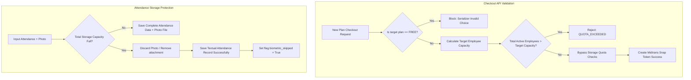

# Subscription Lifecycle and Quota Policy Guide (SaaS)

This document provides a deep dive into the subscription lifecycle architecture, plan management policies (*Upgrade/Downgrade*), employee quota validation safeguards, and storage limitation handling on the HariKerja HRMS platform.

---

## 1. Tenant Initial Lifecycle Flow

### Registration & Auto-Provisioning
Every new customer integrates into the platform through a self-service onboarding mechanism:
1. **Public Registration**: The prospective tenant registers via `https://harikerja.web.id/signup`.
2. **Review & Approval**: The Super Admin reviews the registration request. Upon approval, the system atomically executes the creation of a dedicated PostgreSQL database schema (*schema isolation*), maps a unique subdomain, and generates the initial Tenant Admin account.
3. **Free Trial Activation**: The new tenant automatically receives the **FREE** plan with a **14-day trial period** duration from the admin approval date (`expiry_date = date.today() + 14`).

---

## 2. Tenant Operational Status Cycle

Platform access states are strictly controlled based on the expiration date (`expiry_date`) stored in the Tenant table:

| Phase & Time Range | System Status | Operational Boundaries & Access Rights |
| :--- | :--- | :--- |
| **Phase A**: Day 1 to 14 | `ACTIVE` | Full access (Read & Write) for all features supported by the active plan type. |
| **Phase B**: Day 15 to 28 | `EXPIRED` | **Read-Only Mode**. Employees and Admins can only view existing data. All write operations (POST, PUT, PATCH, DELETE) will be blocked with a `402 Payment Required` error. |
| **Phase C**: Day 29 onwards | `SUSPENDED` | **Full Access Block**. Users cannot access any menus except the Billing page to settle invoices and the Logout feature. |

---

## 3. Plan Transition Policies (Upgrade & Downgrade)

Tenants can change their plan at any time through the Billing Settings page.

### FREE Plan Rules
* The **FREE** plan operates exclusively as a trial tier at the beginning of registration.
* Tenants are **not allowed** to manually *downgrade* back to the **FREE** plan after switching to commercial plans (`ESSENTIAL`, `PROFESSIONAL`, `PREMIUM`). The checkout transaction serializer strictly blocks the choice of the FREE plan.

### Employee Quota Validation on Downgrade
When switching to a lower plan type (fewer HR capacity), the Checkout API applies active capacity safeguards:
* **Failure Condition**: If the tenant's active employee count (`employee_count`) exceeds the target base plan limit plus active Add-on quotas, the checkout request will be rejected with the `QUOTA_EXCEEDED` error code.
* **Resolution Options for Tenant**:
  1. **Purchase Extra Add-ons**: Choose additional employee Add-on blocks in multiples of 10 on the checkout interface to cover excess employees.
  2. **Employee Management**: Access the Employee module and deactivate or terminate (*Terminate*) older employees so the total active employee count drops below the target plan's capacity limit.

---

## 4. Data Storage Quota Policy

Unlike the strict employee quota, data storage capacity (*data disk quota*) is managed asynchronously to protect the smooth operation of core company business processes.

### Safe Downgrade Policy
* **Constraint Bypass**: Data storage capacity checks are **completely ignored** during a plan downgrade transaction.
* This ensures that subscription billing transitions run smoothly without corrupting, deleting, or blocking access to older data already stored in the AWS S3/Cloud systems.

### Attendance Storage Fallback Protection
Data storage is commonly used to record physical files such as clock-in selfies. If the tenant's storage quota is detected full (`storage_full`), the system applies a smart safeguarding mechanism:

1. **Clock-In & Clock-Out Process**:
   * Instead of failing attendance with error warnings that prevent employees from working, the system will proactively discard the incoming photo transmission (`photo_in` / `photo_out` set to `None`).
   * The system flags `biometric_skipped = True` in the attendance record table.
2. **End Result**:
   * The textual attendance record data (Clock-in Time, GPS Coordinates, Employee Info) is **still successfully saved** to the database.
   * Company attendance logging operations are guaranteed not to be hampered even if the data quota has run out.

---

## 5. Logic Mapping Summary

---
*This documentation was last updated on May 14, 2026, to reflect the integration of downgrade quota validation and attendance protection fallback mechanisms.*
