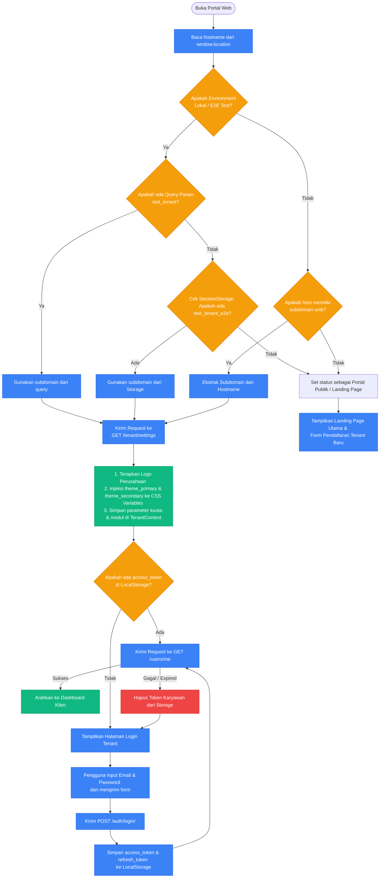
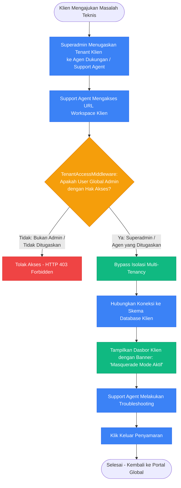
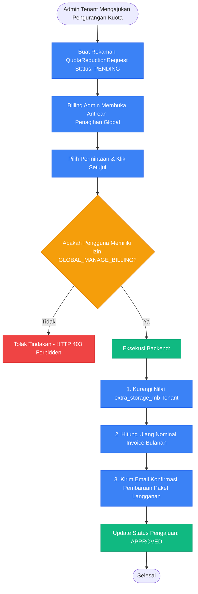

# Panduan Alur Kerja & Diagram Alir Aplikasi Web (Portal Tenant & Global Admin)

Dokumen ini menjelaskan secara mendalam mekanisme kerja, arsitektur, dan alur pengguna (*user flows*) pada portal web **HariKerja HRMS** baik untuk tingkat tenant (Admin Perusahaan, Manajer HR, Supervisor, Layanan Mandiri Karyawan) maupun tingkat platform SaaS (Global Admin, Superadmin, Agen Onboarding, Dukungan Teknis, dan Finansial).

---

## 🏗️ Bagian 1: Portal Web Tenant (Company Workspace)

Portal web tenant dirancang sebagai aplikasi Next.js (App Router) multi-tenant yang menggunakan isolasi database skema per-tenant di tingkat backend.

### 1. Inisialisasi Tenant & Deteksi Domain

Setiap interaksi dengan portal web disaring berdasarkan domain/subdomain untuk mengidentifikasi tenant.

*   **Deteksi Subdomain**: Next.js mendeteksi nama host melalui `window.location.hostname`.
    *   *Produksi*: `https://[subdomain].harikerja.com` (misal: `https://ptmaju.harikerja.com`).
    *   *Pengujian/Lokal*: Mendukung query parameter `?test_tenant=subdomain` atau `sessionStorage` untuk pengujian E2E terisolasi.
*   **Pemuatan Konfigurasi**: `TenantProvider` memanggil `GET /api/v1/tenant/settings` dengan subdomain terdeteksi. Server mengembalikan kustomisasi branding (logo, tema CSS), kuota karyawan/penyimpanan, modul aktif, dan parameter operasional (denda terlambat, persentase BPJS, konfigurasi tingkat persetujuan).
*   **Branding Dinamis**: Warna primer (`themePrimaryColor`) dan sekunder (`themeSecondaryColor`) diterapkan langsung ke CSS variables Root secara real-time.



### 2. Onboarding Karyawan & Cabang

Pengelolaan data karyawan baru dan struktur cabang perusahaan dikendalikan oleh HR Manager atau Tenant Admin.

1.  **Pengaturan Cabang (Branch)**: Menentukan GPS koordinat (Latitude, Longitude) dan `radius_meters` sebagai batas Geofencing absensi mobile.
2.  **Grade Gaji**: Menentukan standar gaji pokok, tunjangan makan, dan tunjangan transportasi harian untuk perhitungan payroll otomatis.
3.  **Tambah Karyawan Baru**: HR menginput nama, email, NIK (ter-generate otomatis), supervisor langsung, peran akses, dan mengunggah KTP, NPWP, serta **Foto Wajah Referensi** untuk Face ID AI.
4.  **Validasi Kuota**: API backend memverifikasi apakah total karyawan aktif berada di bawah `max_employees` paket langganan. Jika melebihi, pendaftaran diblokir dengan pesan `QUOTA_EXCEEDED`.

```mermaid
flowchart TD
    Start[HR Membuka Formulir Tambah Karyawan] --> InputData[Input Data Karyawan:\n- Nama, Email, No. Telp\n- Pilih Departemen & Jabatan\n- Pilih Cabang & Supervisor]
    InputData --> SetCompensation[Tentukan Grade Gaji\n(Mengunci Gaji Pokok & Tunjangan)]
    SetCompensation --> SetRBAC[Tentukan Access Role:\nAdmin / HR Staf / Karyawan]
    SetRBAC --> UploadDocs[Unggah Dokumen Wajib:\n- Scan KTP & NPWP\n- Foto Referensi Wajah (Face ID)]
    UploadDocs --> SubmitForm[Kirim Data via POST /employees/]
    
    SubmitForm --> CheckQuota{Apakah Jumlah Karyawan \nMasih dalam Kuota Langganan?}
    
    CheckQuota -- Tidak --> ShowQuotaError[Tampilkan Eror: Kuota Terlampaui. \nSilakan Upgrade Paket Penagihan]
    CheckQuota -- Ya --> SaveDB[Sistem Backend:\n1. Daftarkan User Django\n2. Buat Rekaman Employee Baru\n3. Generate NIK otomatis\n4. Simpan dokumen di media terproteksi]
    
    SaveDB --> SendInvite[Kirim Email Undangan Aktivasi Sesi Karyawan]
    SendInvite --> End([Selesai])
    ShowQuotaError --> UpgradePlan[Arahkan HR ke Menu Penagihan Web]

    classDef success fill:#10B981,stroke:#059669,color:#fff;
    classDef fail fill:#EF4444,stroke:#DC2626,color:#fff;
    classDef step fill:#3B82F6,stroke:#2563EB,color:#fff;
    classDef decision fill:#F59E0B,stroke:#D97706,color:#fff;
    
    class SaveDB,SendInvite success;
    class ShowQuotaError fail;
    class InputData,SetCompensation,SetRBAC,UploadDocs,SubmitForm,UpgradePlan step;
    class CheckQuota decision;
```

### 3. Persetujuan Berjenjang (Approval Workflows)

Mengakomodasi birokrasi internal perusahaan untuk persetujuan cuti, lembur, reimbursement, dan koreksi absen.

*   **WorkflowConfig**: Menentukan tipe pengajuan (contoh: `LEAVE`, `REIMBURSEMENT`).
*   **WorkflowStage**: Langkah berurutan (N-Level Approval) dengan tipe penyetuju:
    *   *Direct Supervisor*: Diambil dari atasan langsung karyawan (`employee.supervisor`).
    *   *Specific Access Role*: Peran akses tertentu (contoh: Tim Finance).
    *   *Specific Employee*: Individu spesifik yang ditunjuk.
*   **Mekanisme Eksekusi**: Status pengajuan berjalan bertahap (1 -> 2 -> N). Jika ditolak (`REJECTED`) di salah satu tahap, alur berhenti. Jika disetujui hingga akhir, status berubah menjadi `APPROVED` dan memicu efek bisnis (pemotongan saldo cuti, pencatatan koreksi log absensi).

```mermaid
flowchart TD
    Start[Karyawan Mengirim Pengajuan\n(Cuti / Reimbursement / Koreksi)] --> CheckConfig{Apakah Ada WorkflowConfig \nAktif untuk Tipe Ini?}
    
    CheckConfig -- Tidak --> DirectApproval[Persetujuan 1 Tingkat:\nLangsung masuk antrean HR / Manager]
    CheckConfig -- Ya --> GetStages[Ambil Semua WorkflowStage \nUrut Berdasarkan Sequence]
    
    GetStages --> InitStage[Set Tahap Aktif = Sequence 1]
    InitStage --> IdentifyApprover[Identifikasi Penyetuju Aktif:\n- Atasan Langsung, ATAU\n- Peran Akses Tertentu, ATAU\n- Karyawan Tertentu]
    
    IdentifyApprover --> ShowInQueue[Tampilkan Pengajuan di Dasbor Web Penyetuju]
    ShowInQueue --> WaitAction{Keputusan Penyetuju?}
    
    WaitAction -- REJECTED --> RejectFlow[Status Akhir: REJECTED \nAlur Kerja Berhenti \nKirim Notifikasi Penolakan]
    WaitAction -- APPROVED --> CheckNext{Apakah Ada Tahap \nSelanjutnya (Sequence + 1)?}
    
    CheckNext -- Ya --> AdvanceStage[Set Tahap Aktif = Sequence + 1]
    AdvanceStage --> IdentifyApprover
    
    CheckNext -- Tidak --> ApproveFlow[Status Akhir: APPROVED \nEksekusi Aturan Bisnis \n(Potong Kuota / Siap Payout)]

    classDef success fill:#10B981,stroke:#059669,color:#fff;
    classDef fail fill:#EF4444,stroke:#DC2626,color:#fff;
    classDef step fill:#3B82F6,stroke:#2563EB,color:#fff;
    classDef decision fill:#F59E0B,stroke:#D97706,color:#fff;
    
    class ApproveFlow success;
    class RejectFlow fail;
    class GetStages,InitStage,IdentifyApprover,ShowInQueue,AdvanceStage,DirectApproval step;
    class CheckConfig,WaitAction,CheckNext decision;
```

### 4. Pemrosesan Penggajian Bulanan (Payroll & PPh 21 TER 2024)

Pemrosesan terpenting di web yang terintegrasi dengan modul kehadiran dan kepatuhan perpajakan Indonesia.

1.  **Gaji Pokok & Tunjangan Tetap**: Berdasarkan Grade Gaji.
2.  **Tunjangan Harian (Makan & Transport)**: Dihitung proporsional berdasarkan kehadiran aktual karyawan:
    $$\text{Tunjangan Harian} = (\text{Hari Hadir} + \text{Terlambat}) \times \text{Tarif Tunjangan Harian}$$
3.  **Denda Potongan Absensi**:
    *   *Terlambat*: Akumulasi jumlah keterlambatan dikali tarif denda keterlambatan tenant.
    *   *Alfa (Absen)*: Dipotong harian jika tidak ada log absensi tanpa keterangan:
        $$\text{Potongan Alfa} = \text{Hari Alfa} \times \text{Tarif Denda Alfa}$$
4.  **Iuran BPJS**:
    *   *Kesehatan*: 1% karyawan, 4% perusahaan (batas upah maksimal Rp12.000.000).
    *   *Ketenagakerjaan*: JHT (2% karyawan, 3.7% perusahaan), JP (1% karyawan, 2% perusahaan), JKK & JKM (ditanggung penuh perusahaan sesuai risiko industri).
5.  **Pajak PPh 21 TER 2024**:
    *   Mengambil status PTKP karyawan (TK/0 s/d K/3).
    *   Menghitung Penghasilan Bruto (Gaji + Tunjangan + Premi BPJS dibayar pemberi kerja).
    *   Mencocokkan Bruto ke tabel TER Kategori A, B, atau C (PMK 168/2023).
    *   $$\text{Potongan PPh 21 Bulanan} = \text{Penghasilan Bruto} \times \text{Tarif TER}$$
6.  **Take Home Pay (THP)**:
    $$\text{THP} = \text{Penghasilan Bruto} - \text{BPJS Karyawan} - \text{PPh 21} - \text{Total Denda} + \text{Reimbursement Approved}$$

```mermaid
flowchart TD
    Start[HR Membuka Periode Penggajian Baru\n- Tentukan Bulan & Tahun Periode] --> FetchData[Ambil Data Historis dari Database:\n1. Log Kehadiran Karyawan\n2. Cuti APPROVED & Lembur APPROVED\n3. Klaim Reimbursement APPROVED]
    
    FetchData --> CalculateDays[Hitung Jumlah Hari Hadir, Terlambat, Alfa, \ndan Hari Cuti per Karyawan]
    CalculateDays --> CalcAllowances[Hitung Tunjangan Kehadiran:\n- Tunjangan Makan Aktual\n- Tunjangan Transport Aktual\n- Upah Lembur Aktual]
    
    CalcAllowances --> CalcDeductions[Hitung Potongan Denda:\n- Akumulasi Denda Terlambat\n- Akumulasi Potongan Alfa]
    
    CalcDeductions --> CalcBPJS[Hitung Iuran BPJS:\n- BPJS Kesehatan (1% potong, 4% subsidi)\n- BPJS TK JHT, JP, JKK, JKM]
    
    CalcBPJS --> CalcGross[Hitung Total Penghasilan Bruto:\nGaji Pokok + Semua Tunjangan + Premi BPJS Perusahaan]
    
    CalcGross --> CheckPTKP[Baca Status PTKP Karyawan\n(TK/0 - K/3 untuk menentukan Kategori TER A/B/C)]
    
    CheckPTKP --> ApplyTER[Terapkan Tarif TER Pajak PPh 21 2024:\nPotongan PPh 21 = Penghasilan Bruto x % Tarif TER]
    
    ApplyTER --> CalcNet[Hitung Gaji Bersih (Take Home Pay):\nGross - BPJS Karyawan - PPh 21 - Total Denda]
    
    CalcNet --> GenerateSlip[Hasilkan Slip Gaji Digital & \nGenerate File PDF Slip Gaji secara Real-Time]
    
    GenerateSlip --> ReviewHR[HR Melakukan Review Hasil Rekapitulasi Gaji]
    ReviewHR --> Verify{Apakah Data Gaji \nSudah Sesuai?}
    
    Verify -- Tidak --> Adjust[Lakukan Penyesuaian Manual / Koreksi Data]
    Adjust --> CalcAllowances
    
    Verify -- Ya --> CommitPayroll[Kunci Periode Penggajian:\n- Status berubah menjadi APPROVED\n- Karyawan menerima notifikasi di email & mobile\n- File PDF tersimpan di secure cloud storage]
    
    CommitPayroll --> Disburse[Proses Transfer Payroll Bank]
    Disburse --> MarkPaid[Update Status Slip Gaji: PAID \n(Periode Ditutup Permanen)]
    
    MarkPaid --> End([Selesai])

    classDef success fill:#10B981,stroke:#059669,color:#fff;
    classDef fail fill:#EF4444,stroke:#DC2626,color:#fff;
    classDef step fill:#3B82F6,stroke:#2563EB,color:#fff;
    classDef decision fill:#F59E0B,stroke:#D97706,color:#fff;
    
    class CommitPayroll,MarkPaid success;
    class Adjust fail;
    class Start,FetchData,CalculateDays,CalcAllowances,CalcDeductions,CalcBPJS,CalcGross,CheckPTKP,ApplyTER,CalcNet,GenerateSlip,ReviewHR,Disburse step;
    class Verify decision;
```

---

## 🏢 Bagian 2: Portal Web Global Admin (SaaS Operator Panel)

Berbeda dengan pengguna tenant yang terisolasi dalam skema database mereka masing-masing, **Global Admin** beroperasi di bawah skema database utama (`public` schema) untuk mengelola seluruh platform SaaS.

### 1. Pembagian Tugas Global (Segregation of Duties)

Platform HRMS memisahkan wewenang administratif tingkat SaaS menjadi 4 peran global utama:

| Peran Global | Kunci Izin Backend | Deskripsi Fungsi |
| :--- | :--- | :--- |
| **`SUPERADMIN`** | `GLOBAL_MANAGE_ADMINS`, `GLOBAL_MANAGE_TENANTS`, `GLOBAL_MANAGE_BILLING`, `GLOBAL_MASQUERADE` | Memiliki kontrol absolut atas seluruh infrastruktur SaaS, pengguna global, keuangan, dan bypass isolasi tenant. |
| **`ONBOARDING_AGENT`** | `GLOBAL_MANAGE_TENANTS` | Memvalidasi pendaftaran tenant baru dan memicu pembuatan skema database tenant. |
| **`SUPPORT_AGENT`** | `GLOBAL_MASQUERADE` (Terbatas) | Melakukan penyamaran (*masquerade*) terbatas ke workspace tenant yang ditugaskan untuk pemecahan masalah teknis. |
| **`BILLING_ADMIN`** | `GLOBAL_MANAGE_BILLING` | Mengelola tagihan keuangan SaaS, paket harga langganan, dan memproses permohonan pengurangan kuota tenant. |

### 2. Registrasi & Provisi Skema Tenant Baru

Menangani pendaftaran mandiri dari calon klien baru hingga lingkungan database terisolasi mereka siap digunakan.

1.  **Registrasi Klien**: Calon tenant mengisi formulir pendaftaran di landing page utama (Prefiks subdomain, nama perusahaan, email admin). Data disimpan ke model `RegistrationRequest` skema `public` dengan status `PENDING`.
2.  **Persetujuan**: Agen Onboarding/Superadmin membuka `/admin/registrations` di portal global dan memproses persetujuan via POST `/internal/registrations/{id}/approve/`.
3.  **Provisi Otomatis**:
    *   Backend membuat skema PostgreSQL baru (contoh: `ptmaju`).
    *   Menjalankan migrasi database Django di skema tersebut untuk membuat tabel-tabel HR lokal.
    *   Membuat akun Admin Tenant lokal di skema `public` dan mengaitkannya ke skema tenant baru.
    *   Mengisi data master dasar (seperti departemen default, hari libur default, dsb.) agar sistem siap langsung dipakai.
    *   Mengirim email undangan aktivasi otomatis kepada admin tenant.

```mermaid
flowchart TD
    Start([Calon Klien Mengisi Form Registrasi]) --> SaveReq[Simpan Permintaan ke public.RegistrationRequest \nStatus: PENDING]
    SaveReq --> ShowAdmin[Agen Onboarding Membuka Portal \n/admin/registrations]
    
    ShowAdmin --> ClickApprove[Klik Setujui / Approve]
    ClickApprove --> AuthCheck{Apakah User Memiliki Izin \nGLOBAL_MANAGE_TENANTS?}
    
    AuthCheck -- Tidak --> BlockReq[Tolak - HTTP 403 Forbidden]
    AuthCheck -- Ya --> SyncDB[Mulai Proses Provisioning:]
    
    SyncDB --> CreateSchema[1. Buat Skema PostgreSQL Baru \n(isolasi data klien)]
    CreateSchema --> RunMigrations[2. Jalankan Migrasi Tabel Django \nke skema baru]
    RunMigrations --> CreateTenantAdmin[3. Daftarkan Akun Tenant Admin \npada public.users & kaitkan ke skema]
    CreateTenantAdmin --> SeedMasterData[4. Inisialisasi Data Master HR Dasar \n(Departemen, Peran, Shift default)]
    SeedMasterData --> SendWelcomeEmail[5. Kirim Email Selamat Datang & \nKredensial Sesi ke Klien]
    
    SendWelcomeEmail --> UpdateStatus[Update Status Registrasi: APPROVED]
    UpdateStatus --> End([Selesai])

    classDef success fill:#10B981,stroke:#059669,color:#fff;
    classDef fail fill:#EF4444,stroke:#DC2626,color:#fff;
    classDef step fill:#3B82F6,stroke:#2563EB,color:#fff;
    classDef decision fill:#F59E0B,stroke:#D97706,color:#fff;
    
    class SyncDB,UpdateStatus success;
    class BlockReq fail;
    class SaveReq,ShowAdmin,ClickApprove,CreateSchema,RunMigrations,CreateTenantAdmin,SeedMasterData,SendWelcomeEmail step;
    class AuthCheck decision;
```

### 3. Dukungan Teknis & Penyamaran (Masquerade Mode)

Mekanisme bagi tim support untuk masuk ke dalam workspace internal tenant klien yang sedang bermasalah tanpa meminta password pengguna bersangkutan.

1.  **Penugasan**: `SUPERADMIN` menugaskan tenant klien tertentu kepada `SUPPORT_AGENT`.
2.  **Inisiasi**: Support Agent mengeklik tombol **Masquerade** pada tenant terkait di portal global.
3.  **Bypass Keamanan**: Middleware `TenantAccessMiddleware` memverifikasi izin `GLOBAL_MASQUERADE`. Jika agen terasosiasi dengan tenant tersebut (atau jika pengguna adalah `SUPERADMIN`), koneksi diloloskan melewati isolasi tenant.
4.  **Mode Penyamaran Aktif**: Halaman memuat dasbor internal klien dengan label visual khusus di bagian atas ("*Mode Penyamaran Aktif*").



### 4. Penagihan & Pengurangan Kuota Penyimpanan

Modul kontrol keuangan SaaS untuk memvalidasi penyesuaian penggunaan penyimpanan data tenant.

1.  **Pengajuan**: Admin tenant menghapus file lama dan mengajukan permohonan pengurangan kuota penyimpanan ekstra (`QuotaReductionRequest`) untuk menekan biaya tagihan bulanan.
2.  **Verifikasi**: `BILLING_ADMIN` or `SUPERADMIN` (memiliki izin `GLOBAL_MANAGE_BILLING`) memeriksa penggunaan penyimpanan riil tenant saat ini.
3.  **Persetujuan**: Jika data valid, admin menyetujui. Sistem memperbarui kolom `extra_storage_mb` tenant untuk mengurangi kapasitas limit terdaftar dan memperbarui nominal tagihan bulanan berikutnya.



### 5. Manajemen Pengguna Global Admin & Visibilitas Menu

Untuk menjaga integritas platform SaaS, manajemen pembuatan akun dengan hak administratif global dikontrol ketat.

*   **Penyimpanan Kredensial**: Disimpan di tabel `users` skema `public` dengan flag `is_global_admin = True` dan penugasan `global_role` yang valid.
*   **Keamanan API**: API `/internal/global-admins/` dilindungi izin backend `IsSuperUserOrSelf`. Hanya peran `SUPERADMIN` yang dapat melakukan operasi CRUD pada daftar global admin.
*   **Platform Context Filtering (Sidebar)**:
    *   *Saat di skema public*: Menu HR operasional (Payroll, Attendance, Leaves) disembunyikan secara otomatis karena skema `public` tidak memiliki karyawan. Halaman hanya merender menu *Overview*, *Registrations*, *Global Admins*, dan *Profile*.
    *   *Saat Masquerade*: Sidebar merender menu operasional HR milik tenant klien yang sedang dimasuki (berdasarkan `enabledModules` aktif klien tersebut).
