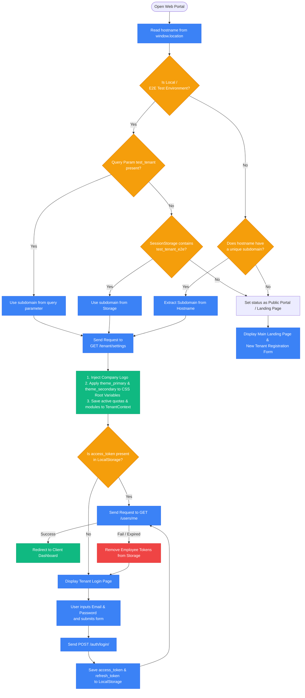
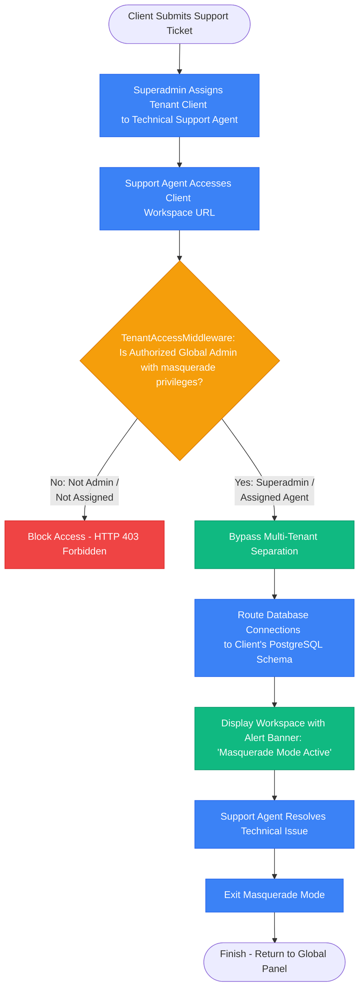
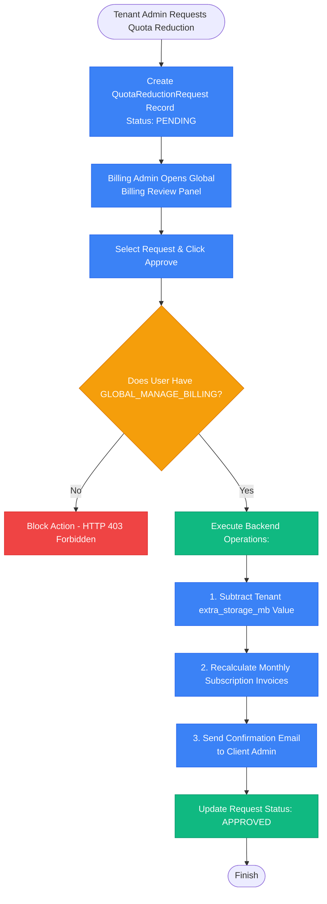

# Web Application Workflows & Flowcharts (Tenant Portal & Global Admin)

This document provides an in-depth explanation of the operational mechanisms, architecture, and user flows of the **HariKerja HRMS** web portal at both the tenant level (Company Admin, HR Manager, Supervisor, Employee Self-Service) and the SaaS platform level (Global Admin, Superadmin, Onboarding Agent, Technical Support, and Billing Admin).

---

## 🏗️ Part 1: Tenant Web Portal (Company Workspace)

The tenant web portal is built as a Next.js (App Router) multi-tenant application that utilizes postgres schema isolation per tenant at the backend database level.

### 1. Tenant Initialization & Domain Detection

Every web portal interaction is filtered based on the domain/subdomain to identify the active tenant context.

*   **Subdomain Detection**: Next.js parses the hostname via `window.location.hostname`.
    *   *Production*: `https://[subdomain].harikerja.com` (e.g., `https://ptmaju.harikerja.com`).
    *   *Testing/Local*: Supports query parameter `?test_tenant=subdomain` or `sessionStorage` for isolated E2E tests.
*   **Configuration Fetching**: `TenantProvider` calls `GET /api/v1/tenant/settings` with the detected subdomain. The server returns branding customisations (logo, CSS variables), limits (employee/storage), active modules, and operational parameters (late penalty fee, BPJS contribution rates, approval stage configurations).
*   **Dynamic Styling**: The primary (`themePrimaryColor`) and secondary (`themeSecondaryColor`) colors are injected directly into CSS Root variables on load.



### 2. Employee Onboarding & Branch Configuration

New employee entries and physical company branch structures are managed by the HR Manager or Tenant Admin.

1.  **Branch Configuration**: Specifies GPS coordinates (Latitude, Longitude) and `radius_meters` to enforce attendance geofencing on mobile devices.
2.  **Salary Grades**: Defines base salaries, meal allowances, and daily transport allowances for automated payroll calculation.
3.  **Add Employee**: HR inputs name, email, NIK (auto-generated), direct supervisor, RBAC role, and uploads mandatory documents (KTP, NPWP) and the **Face Reference Photo** used by ML Kit for Face ID AI.
4.  **Quota Verification**: The backend API validates that the total active employee count remains below the plan's `max_employees`. If exceeded, registration returns a `QUOTA_EXCEEDED` error.

```mermaid
flowchart TD
    Start[HR Opens Add Employee Form] --> InputData[Input Employee Data:\n- Name, Email, Phone\n- Select Department & Role\n- Select Branch & Supervisor]
    InputData --> SetCompensation[Set Salary Grade\n(Binds Base Salary & Allowances)]
    SetCompensation --> SetRBAC[Select Access Role:\nAdmin / HR Staff / Employee]
    SetRBAC --> UploadDocs[Upload Required Docs:\n- Scan KTP & NPWP\n- Face Reference Photo (Face ID)]
    UploadDocs --> SubmitForm[Post Data via POST /employees/]
    
    SubmitForm --> CheckQuota{Is Employee Count \nWithin Subscription Limit?}
    
    CheckQuota -- No --> ShowQuotaError[Show Error: Quota Exceeded. \nPlease Upgrade Subscription Package]
    CheckQuota -- Yes --> SaveDB[Backend Operations:\n1. Register Django User\n2. Create Employee Record\n3. Auto-generate NIK\n4. Save files to secure storage]
    
    SaveDB --> SendInvite[Send Session Activation Email invitation]
    SendInvite --> End([Finish])
    ShowQuotaError --> UpgradePlan[Redirect HR to Billing Dashboard]

    classDef success fill:#10B981,stroke:#059669,color:#fff;
    classDef fail fill:#EF4444,stroke:#DC2626,color:#fff;
    classDef step fill:#3B82F6,stroke:#2563EB,color:#fff;
    classDef decision fill:#F59E0B,stroke:#D97706,color:#fff;
    
    class SaveDB,SendInvite success;
    class ShowQuotaError fail;
    class InputData,SetCompensation,SetRBAC,UploadDocs,SubmitForm,UpgradePlan step;
    class CheckQuota decision;
```

### 3. Approval Workflows (N-Level Approvals)

Enforces internal organizational hierarchy approvals for leaves, overtime, reimbursements, and clock-in corrections.

*   **WorkflowConfig**: Binds specific request types (e.g., `LEAVE`, `REIMBURSEMENT`).
*   **WorkflowStage**: Ordered sequence steps (N-Level Approval) where the designated approver can be:
    *   *Direct Supervisor*: Resolved dynamically from `employee.supervisor`.
    *   *Specific Access Role*: A custom group (e.g., Finance Team).
    *   *Specific Employee*: A fixed individual user.
*   **Execution Logic**: The request status progresses sequentially (1 -> 2 -> N). If any step is `REJECTED`, the workflow halts. Once approved by the final stage, status shifts to `APPROVED` and triggers downstream side-effects (e.g., deducting leave balance, updating attendance log corrections).

```mermaid
flowchart TD
    Start[Employee Submits Request\n(Leave / Reimbursement / Correction)] --> CheckConfig{Is WorkflowConfig \nActive for this Type?}
    
    CheckConfig -- No --> DirectApproval[Single Stage Approval:\nDirect to HR / Manager queue]
    CheckConfig -- Yes --> GetStages[Retrieve WorkflowStages \nOrdered by Sequence]
    
    GetStages --> InitStage[Set Active Stage = Sequence 1]
    InitStage --> IdentifyApprover[Resolve Approver:\n- Direct Supervisor, OR\n- Access Role, OR\n- Fixed Employee ID]
    
    IdentifyApprover --> ShowInQueue[Display Request on Approver Dashboard]
    ShowInQueue --> WaitAction{Approver Action?}
    
    WaitAction -- REJECTED --> RejectFlow[Final Status: REJECTED \nStop Workflow \nSend Rejection Notification]
    WaitAction -- APPROVED --> CheckNext{Is There a Next Stage \n(Sequence + 1)?}
    
    CheckNext -- Yes --> AdvanceStage[Set Active Stage = Sequence + 1]
    AdvanceStage --> IdentifyApprover
    
    CheckNext -- No --> ApproveFlow[Final Status: APPROVED \nExecute Business Rule \n(Deduct Balance / Mark Payout)]

    classDef success fill:#10B981,stroke:#059669,color:#fff;
    classDef fail fill:#EF4444,stroke:#DC2626,color:#fff;
    classDef step fill:#3B82F6,stroke:#2563EB,color:#fff;
    classDef decision fill:#F59E0B,stroke:#D97706,color:#fff;
    
    class ApproveFlow success;
    class RejectFlow fail;
    class GetStages,InitStage,IdentifyApprover,ShowInQueue,AdvanceStage,DirectApproval step;
    class CheckConfig,WaitAction,CheckNext decision;
```

### 4. Monthly Payroll Processing & PPh 21 TER 2024 Compliance

The core financial operation in the tenant portal, deeply integrated with attendance and Indonesian tax regulations.

1.  **Base Salary & Fixed Allowances**: Derived automatically from the Employee Salary Grade.
2.  **Daily Allowances (Meal & Transport)**: Calculated proportionally based on actual attendance logs:
    $$\text{Daily Allowance} = (\text{Days Attended} + \text{Days Late}) \times \text{Daily Allowance Rate}$$
3.  **Denda Potongan Absensi (Attendance Deductions)**:
    *   *Late*: Aggregated late count multiplied by the tenant's late penalty fee parameter.
    *   *Unexcused Absence (Alfa)*: Daily salary deduction applied if no attendance log is found and no leave request is registered:
        $$\text{Alfa Deduction} = \text{Alfa Days} \times \text{Alfa Penalty Rate}$$
4.  **BPJS Social Security**:
    *   *Healthcare (BPJS Kesehatan)*: 1% employee contribution, 4% employer subsidy (wage ceiling cap at Rp12,000,000).
    *   *Pensions (BPJS Ketenagakerjaan)*: JHT (2% employee, 3.7% employer), JP (1% employee, 2% employer), JKK & JKM (fully subsidized by employer based on company risk class).
5.  **Indonesian PPh 21 TER 2024 Taxes**:
    *   Retrieves employee PTKP status (TK/0 to K/3).
    *   Calculates Gross Income (Salary + Allowances + Employer-paid BPJS premiums).
    *   Maps Gross Income to the corresponding TER Category A, B, or C tables (PMK 168/2023).
    *   $$\text{Monthly PPh 21 Tax} = \text{Gross Income} \times \text{TER Rate}$$
6.  **Take Home Pay (THP)**:
    $$\text{THP} = \text{Gross Income} - \text{BPJS Employee} - \text{PPh 21} - \text{Total Deductions} + \text{Approved Reimbursements}$$

```mermaid
flowchart TD
    Start[HR Opens New Payroll Period\n- Select Month & Year] --> FetchData[Retrieve Historical Data:\n1. Employee Attendance Logs\n2. APPROVED Leaves & APPROVED Overtime\n3. APPROVED Reimbursements]
    
    FetchData --> CalculateDays[Calculate Days Attended, Late, Alfa, \nand Leave days per employee]
    CalculateDays --> CalcAllowances[Calculate Attendance Allowances:\n- Pro-rated Meal Allowance\n- Pro-rated Transport Allowance\n- Overtime Earnings]
    
    CalcAllowances --> CalcDeductions[Calculate Deductions:\n- Late Attendance Penalties\n- Alfa Penalty Deductions]
    
    CalcDeductions --> CalcBPJS[Calculate BPJS Contributions:\n- BPJS Kesehatan (1% employee, 4% employer)\n- BPJS TK JHT, JP, JKK, JKM]
    
    CalcBPJS --> CalcGross[Calculate Gross Earnings:\nBase Salary + Allowances + Employer BPJS Premiums]
    
    CalcGross --> CheckPTKP[Fetch Employee PTKP Status\n(TK/0 - K/3 for Category TER A/B/C)]
    
    CheckPTKP --> ApplyTER[Apply TER PPh 21 2024 Rates:\nMonthly PPh 21 = Gross Earnings x TER Rate %]
    
    ApplyTER --> CalcNet[Calculate Net Salary (Take Home Pay):\nGross - Employee BPJS - PPh 21 - Total Deductions]
    
    CalcNet --> GenerateSlip[Generate Digital Pay Slips & \nPDF file dynamically]
    
    GenerateSlip --> ReviewHR[HR Reviews Payroll Aggregations]
    ReviewHR --> Verify{Does payroll data \nmatch parameters?}
    
    Verify -- No --> Adjust[Perform Manual Adjustments / Correct Data]
    Adjust --> CalcAllowances
    
    Verify -- Yes --> CommitPayroll[Approve Payroll Period:\n- Set Period Status to APPROVED\n- Employee receives Email & Mobile alert\n- Secure PDF saved to cloud storage]
    
    CommitPayroll --> Disburse[Initiate Bank Payroll Transfer]
    Disburse --> MarkPaid[Update Status: PAID \n(Period Permanently Closed)]
    
    MarkPaid --> End([Finish])

    classDef success fill:#10B981,stroke:#059669,color:#fff;
    classDef fail fill:#EF4444,stroke:#DC2626,color:#fff;
    classDef step fill:#3B82F6,stroke:#2563EB,color:#fff;
    classDef decision fill:#F59E0B,stroke:#D97706,color:#fff;
    
    class CommitPayroll,MarkPaid success;
    class Adjust fail;
    class Start,FetchData,CalculateDays,CalcAllowances,CalcDeductions,CalcBPJS,CalcGross,CheckPTKP,ApplyTER,CalcNet,GenerateSlip,ReviewHR,Disburse step;
    class Verify decision;
```

---

## 🏢 Part 2: Global Admin Portal (SaaS Operator Panel)

Unlike tenant users who are isolated in their respective schemas, **Global Admins** operate in the primary master schema (`public`) to govern the entire SaaS ecosystem.

### 1. SaaS Segregation of Duties

The HRMS platform isolates global administrative privileges into 4 distinct roles:

| Global Role | Backend Permission Key | Functional Scope |
| :--- | :--- | :--- |
| **`SUPERADMIN`** | `GLOBAL_MANAGE_ADMINS`, `GLOBAL_MANAGE_TENANTS`, `GLOBAL_MANAGE_BILLING`, `GLOBAL_MASQUERADE` | Absolute root access over SaaS infrastructure, global user management, billing, and tenant bypass. |
| **`ONBOARDING_AGENT`** | `GLOBAL_MANAGE_TENANTS` | Validates new signups and triggers tenant postgres database schema provisioning. |
| **`SUPPORT_AGENT`** | `GLOBAL_MASQUERADE` (Restricted) | Performs restricted impersonation (*masquerade*) into designated tenant workspaces for debugging. |
| **`BILLING_ADMIN`** | `GLOBAL_MANAGE_BILLING` | Handles financial metrics, billing invoices, subscription upgrades, and quota reductions. |

### 2. Tenant Registration & Auto-Provisioning

Governs the flow from when a prospect registers on the public landing page to when their isolated database environment is created.

1.  **Client Signup**: The prospect fills out the registration form (Subdomain prefix, company name, admin email). Data is stored in the `RegistrationRequest` model under the `public` schema with a `PENDING` status.
2.  **Approval**: The Onboarding Agent reviews the request at `/admin/registrations` in the global panel and clicks approve, calling POST `/internal/registrations/{id}/approve/`.
3.  **Auto-Provisioning**:
    *   The backend creates a new isolated PostgreSQL schema (e.g., `ptmaju`).
    *   Runs Django tenant-specific migrations to build local HR tables in the new schema.
    *   Creates the Tenant Admin user in the `public` schema and links it to the tenant.
    *   Seeds core master data (default departments, basic roles, default shifts) inside the schema.
    *   Sends a welcome activation email to the client admin.

```mermaid
flowchart TD
    Start([Client Submits Signup Form]) --> SaveReq[Save Request to public.RegistrationRequest \nStatus: PENDING]
    SaveReq --> ShowAdmin[Onboarding Agent Opens Global Portal \n/admin/registrations]
    
    ShowAdmin --> ClickApprove[Click Approve]
    ClickApprove --> AuthCheck{Does User Have \nGLOBAL_MANAGE_TENANTS?}
    
    AuthCheck -- No --> BlockReq[Reject - HTTP 403 Forbidden]
    AuthCheck -- Yes --> SyncDB[Start Provisioning Process:]
    
    SyncDB --> CreateSchema[1. Create New isolated PostgreSQL Schema \n(client data separation)]
    CreateSchema --> RunMigrations[2. Run Django Database Migrations \nto populate local schema tables]
    RunMigrations --> CreateTenantAdmin[3. Create Tenant Admin in public.users \nand link to the tenant]
    CreateTenantAdmin --> SeedMasterData[4. Seed Basic Master Data \n(Default Department, Roles, Shifts)]
    SeedMasterData --> SendWelcomeEmail[5. Send Welcome Activation Email \nwith workspace credentials]
    
    SendWelcomeEmail --> UpdateStatus[Update Registration Status: APPROVED]
    UpdateStatus --> End([Finish])

    classDef success fill:#10B981,stroke:#059669,color:#fff;
    classDef fail fill:#EF4444,stroke:#DC2626,color:#fff;
    classDef step fill:#3B82F6,stroke:#2563EB,color:#fff;
    classDef decision fill:#F59E0B,stroke:#D97706,color:#fff;
    
    class SyncDB,UpdateStatus success;
    class BlockReq fail;
    class SaveReq,ShowAdmin,ClickApprove,CreateSchema,RunMigrations,CreateTenantAdmin,SeedMasterData,SendWelcomeEmail step;
    class AuthCheck decision;
```

### 3. Masquerade Mode (Technical Support)

Allows authorized support agents to step into a client's workspace without knowing their password or compromising overall system isolation.

1.  **Assignment**: A `SUPERADMIN` assigns a specific tenant client to a `SUPPORT_AGENT` record.
2.  **Impersonation**: The support agent clicks **Masquerade** on the corresponding tenant in the global portal.
3.  **Security Bypass**: `TenantAccessMiddleware` verifies the `GLOBAL_MASQUERADE` permission. If the agent is assigned to that tenant (or if the user is a `SUPERADMIN`), the request bypasses standard tenant membership blocks.
4.  **Active Impersonation**: The application renders the client workspace, displaying a prominent top banner ("*Masquerade Mode Active*").



### 4. Quota Reductions & Billing Audits

Enforces systematic validations for adjusting resource billing metrics.

1.  **Request Submission**: The tenant admin deletes old assets and submits a `QuotaReductionRequest` to lower their monthly billing expenses.
2.  **Audit**: A `BILLING_ADMIN` or `SUPERADMIN` (holding the `GLOBAL_MANAGE_BILLING` permission) verifies actual physical storage consumption.
3.  **Approval**: On approval, the system updates the tenant's `extra_storage_mb` field, resizing the allowed cap and adjusting downstream subscription invoices.



### 5. Global User Management & Sidebar Filtering

*   **Credential Storage**: Accounts exist in the `public.users` table with `is_global_admin = True` and a mapped `global_role`.
*   **Security Restrictions**: The `/internal/global-admins/` API endpoint is secured with the `IsSuperUserOrSelf` backend permission check. Only `SUPERADMIN` profiles can perform CRUD operations on other global accounts.
*   **Module-Based Sidebar Filtering**:
    *   *When in the public schema context (`harikerja.web.id`)*: Operational HR menus (Payroll, Attendance, Leaves) are hidden, rendering only master views (*Overview*, *Registrations*, *Global Admins*, and *Profile*).
    *   *When in masquerade mode*: Renders only the operational HR menus active under the client's `enabledModules` array.
