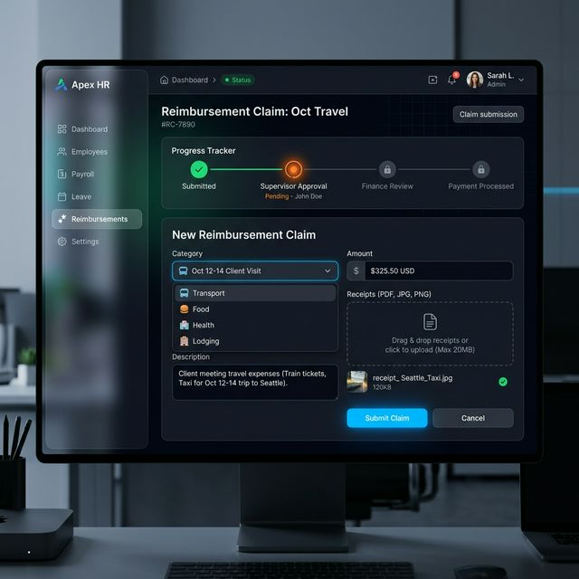

# Walkthrough: Web Frontend (harikerja HRMS)

A premium Next.js 14 dashboard with glassmorphism UI, focused on real-time HR management and executive analytics.

## ✨ Feature Evolution

### Phase 1-3: UI Framework & Core Dashboard
- **Tech Stack**: Next.js 14, Tailwind CSS, Framer Motion.
- **Branding**: Implemented Glassmorphism UI patterns with dark-mode support.
- **Live Stream**: Connected Admin Dashboard to attendance logs via real-time stream.

### Phase 24-29: Admin Empowerment
- **Tenant Settings**: Halaman kustomisasi logo dan branding tenant.
- **Provisioning**: Integrated Employee creation with Hybrid RBAC permissions.
- **Secret Portal**: Professional login hidden for platform administrators (`/login/portal-admin`).

### Phase 34-45: Advanced Modules
- **Attendance**: Dashboard for geofencing status and audit visualization.
- **Approvals**: UI for multi-stage approval workflows (Leaves, Overtime).
- **Performance**: KPI and appraisal lifecycle tracking at the organizational level.

## 🛠 Reliability & Testing
- **Unit Tests**: 29 tests (Vitest) with 100% logic coverage for critical components.
- **Performance**: Optimized App Router patterns for SEO and hydration speed.
