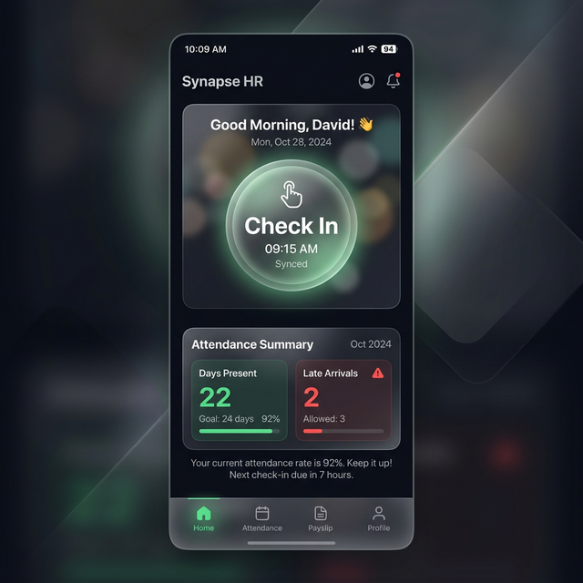

# harikerja HRMS Mobile (Flutter)

The employee self-service (ESS) application for the **harikerja HRMS** ecosystem. This Flutter app provides a secure, biometric-enabled portal for employees to manage their attendance, work schedules, and payroll.

## 📱 Key Features

- **Biometric Face Recognition**: AI-powered attendance verification with liveness checks using Google ML Kit.
- **Smart Geofencing**: High-accuracy GPS validation to ensure attendance records are within office boundaries.
- **Integrated Identity**: Real-time synchronization with the unified backend identity system (Employee NIK, Role, Department).
- **ESS Profile Management**: Self-service portal for updating contact info and uploading KTP/NPWP documents.
- **Attendance Corrections**: Request workflow for fixing missed or incorrect logs directly from the mobile app.
- **Strategic Performance**: Personal KPI dashboard with progress visualization and self-appraisal submissions.
- **Shift & Schedule**: Personal work calendar with real-time shift status.
- **Dynamic Payslips**: View and download payroll details with TER 2024 compliance data.
- **Leave Management**: Submit leave requests (Annual, Permission, Sick) and track balances in real-time.
- **Reimbursement Claims**: Easy expense submission with category-based validation and status tracking.
- **Account Settings**: App personalization, language preferences, and secure logout management.
- **Biometric Face Recognition**: AI-powered attendance verification with liveness checks using Google ML Kit.
- **Smart Geofencing**: High-accuracy GPS validation to ensure attendance records are within office boundaries.

### 📊 Feature Status & Maturity
For a detailed audit of implemented vs. mocked features, see [**Feature Audit & Gap Analysis**](./docs/feature_audit.md).

| Module | Status | Dynamic? |
| :--- | :--- | :--- |
| Auth & Face ID | ✅ Ready | Yes |
| Profile & Docs | ✅ Ready | Yes |
| Attendance Logic | ✅ Ready | Yes |
| Leave & Reimb | ⚠️ Polishing | Yes |
| Performance | ✅ Ready | Yes |
| Payslips | ❌ Incomplete | No (Mock) |
| L10n | ⚠️ Incomplete | No |

### 📱 Flutter UI Previews

|  |  |

### Face ID Attendance

*AI-powered face recognition with liveness detection for secure clock-in.*

## 🛠 Tech Stack

- **Framework**: Flutter 3.19+
- **Biometrics**: Google ML Kit (Face Detection)
- **Maps/Location**: Geolocator API (High Accuracy)
- **Media**: Camera & Image Picker (Documents)
- **Storage**: Flutter Secure Storage (JWT)
- **Fonts**: Plus Jakarta Sans (Google Fonts)

---

## 1. Getting Started

### Prerequisites
- **Flutter SDK**: 3.19 or later.
- **Android Studio / Xcode**: For emulator or physical device testing.
- **Backend Running**: Ensure the backend is active (e.g., run `.\run_dev.ps1` in the backend directory).

### Setup
```powershell
cd mobile
flutter pub get
```

### Running the App
```powershell
# Automated Local Dev - RECOMMENDED
pwsh .\run_dev.ps1

# Optional Flags:
pwsh .\run_dev.ps1 -Web
pwsh .\run_dev.ps1 -Windows
```

---

## 2. API Integration & Multi-Tenancy

The app handles multi-tenancy by injecting custom headers into every request via `ApiService`:
- `X-Tenant-Domain`: Standard tenant routing.
- `Host`: Required for `django-tenants` schema isolation in development.

| Target | API URL / Domain | Purpose |
| :--- | :--- | :--- |
| **Android Emulator** | `http://10.0.2.2:8000/api` | Local Development |
| **QA** | `https://harilibur.web.id/api` | IDCloudHost (Functional Testing) |
| **Staging** | `https://harikerja.web.id/api` | AWS (1M User Stress Test) |
| **Production** | `https://harikerja.com/api` | AWS (Official Enterprise) |

### Environment Switching
The app supports environment-specific builds using `--dart-define`:
```bash
# Example: Build for QA
flutter build apk --dart-define=APP_ENV=qa
```

---

## 3. Testing

Run all mobile logic & infrastructure tests (Real Backend):
```powershell
# Run from workspace root:
pwsh .\mobile\run_tests.ps1
```

Run Mobile E2E user flow test (Real Backend):
```powershell
pwsh .\mobile\run_e2e.ps1
```
**Status**: ✅ **100% test coverage** for all core modules. All tests are configured to communicate directly with the local development server for end-to-end verification.


---

## 📚 Technical Documentation

For in-depth technical details, please refer to the internal documentation:
- [**Implementation Plan**](./docs/implementation_plan.md)
- [**Walkthrough & Results**](./docs/walkthrough.md)
- [**Development Roadmap**](./docs/task.md)

---
**Branding Note**: This project was rebranded to **harikerja** on March 16, 2026.
